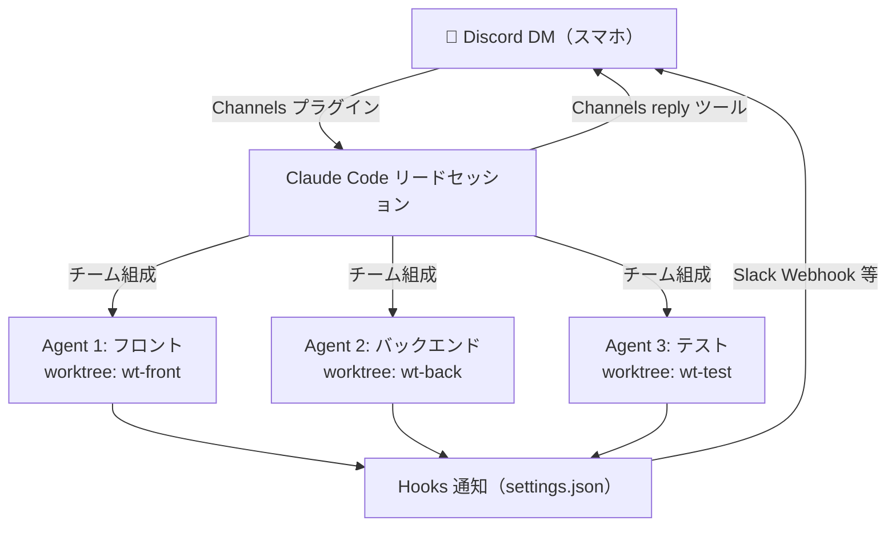
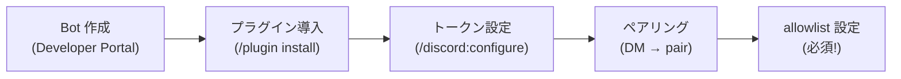

# スマホからAIチームを指揮する — Claude Code × Discord並列開発術

@[docswell](https://www.docswell.com/s/takish/TODO-channels-agent-teams)

ターミナルの前に座っていないと、AIエージェントに仕事を振れない——。

Claude Code の Agent Teams は複数エージェントを並列で動かせる強力な機能ですが、ローカルPCに張り付く前提が使いこなしのボトルネックになっています。本記事では、Discord の DM から Claude Code に指示を飛ばし、複数エージェントを並列起動して進捗通知まで受け取るワークフローを紹介します。

セットアップ手順は最小限に留め、実際に運用してわかったこと——リードのタスク分解精度、コスト感覚、マージ時のハマりポイント——に重点を置いて書きました。

---

## スマホから指揮すべき理由

### Agent Teams の可能性と現状の制約

Claude Code の Agent Teams を使うと、自然言語でチーム構成を伝えるだけで、ひとつのタスクを複数のエージェントに分解して並列実行できます。たとえば認証機能の実装で、フロントのログインフォーム、バックエンドの API、E2Eテストを3つのエージェントが同時に進める——といった使い方です。

ところが、この機能には大きな前提があります。**ターミナルの前にいなければ指示を出せない**ということです。通勤中にふと「あの Issue、並列で片付けておきたいな」と思っても、PCを開かない限りエージェントは動き出しません。

### リモートコントロールだけでは足りない理由

Claude Code にはリモートコントロール機能もありますが、複数エージェントが並列で動いている状態をスマホの小さな画面で把握するのは正直厳しいところです。

ほしいのは、**チャットアプリのように気軽に指示を出せて、進捗が通知で飛んでくるインターフェース**です。

### なぜ Discord なのか

Channels は Discord と Telegram をサポートしています。Discord を選んだ理由は以下の通りです。

- **Bot API の自由度が高い**: Webhook、リアクション、スレッドなど、通知のカスタマイズ余地が大きい
- **プッシュ通知の即時性**: モバイルアプリの通知が安定しており、エージェントの状態変化を見逃しにくい
- **既存の開発コミュニティとの親和性**: 多くのエンジニアが日常的に使っているため、新しいアプリを増やさずに済む

一方、Telegram は BotFather でボットを作成するだけでセットアップが完了するため、手順の簡素さでは Discord より優れています。Discord サーバーを持っていない場合は検討する価値があります。

---

## アーキテクチャ全体像

### 4層パイプラインと worktree 分離

全体の構成はシンプルな4層です。



スマホから Discord DM でメッセージを送ると、ローカルPCで動いている Claude Code のリードセッションがそれを受け取ります。リードが指示を解釈し、エージェントチームを組成。各エージェントは独立した git worktree で作業するため、同じファイルを同時に編集しても衝突しません。タスクを消化してアイドルになると Hook が発火してスマホに通知が届きます。

**worktree 分離のポイント**: worktree はデフォルトでは使われません。有効化するにはリードに「各チームメイトは worktree を使って作業して」と自然言語で伝えるか、`agents/` ディレクトリにサブエージェント定義を作成して `isolation: worktree` を指定します。`--worktree <name>` フラグは個別セッション起動用であり、Agent Teams のリード起動時に指定するものではない点に注意してください。

---

## セットアップ（10分）

セットアップの詳細は [公式ドキュメント（Channels 利用ガイド）](https://code.claude.com/docs/en/channels) を参照してください。ここでは全体の流れと、公式には書かれていないハマりポイントに絞って紹介します。

### 前提条件

- **Claude Code v2.1.80 以降**（Channels は research preview。Channels と Agent Teams を併用するにはこのバージョンが必要）
- **claude.ai でのログイン**（Console / API Key 認証は非対応）
- **[Bun](https://bun.sh)** のインストール（Discord プリビルトプラグインの実行に必要）
- Team / Enterprise プランの場合は、管理者による Channels の有効化（`channelsEnabled` ポリシー）

> **注意**: Channels は research preview であり、仕様が変更される可能性があります。

### セットアップの流れ



1. [Discord Developer Portal](https://discord.com/developers/applications) で Bot を作成し、**Message Content Intent** を有効化してトークンを取得
2. `/plugin install discord@claude-plugins-official` でプラグインを導入
3. `/discord:configure <token>` でトークンを設定
4. `--channels` フラグ付きで Claude Code を再起動
5. Discord DM で Bot にメッセージを送信 → ペアリングコードが返る → `/discord:access pair <code>` で承認
6. `/discord:access policy allowlist` でアクセスを制限する

**動作確認**: ペアリング完了後、Discord DM で「hello」と送ってみてください。Claude Code のセッションに届いて応答が返れば成功です。

:::message alert
**allowlist の設定は必須です。** 未設定の場合、ペアリングコードが誰にでも返されるため、第三者がセッションに接続できてしまいます。また、Discord Bot トークンが漏洩すると任意のメッセージをセッションに注入できるため、2FA 有効化と合わせてトークンの管理を徹底してください。
:::

### tmux で常時待受セッションを作る

プラグインのセットアップが完了したら、tmux でバックグラウンドセッションを作ります。毎回長いコマンドを打つのは手間なので、シェル関数にまとめておくのが実用的です。

```bash
# .zshrc に追加
claude-team() {
  CLAUDE_CODE_EXPERIMENTAL_AGENT_TEAMS=1 claude \
    --channels plugin:discord@claude-plugins-official "$@"
}
```

tmux での起動はこうなります。

```bash
tmux new-session -d -s claude-team \
  'CLAUDE_CODE_EXPERIMENTAL_AGENT_TEAMS=1 claude --channels plugin:discord@claude-plugins-official'
```

:::message
PCがスリープから復帰した際に Discord Bot の WebSocket 接続が切れている場合があります。長時間放置した後は `tmux attach -t claude-team` で接続状態を確認してください。切れていた場合はセッションの再起動が必要です。
:::

### Hooks で進捗通知を設定する

エージェントの状態変化を検知して通知するために、`~/.claude/settings.json` に Hook を設定します。

```json
{
  "hooks": {
    "TeammateIdle": [
      {
        "hooks": [
          {
            "type": "command",
            "command": "$HOME/.claude/hooks/slack-notify.sh 'エージェントがアイドルになりました'"
          }
        ]
      }
    ],
    "TaskCompleted": [
      {
        "hooks": [
          {
            "type": "command",
            "command": "$HOME/.claude/hooks/slack-notify.sh 'タスクが完了しました'"
          }
        ]
      }
    ]
  }
}
```

`TeammateIdle` はエージェントがタスクを消化してアイドル状態になった時に発火します。`TaskCompleted` は個別タスクの完了マーク時です。通知を受けたら Discord DM で追加指示を返せば作業が再開されます。

**Hooks と Channels reply の違い**: Hooks は `settings.json` で設定する外部コマンド実行（Slack Webhook 等）であり、エージェントの意思に関係なく自動発火します。一方、Channels の `reply` ツールは Claude Code がセッション内から Discord に直接メッセージを送る機能です。重要な通知は自動発火する Hooks 経由が信頼性で勝りますが、通知経路が分散するので、どちらに寄せるかはプロジェクトの規模に応じて判断してください。

---

## 実践 — Discord から並列開発を回す

### 指示の出し方パターン集

Discord DM からの指示は、普段 Claude Code に話しかけるのと同じ感覚で問題ありません。メッセージはリードセッションに届き、リードが適切なエージェントに伝達します。

**タスク分解を任せる**
```
Issue #42 を実装して。フロント・バックエンド・テストの3チームに分けて並列で進めて。
各チームメイトは worktree を使って作業して
```

**並列作業を明示する**
```
認証機能を実装して。フロントのログインフォームとバックのAPIを並列で
```

**進捗確認**
```
今のエージェントの進捗を教えて
```

**方針変更**
```
バックエンド担当のエージェントを止めて、認証方式を JWT からセッションベースに変更して
```

### リードのタスク分解 — 期待通りにいかないケース

Agent Teams の核はリードによるタスク分解です。しかし、リードの判断が常に最適とは限りません。運用中に遭遇した典型的なパターンを紹介します。

**分解が粗すぎるケース**: 「認証機能を実装して」のような抽象度の高い指示では、リードが機能全体を1つのエージェントに丸投げすることがあります。並列化の恩恵を受けるには「フロントのログインフォームとバックの認証APIを別々のエージェントで」のように、分割の境界を明示するのが効果的でした。

**依存関係を見落とすケース**: フロントエンドがバックエンドの API スキーマに依存しているのに、両方を同時にスタートさせてしまうことがあります。結果、フロント側が存在しないエンドポイントに対してコードを書き、後からやり直しになりました。依存関係がある場合は「バックエンドの API 定義が完了したらフロントに着手して」と順序を指定するか、先に API スキーマだけ定義するタスクを挟む方が確実です。

**分解が細かすぎるケース**: 逆に、5〜6個のエージェントに分けすぎて、各エージェントの成果物が小さくなりすぎることもあります。マージの手間が増えるだけなので、2〜3個の意味のある単位に収めるよう指示を調整しました。

### エージェントがアイドルになったときの対応フロー

エージェントがタスクを消化してアイドルになると `TeammateIdle` Hook が発火し、スマホに通知が届きます。

1. 通知を受け取る
2. Discord DM でリードからの報告を確認
3. 追加タスクや次の指示を返す
4. Channels 経由でリードに届き、作業が再開される

通勤中の15分で3エージェントの成果を確認し、次の Issue を割り振る——という使い方が実際にできました。

### マージ戦略 — 並列開発の最大の課題

複数エージェントが worktree で並列作業した成果物をマージする工程は、この構成で最も注意が必要なポイントです。

**PR 作成の順序**: 依存関係の少ないものから順にマージするのが基本です。テスト → バックエンド → フロントエンドの順で PR を出すと、コンフリクトが最小限に収まりました。リードに「PR はテスト、バックエンド、フロントの順で作成して」と指示すれば従ってくれます。

**コンフリクトが発生した場合**: worktree 間でコンフリクトが起きたら、リードに「コンフリクトを解消して」と伝えます。ただし、大きなコンフリクトの場合はリードの判断だけでは不十分なことがあります。その場合は PC に戻って手動で解消する方が安全でした。スマホだけで完結する理想と、実際の運用のバランスを認識しておく必要があります。

---

## 運用のコツと注意点

### コスト感覚

Agent Teams の最大の注意点はコストです。各エージェントが独立してコンテキストウィンドウを消費するため、3エージェント並列なら単体の約3倍のトークンを使います。

筆者の環境での感覚値として、3エージェント並列で中規模の機能実装（API + UI + テスト）を1時間回すと、単体セッション3時間分に相当するトークンを消費しました。常時起動ではなく「この Issue は並列で片付ける」とメリハリをつけるのが現実的な運用です。

コスト見積もりの詳細は [公式ドキュメントのコスト管理ページ](https://code.claude.com/docs/en/costs#agent-team-token-costs) を確認してください。

### エージェント数の目安

実用的には **2〜3エージェント** が安定する範囲です。4以上に増やすと API レート制限に引っかかりやすくなるのに加え、各エージェントの成果物を把握するコストが急激に上がります。まずは2エージェント（フロント + バックエンド）から始めて、運用に慣れたら3に増やす段階的なアプローチが無難でした。

### エラー復旧パターン

チームメイトが途中でエラー停止した場合の対処法をパターン別にまとめます。

| エラーパターン | 症状 | 対処法 |
|--------------|------|--------|
| API レート制限 | エージェントが応答しなくなる | しばらく待ってからリードに「再開して」と指示。エージェント数を減らすことも検討 |
| worktree ロック競合 | git 操作でエラー | リードに「worktree のロックを解除して」と伝える。解消しない場合は `git worktree prune` を手動実行 |
| WebSocket 切断 | Discord からの指示が届かない | tmux セッションにアタッチして再起動。スリープ復帰後に頻発する |
| タスクの無限ループ | エージェントが同じ操作を繰り返す | リードに「そのエージェントを停止して、タスクを再定義して」と指示 |

共通して言えるのは「リードに直接指示を送って対応する」のが基本方針です。「バックエンド担当のエージェントがエラーで止まったので、同じタスクを新しいエージェントに引き継いで」のように伝えれば、リードが代替チームメイトをスポーンしてくれます。

### Agent Teams の既知の制限

運用前に把握しておくべき制限を重要度順に並べます。

1. **セッション復元不可**（影響: 大）: `/resume` や `/rewind` でセッションを復元しても、チームメイトは復元されません。長時間の作業中にセッションが切れると、チームを一から再構成する必要があります
2. **1セッション1チーム**（影響: 中）: ひとつのセッションで同時に動かせるチームはひとつだけです。複数プロジェクトを並列で進めたい場合は、tmux セッションごと分ける必要があります
3. **ネストされたチーム不可**（影響: 小）: チームメイトがさらにチームを作ることはできません
4. **タスクステータスの遅延**（影響: 小）: チームメイトのステータス更新が遅れることがあります。通知が来ない場合は進捗確認の指示を送ってください
5. **スプリットペイン非対応**（影響: 環境依存）: VS Code 統合ターミナル、Windows Terminal、Ghostty ではスプリットペインが動作しません

### セキュリティ上の考慮事項

Discord DM の内容がそのままローカルPCのファイルシステムに影響する構成のため、セキュリティの意識は不可欠です。

- **allowlist ポリシーは必ず設定する**: 前述の通り、未設定だと第三者がセッションに接続できる
- **Permission relay のリスクを理解する**: Channels では `claude/channel/permission` を通じてリモートからツール実行を承認できる。allowlist 未設定の状態では第三者が承認操作を行える危険性がある
- **パーミッション設定は具体的に行う**: 特に **`--dangerously-skip-permissions` でリードを起動した場合、その権限は全チームメイトに波及する**。本番運用では絶対に使わないこと
- **プロンプトインジェクション対策**: Channels 経由の入力にも外部からの悪意ある指示が混入する可能性がある。パーミッション設定で防御する

### チーム終了時の cleanup

Agent Teams を終了する際は、以下の順序で cleanup を行います。

1. リードに「全チームメイトをシャットダウンして」と指示
2. チームメイトが全て停止したことを確認
3. リードセッションの cleanup を実行

cleanup を忘れると、孤立した tmux セッションや worktree の不整合が残ります。`tmux list-sessions` で不要なセッションが残っていないか定期的に確認するのが安全です。

---

## まとめ — 非対称開発スタイルという選択肢

「指示はスマホ、実行はローカルPC」——この非対称な開発スタイルは、AIエージェントが実用的になった今だからこそ成立する構成です。

運用してみて感じたのは、スマホから指揮する利便性と、リードのタスク分解精度やマージの手間というトレードオフが常に存在するということです。すべてがスマホで完結する理想像と、PC に戻って手を動かす現実のバランスを取りながら、自分のワークフローに合った使い方を見つけていく段階にあります。

### 段階的に導入する

いきなり Agent Teams と組み合わせる必要はありません。まずはこのコマンドだけで十分です。

```bash
claude --channels plugin:discord@claude-plugins-official
```

Discord DM から Claude Code に指示を送り、結果が返ってくる体験をしてみてください。それだけでも「ターミナルに張り付かなくていい」という開放感があります。

慣れてきたら Agent Teams で並列実行を追加し、Hook で通知パイプラインを構築する。段階的に拡張していける構成です。

Channels と Agent Teams の組み合わせを扱った日本語の情報はまだほとんどなく、知見を蓄積しやすい状況にあります。この記事がその一歩目の参考になれば幸いです。
