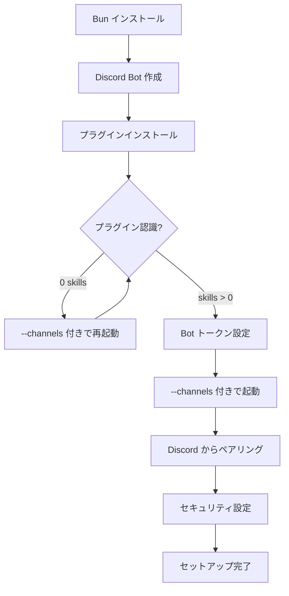

ターミナルに張り付かなくても、Discord で DM を送るだけでローカルの Claude Code が動きます。

Claude Code Channels（v2.1.80+、2026-03 時点で research preview）の Discord 連携を使えば、スマホからでもコード生成やファイル操作が可能になります。ただし、セットアップは公式ドキュメント通りには進みません。「Unknown skill」エラー、プラグインが認識されない問題など、実際に手を動かすと想定外のつまずきが待っています。

> **注意**: Channels は research preview 機能です。今後のアップデートで手順・コマンド・フラグが変更される可能性があります。本番ワークフローへの組み込みは慎重に判断してください。

本記事では、動くまでの全手順をハマりポイントの解決策付きで解説します。

## Claude Code Channels の仕組みと特徴

### 従来のリモート操作との違い（/remote-control vs Channels）

Claude Code にはもともと `/remote-control`（`/rc`）というリモート操作機能があります。これはブラウザ経由でターミナル UI そのものを操作する仕組みです。動くには動くのですが、スマホの小さい画面でターミナルを操作するのはなかなかつらいものがあります。

Channels はアプローチが異なります。Discord の DM から自然言語で指示を送り、Claude Code がローカルで処理して結果を返します。ターミナル出力をそのまま見たいなら `/rc`、手軽にタスクを投げたいなら Channels、という使い分けです。同じセッションで両方を有効にすることもできます。

### Channels のアーキテクチャ（MCP サーバー方式）

Channels の内部実装は MCP（Model Context Protocol）サーバーです。`claude/channel` capability（正式には `capabilities.experimental['claude/channel']`）を持つ MCP サーバーが、Discord から届いたメッセージを `<channel>` タグとして Claude のコンテキストに注入する仕組みになっています。

プラグインは Bun ランタイムで動作し、Claude Code がサブプロセスとして管理します。つまり、自分でサーバーを立てたり、ポートを開けたりする必要はありません。Claude Code を起動するだけで、裏側で Discord Bot が自動的に動き出します。

## 前提条件を確認する

### 必要なバージョンとアカウント

セットアップを始める前に、以下を確認しておきましょう。

```bash
# Claude Code のバージョン確認（v2.1.80 以上が必要）
claude --version

# Bun ランタイムの確認（最新版推奨）
bun --version

# Bun が入っていない場合
brew install bun
```

そのほかの前提条件は以下の通りです。

- **claude.ai ログインが必須**。API key 認証（Console 経由）では Channels は使えない
- Team / Enterprise プランの場合は、管理者による Channels 機能の有効化が必要
- Discord アカウントと、Discord Developer Portal へのアクセス
- 安定したインターネット接続（Discord Gateway への WebSocket 通信が可能な環境。企業プロキシでは遮断される場合があります）

## セットアップ手順（Step by Step）

全体の流れを先に把握しておきましょう。



### Step 1 -- Discord Bot を作成する

Discord Developer Portal（https://discord.com/developers/applications）で Bot を作成します。

1. 「New Application」で新しいアプリケーションを作成
2. 「Bot」セクションでトークンを生成（「Reset Token」ボタン）
3. **重要**: 「Privileged Gateway Intents」の「Message Content Intent」を ON にします。忘れると Bot がメッセージ内容を読み取れません
4. 「OAuth2 > URL Generator」でサーバーへの招待 URL を生成します
   - **Scopes**: `bot` を選択
   - **Bot Permissions**: 以下の 6 つを選択
     - View Channels
     - Send Messages
     - Send Messages in Threads
     - Read Message History
     - Attach Files
     - Add Reactions
5. 生成された URL をブラウザで開き、Bot を招待するサーバーを選択して承認します

### Step 2 -- プラグインをインストールする

Claude Code のセッション内で以下を実行します。

```bash
/plugin install discord@claude-plugins-official
```

プラグインが見つからないというエラーが出た場合は、マーケットプレイスが未登録または古い可能性があります。以下のコマンドで対処しましょう。

```bash
# マーケットプレイスを更新する
/plugin marketplace update claude-plugins-official

# それでもダメなら、マーケットプレイスを追加してからリトライ
/plugin marketplace add anthropics/claude-plugins-official
/plugin install discord@claude-plugins-official
```

インストール完了のメッセージが表示されたら、続けて `/reload-plugins` でプラグインを有効化します。

```bash
/reload-plugins
# → skills > 0 と表示されれば成功
```

`0 skills` と表示される場合は Step 3 を参照してください。ここで安心するのはまだ早いです。

### Step 3 -- プラグインを有効化する【ハマりポイント 1】

ここが最初の罠です。インストールしただけでは `enabledPlugins` に登録されないことがあります。`/reload-plugins` で確認しましょう。

```bash
# 正常な場合
/reload-plugins
# → skills > 0 と表示される

# 異常な場合（プラグインが認識されていない）
/reload-plugins
# → 0 skills
```

`0 skills` の状態で `/discord:configure` を実行すると「Unknown skill」エラーになります。

**解決策**: セッションを終了し、Step 5 の `--channels` フラグ付きで再起動してください。これが最も確実です。

### Step 4 -- Bot トークンを設定する【ハマりポイント 2】

プラグインが正しく認識された状態で、Bot トークンを設定します。

```bash
/discord:configure <BOT_TOKEN>
# → トークンが ~/.claude/channels/discord/.env に保存される
```

`<BOT_TOKEN>` は Step 1 で生成したトークン文字列に置き換えてください。

> **トークンの取り扱いに注意**: Bot トークンは Discord API へのフルアクセスを与える認証情報です。漏洩すると Bot を乗っ取られる可能性があります。
> - トークンを Git リポジトリにコミットしないこと（`~/.claude/channels/` が dotfiles 管理下にある場合は特に注意）
> - `.env` ファイルのパーミッションを確認すること（`chmod 600 ~/.claude/channels/discord/.env`）
> - シェル履歴への記録を避けたい場合は、コマンドの先頭にスペースを入れて実行する

ここでも「Unknown skill」エラーが出る場合は、Step 3 に戻って `--channels` フラグ付きでセッションを再起動してから再実行しましょう。

### Step 5 -- Channels 有効でセッションを起動する

いよいよ本番です。以下のコマンドで Claude Code を起動します。

```bash
claude --channels plugin:discord@claude-plugins-official
```

`--channels` フラグはセッション単位の設定なので、毎回指定する必要があります（後述の alias 設定で省略可能です）。

起動時のログで Discord Bot がオンラインになっていることを確認しましょう。

> **警告: Bot 起動直後は誰でも DM を送れる状態です。** Bot が起動した時点から Step 7 で allowlist を設定するまでの間、Bot は全ユーザーからの DM を受け付けます。この「危険なウィンドウ」を最小限にするため、起動後はすぐに Step 6 のペアリングと Step 7 の allowlist 設定を続けて実行してください。公開サーバーに Bot を招待している場合は特に注意が必要です。

### Step 6 -- ペアリングで接続する

Bot が起動したら、すぐにペアリングと allowlist 設定を行います。

1. Discord で Bot に DM を送信します（内容は何でも OK）
2. Bot がペアリングコードを返信してきます
3. Claude Code のセッション側で以下を実行します

```bash
/discord:access pair <pairing_code>
```

ペアリングは sender gating の仕組みです。Discord のユーザー ID を使って allowlist チェックを行い、許可されたユーザーだけがセッションを操作できるようにします。

### Step 7 -- セキュリティを固める

デフォルトでは、Bot の DM に誰でもメッセージを送信できる状態になっています。必ずセキュリティ設定を行いましょう。

```bash
# DM ポリシーを allowlist 方式に変更
/discord:access policy allowlist
```

これにより、ペアリング済みのユーザーだけがメッセージを送れるようになります。

> **allowlist 未設定のリスク**: allowlist を設定しないと、Bot に DM を送れる全ユーザーがローカルマシン上の Claude Code を操作できる状態になります。ファイルの読み書きやコマンド実行を含むため、プロンプトインジェクション防止の観点からも allowlist の設定は必須です。Bot の運用は DM ベースを推奨します。サーバーのパブリックチャンネルで Bot が反応する場合、他メンバーの発言がインジェクションのベクターになりえます。

## 動作確認と使える MCP ツール一覧

セットアップが完了したら、Discord から DM を送って動作確認しましょう。「hello」と送信して、Claude Code から応答が返ってくれば成功です。

Channels で使える MCP ツールは以下の通りです。

| ツール | 説明 | 使いどころ |
|--------|------|-----------|
| `reply` | メッセージ送信 | 基本の応答 |
| `react` | リアクション追加 | 処理中・完了の通知に便利 |
| `edit_message` | 送信済みメッセージの編集 | 長い出力の段階的な更新 |
| `fetch_messages` | メッセージ取得（最大100件） | 過去の会話の参照 |
| `download_attachment` | ファイルダウンロード | スマホで撮った写真やスクショを渡す |

`download_attachment` が特に便利で、スマホで撮ったエラー画面のスクショを Bot に送れば、Claude Code が画像を解析してデバッグしてくれます。

## 実践的な運用 Tips

### alias で起動コマンドを簡略化する

毎回長いコマンドを打つのは面倒なので、shell alias を設定しておきましょう。

```bash
# .zshrc や .bashrc に追加
alias claude-discord='claude --channels plugin:discord@claude-plugins-official'
```

これで `claude-discord` と打つだけで Channels 付きのセッションが起動します。

### tmux で常時起動する

tmux と組み合わせれば、Claude Code を常時待機させておけます。

```bash
# バックグラウンドで tmux セッションを作成して Claude Code を起動
tmux new-session -d -s claude-discord 'claude --channels plugin:discord@claude-plugins-official'
```

朝 PC を開いたらこのコマンドを実行しておけば、外出先からいつでも Discord 経由で Claude Code を使える状態になります。PC がスリープすると Discord Gateway が切断され、Bot はオフラインになります。復帰後はセッションを再起動すれば、再ペアリングなしで再接続できます。

### 複数リポジトリでの運用

**1 つの Bot トークンにつき、`--channels` 付きセッションは 1 つだけ起動できます。** 同じトークンで複数の `--channels` セッションを起動すると、Discord Gateway が二重接続になり片方が切断されます。

作業リポジトリを切り替える場合は、現在の `--channels` 付きセッションを終了してから、別ディレクトリで再起動してください。他のリポジトリの Claude Code セッションは `--channels` なしの通常起動で併用できます。Discord からの指示は `--channels` 付きセッションに集約される形になります。

## トラブルシューティング

### 「入力中...」が一瞬表示されて消える【ハマりポイント 3】

Bot に DM を送ると「ClaudeCodeBot が入力中...」と一瞬表示されるのに、数秒で消えて返信が来ない。エラーメッセージも表示されない。

**原因**: `--channels` フラグなしでセッションを起動している。

プラグインをインストールすると MCP サーバーとしては自動起動するため、`reply` や `fetch_messages` などのツールは使えます。Bot プロセスも起動し、Discord Gateway にも接続され、`sendTyping()` まで実行されます。しかし、**チャンネル通知（受信側）は `--channels` フラグで明示的に有効化しないと動作しません**。

- MCP ツール（送信側） -- プラグインインストールだけで使える
- チャンネル通知（受信側） -- `--channels` フラグが必須

`/reload-plugins` で `1 plugin MCP server` と表示されていても、それは MCP サーバーが動いているだけです。エラーが一切出ないため原因特定が難しいですが、解決策はシンプルです。

```bash
# セッションを終了してから --channels 付きで再起動
claude --channels plugin:discord@claude-plugins-official
```

## よくある質問（FAQ）

**Q: API key 認証（Console）でも使える？**
A: いいえ。claude.ai ログインが必須です。Team/Enterprise は管理者による有効化も必要です。

**Q: /remote-control と併用できる？**
A: できます。同じセッションで両方有効にできます。

**Q: Telegram でも使える？**
A: 公式プラグインがあります。手順はほぼ同じで、Bot 作成先が BotFather になるだけです。

**Q: カスタムチャンネルは作れる？**
A: `--dangerously-load-development-channels` フラグで自作プラグインを読み込めます。ただし Channels 全体が research preview であり、API やコマンド体系が変わる可能性があります。

## まとめと次のステップ

困ったら `--channels` フラグ付きで再起動。これだけ覚えておけば、大半のトラブルは解決します。

Claude Code Channels の Discord 連携は全 7 ステップでセットアップできます。ハマりポイントは Step 3-4 のプラグイン有効化周りと、`--channels` フラグの付け忘れに集中していますが、対処法はシンプルです。

1. **困ったら `--channels` フラグ付きで再起動**。プラグイン認識の問題も「入力中が消える」問題もこれで解決します
2. **allowlist 設定を忘れずに**。デフォルトでは誰でも Bot に DM を送れるので、起動後すぐに `policy allowlist` を設定してください
3. **1 Bot トークンにつき `--channels` セッションは 1 つ**。複数起動すると Gateway が競合します

動かせたら、まずは外出先から簡単なファイル修正を試してみてください。tmux と alias を設定しておけば、毎朝 PC を開いたら Channels が待機している状態を作れます。Telegram 連携やカスタムチャンネル開発にも挑戦すると、さらに活用の幅が広がるはずです。つまずいたポイントや知見があれば、ぜひコメントで共有してください。
