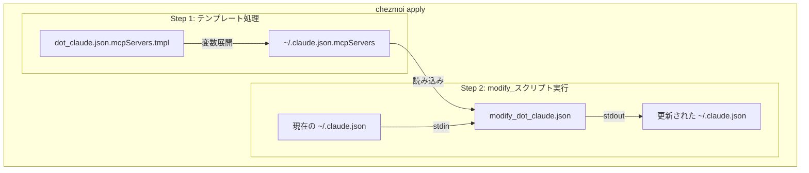
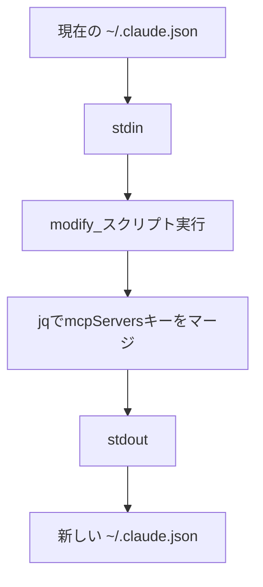

@[docswell](https://www.docswell.com/s/takish/TODO-chezmoi-modify)

chezmoiの `modify_` プレフィックスとjqを組み合わせれば、JSONファイルの特定キーだけを安全にマージできます。`chezmoi add` で丸ごと管理できない動的ファイルでも、必要な部分だけをdotfilesリポジトリに含められます。

dotfilesをchezmoiで管理していると、ある日こんな壁にぶつかります。「このJSONファイル、一部だけgitで管理したいのに、丸ごと `chezmoi add` すると秘密情報がリポジトリに載ってしまう」。特にClaude Code（Anthropicが提供するCLIベースのAIコーディングツール）の設定ファイル `~/.claude.json` は、この問題の典型例です。

MCP（Model Context Protocol：AIツールが外部サービスと連携するための標準プロトコル）サーバーの設定は管理したい。でも同じファイルにはAPIキーやランタイム統計も入っている。`chezmoi add` すれば認証情報が漏洩し、管理しなければマシン移行のたびに手動設定が必要になります。

この記事では、chezmoiの `modify_` プレフィックス（ファイルを丸ごと置換せず、変換して書き出す仕組み）を使って「必要なキーだけマージする」パターンを解説します。jqによるJSON部分マージの実装、末尾改行の罠、テンプレートとの組み合わせまで、実運用で得た知見をまとめました。

> 本記事の内容はchezmoi v2.68.1、jq 1.7.1で動作確認しています。お使いのバージョンは `chezmoi --version` / `jq --version` で確認できます。

<!-- 画像: 記事のアイキャッチ。chezmoiのロゴとJSONファイルのアイコンが重なるイメージ -->

## chezmoi add では動的JSONを管理できない

### APIキーとランタイム統計が同居する問題

`~/.claude.json` は、Claude Codeが常時読み書きする設定ファイルです。このファイルには性質の異なるデータが混在しています。

- **管理したいもの**: MCPサーバー設定（Obsidian連携、Chrome DevTools、Figma等）
- **管理してはいけないもの**: APIキー、Webhookトークン、ランタイム統計

管理したい部分と管理してはいけない部分が1つのJSONファイルに同居しているため、ファイル単位の管理では対応できません。「一部だけ管理する」という仕組みが必要です。

<!-- 画像: ~/.claude.json の構造図。mcpServersセクション（管理したい）とapiKey/statsセクション（管理してはいけない）を色分けした図 -->

### `chezmoi add` がもたらす3つのリスク

普通に `chezmoi add ~/.claude.json` を実行すると、3つの深刻なリスクが発生します。

**リスク1: 認証情報の漏洩**

```bash
chezmoi add ~/.claude.json
# → APIキー・Webhookトークンがdotfilesリポジトリにコミットされる
# → GitHubにpushすれば全世界に公開される
```

APIキーを含むファイルをgitリポジトリに追加してしまうと、たとえプライベートリポジトリであっても漏洩リスクがあります。一度コミットした秘密情報は、履歴から完全に消すのが困難です。

**リスク2: ランタイム状態の破壊**

`~/.claude.json` にはClaude Codeのテレメトリ（利用状況データ）やセッション情報が含まれます。`chezmoi apply` を実行するたびに、これらの動的な値が「`chezmoi add` した時点」のスナップショットで上書きされます。結果として、セッション状態がリセットされる問題が発生します。

**リスク3: レースコンディション（競合状態）**

Claude Codeは動作中に `~/.claude.json` へ頻繁に書き込みを行います。Claude Codeが書き込み中に `chezmoi apply` が走ると、最新の変更が失われる可能性があります。なお、後述するmodify_スクリプトを使う場合も同様のリスクはゼロではありませんが、影響範囲が `mcpServers` キーに限定されるため、被害を最小化できます。

## modify_ スクリプトは現在の内容を変換して書き出す

### 「丸ごと置換」ではなく「変換して書き出す」

chezmoiの通常のファイル管理は「ソースファイルの内容でターゲットを置き換える」という単純なモデルです。`dot_zshrc` の内容がそのまま `~/.zshrc` になります。

`modify_` プレフィックスを使うと、このモデルが変わります。chezmoiは `modify_` プレフィックスのファイルをスクリプトとして実行します。スクリプトは現在のターゲット内容を受け取り、変換した結果を出力するという仕組みです。

| 方式 | 動作 | 用途 |
|------|------|------|
| 通常（`dot_`） | ソース → ターゲットに置換 | 全体を管理するファイル |
| `modify_` | 現在の内容を変換して書き出す | 一部だけ管理したいファイル |

この違いが、「ファイルの一部だけを管理する」という要件を実現する鍵です。



### stdinとstdoutのデータフロー

`modify_` スクリプトのデータフローは明確です。

1. chezmoiがスクリプトを実行する
2. スクリプトの**stdin**に現在のターゲットファイルの内容が渡される
3. スクリプトが内容を変換する
4. スクリプトの**stdout**に出力された内容が新しいターゲットになる

```
[現在の ~/.claude.json] → stdin → modify_スクリプト → stdout → [新しい ~/.claude.json]
```

この仕組みにより、ファイルの大部分をそのまま保持しつつ、特定のキーだけを上書きすることが可能になります。stdinから読んだ内容にはAPIキーもランタイム統計もそのまま含まれているため、これらの値は一切失われません。

なお、`.mcpServers = $mcp` は `mcpServers` キー配下を**丸ごと置換**するシャローマージ（浅いマージ）です。ターゲットファイルの `mcpServers` に手動で追加したサーバー設定がある場合、`chezmoi apply` で上書きされます。これは意図的な設計判断です。MCP設定はすべてchezmoiのソースファイルで一元管理し、ターゲットへの手動追加は行わないというポリシーにより、設定の一貫性を保っています。手動追加した設定も保持したい場合は、jqの `*` 演算子（`.mcpServers = (.mcpServers // {}) * $mcp`）で深いマージを行う方法もあります。

## jqでMCPサーバー設定だけを安全にマージする

### ファイル構成と各ファイルの役割

この実装は3つのファイルで構成されます。

```
~/.local/share/chezmoi/
├── modify_dot_claude.json            # マージスクリプト本体
├── dot_claude.json.mcpServers.tmpl   # MCP設定（テンプレート）
└── .chezmoiignore                    # バックアップファイル等を除外
```

各ファイルの役割は以下のとおりです。

- **`modify_dot_claude.json`**: マージロジックを担うシェルスクリプト。stdinから現在の `~/.claude.json` を受け取り、MCPサーバー設定だけを差し替えてstdoutに出力する
- **`dot_claude.json.mcpServers.tmpl`**: 管理したいMCPサーバー設定を記述するファイル。`.tmpl` 拡張子により、chezmoiのテンプレートエンジンで環境変数の注入が可能
- **`.chezmoiignore`**: chezmoiの管理対象から除外するファイルを指定。バックアップファイルや一時ファイルを除外する

### マージスクリプトの全コードと解説

`modify_dot_claude.json` の全コードは15行程度です。

```bash
#!/bin/bash
# Merge mcpServers from chezmoi into existing ~/.claude.json
# This preserves all runtime stats while syncing MCP configuration

set -eo pipefail

MCP_CONFIG="$HOME/.claude.json.mcpServers"

# Read current file from stdin (empty on first run when ~/.claude.json doesn't exist)
current=$(cat)

if [[ -z "$current" ]]; then
    # First run: no existing file, output empty string to let chezmoi create a minimal file
    printf '%s' "$current"
elif [[ -f "$MCP_CONFIG" ]]; then
    mcp_servers=$(cat "$MCP_CONFIG")
    # -j: suppress trailing newline (Claude Code saves without trailing newline)
    printf '%s\n' "$current" | jq -j --argjson mcp "$mcp_servers" '.mcpServers = $mcp'
else
    printf '%s' "$current"
fi
```

各行のポイントを解説します。

- **`set -eo pipefail`**: エラーが発生したら即座にスクリプトを終了する。jqが見つからない場合やJSONパースに失敗した場合、不正な出力でファイルを壊すことを防ぐ。`pipefail` を付けることで、パイプライン内のいずれかのコマンドが失敗した場合もスクリプトを停止する（`set -e` だけではパイプの最後のコマンドの終了コードしか評価されない）
- **`current=$(cat)`**: stdinの内容（現在の `~/.claude.json`）を変数に読み込む。パイプで直接渡さず変数に格納することで、複数回参照できるようにしている。`~/.claude.json` が存在しない初回実行時は空文字列になる
- **`[[ -z "$current" ]]`**: stdinが空（初回セットアップ時）の場合のガード。空の入力をjqに渡すとパースエラーになるため、そのまま空文字列を返す。Claude Codeを起動して `~/.claude.json` が生成されたあとに再度 `chezmoi apply` を実行すればマージされる
- **`printf '%s\n' "$current" | jq ...`**: `echo` ではなく `printf` を使う。`echo` はシェルやプラットフォームによって `-n` や `-e` で始まる文字列をフラグとして解釈する場合があり、JSONの内容次第では意図しない動作を引き起こす可能性がある。`printf '%s\n'` はより安全でポータブルな選択肢
- **`jq -j --argjson mcp "$mcp_servers" '.mcpServers = $mcp'`**: jq（JSONを操作するコマンドラインツール）の核心部分。`--argjson` でMCP設定をJSON変数として渡し、`.mcpServers` キーだけを上書きする。`-j` フラグは末尾の改行を抑制する（理由は後述）。なお、`--argjson` はコマンドライン引数として値を渡すため、プロセスリストに一時的に露出する点に注意。MCP設定に秘密情報を含む場合は、jq 1.7以降の `--argjsonfile` でファイル経由で渡す方法を検討するとよい
- **`printf '%s' "$current"`**: MCP設定ファイルが存在しない場合のフォールバック。現在の内容をそのまま返すことで、ファイルを変更しない

このスクリプトは冪等（べきとう：何度実行しても同じ結果になること）です。MCP設定が変わらなければ、`chezmoi apply` を何度実行してもファイルは変更されません。



### テンプレートとの2段階処理

MCP設定ファイルに `.tmpl`（テンプレート）拡張子をつけることで、chezmoiのテンプレートエンジンとmodify_スクリプトの2段階処理が可能になります。

`chezmoi apply` を実行すると、以下の順序で処理が進みます。

1. **テンプレート処理**: `dot_claude.json.mcpServers.tmpl` が処理され、`~/.claude.json.mcpServers` が生成される。この段階で環境変数やchezmoi変数が展開される
2. **modify_スクリプト実行**: `modify_dot_claude.json` が実行され、stdinに現在の `~/.claude.json` が渡される。スクリプトは生成済みの `~/.claude.json.mcpServers` を読み込み、mcpServersキーをマージする
3. **結果の書き出し**: stdoutの内容が `~/.claude.json` に書き込まれる

この2段階処理により、テンプレートで環境ごとの差異（パスやURLの違い等）を吸収しつつ、modify_スクリプトで安全なマージを実現できます。役割が明確に分離されているため、保守性も高くなります。

## 末尾改行と処理順序でハマりやすい

### 末尾改行問題 — 永遠に出続けるdiff

実装して最初に遭遇した問題が「`chezmoi diff` で末尾改行の差分が消えない」現象です。

Claude Codeは `~/.claude.json` を末尾改行なしで保存します。一方、jqはデフォルトで出力の末尾に改行を追加します。この1バイトの違いにより、`chezmoi diff` を実行するたびに差分が表示され続けます。

```diff
 }
-}
\ No newline at end of file
+}
```

解決策は `jq -j`（末尾改行を抑制するフラグ）を使うことです。フォールバック側も `printf '%s'`（echo と異なり末尾改行を追加しない）を使います。

```bash
# NG: 末尾改行が追加される
printf '%s\n' "$current" | jq --argjson mcp "$mcp_servers" '.mcpServers = $mcp'

# OK: 末尾改行なし
printf '%s\n' "$current" | jq -j --argjson mcp "$mcp_servers" '.mcpServers = $mcp'
```

この問題はmodify_スクリプトに限らず、JSONファイルを扱うあらゆるスクリプトで発生し得ます。ターゲットファイルの末尾改行の有無を確認し、出力を合わせることが重要です。

### テンプレート処理順序の落とし穴

テンプレートファイル（`.tmpl`）とmodify_スクリプトを組み合わせる場合、処理順序に注意が必要です。

初回セットアップ時、つまり `~/.claude.json` がまだ存在しない状態で `chezmoi apply` を実行すると、以下の事態が起こり得ます。

1. chezmoiはターゲットパスのアルファベット順で処理するため、テンプレートファイル（`dot_claude.json.mcpServers.tmpl` → `~/.claude.json.mcpServers`）がmodify_スクリプトより先に処理される可能性がある
2. ただし、`~/.claude.json` が存在しない場合、modify_スクリプトのstdinには**空の入力**が渡される
3. 空の入力をそのままjqに渡すとパースエラーになる

このため、スクリプトには2段階のフォールバック処理が必要です。前述のコードの `[[ -z "$current" ]]`（空入力のガード）と `[[ -f "$MCP_CONFIG" ]]`（MCP設定ファイル未生成のガード）がこの役割を果たしています。

フォールバックがないとスクリプトがエラーで停止し、`chezmoi apply` 全体が失敗します。初回セットアップ時のシナリオを常にテストすることをおすすめします。

## modify_ パターンはVS Code設定やSlack設定にも応用できる

### VS Code settings.json や他のアプリ設定への応用

modify_スクリプトによる部分マージのパターンは、Claude Codeに限らず幅広いアプリケーションに応用できます。

**VS Code settings.json**

VS Codeの `settings.json` は、拡張機能がインストール時に設定を自動追加します。ユーザーが管理したい設定（フォントサイズ、テーマ等）と、拡張機能が管理する設定が混在しています。modify_スクリプトで「自分の設定キーだけマージする」パターンが使えます。

**Slack Desktop の設定**

Slack Desktopはウィンドウサイズや通知設定をJSONファイルに書き込みます。通知設定だけを統一したい場合に、modify_スクリプトが有効です。

**Cursor / Windsurf の設定**

VS Code系のエディタフォーク（CursorやWindsurf等）も同様のsettings.json構造を持ちます。これらのエディタでも同じパターンが適用可能です。

共通する条件は以下の3つです。

- アプリケーションがファイルに常時書き込みを行う
- ファイル内に管理したい部分と管理したくない部分が混在する
- JSONなどの構造化フォーマットで、キー単位のマージが可能

### 1PasswordやSOPSとの使い分け

秘密情報を扱う別のアプローチとして、1Password CLIやSOPS（Secrets OPerationS：JSONやYAMLの値のみを暗号化し、キー構造は平文で保持するツール）があります。modify_スクリプトとの使い分け基準は明確です。

| アプローチ | 向いているケース | 具体例 |
|-----------|----------------|--------|
| modify_スクリプト | 同一ファイル内の一部だけ管理したい | `~/.claude.json` のMCP設定 |
| 1Password CLI | 秘密情報そのものをテンプレートに注入したい | APIキー、パスワード |
| SOPS | 構造化ファイルの値だけを暗号化して管理したい | Kubernetesシークレット、Terraform変数 |

これらは排他的ではありません。併用が可能です。

たとえば、chezmoi の `.tmpl` テンプレート内で1Password CLIを呼び出して秘密情報を注入し、modify_スクリプトでその結果をターゲットファイルにマージするという構成が実現できます。「秘密情報の管理」と「ファイルの部分マージ」は独立した課題なので、それぞれに適したツールを選ぶのが最善です。

## MCP設定の追加・変更は3ステップで完了する

modify_スクリプトを導入したあと、日常的なMCP設定の追加・変更は3ステップで完了します。

```bash
# 1. MCP設定ファイルを編集
vim ~/.local/share/chezmoi/dot_claude.json.mcpServers

# 2. chezmoi apply でマージ実行
chezmoi apply ~/.claude.json

# 3. 差分がないことを確認
chezmoi diff
```

新しいMCPサーバーを追加する場合は、`dot_claude.json.mcpServers`（またはテンプレートを使う場合は `.tmpl` ファイル）にサーバー定義を追記するだけです。`modify_dot_claude.json` のスクリプト自体を編集する必要はありません。

この運用フローにより、dotfilesリポジトリにコミットするのは「どのMCPサーバーを使うか」という情報だけになります。APIキーやランタイム統計は一切リポジトリに含まれません。

<!-- 画像: 日常の運用フロー図。MCP設定編集 → chezmoi apply → git commit の3ステップ -->

## よくある質問

**Q: jqがインストールされていない環境ではどうなりますか？**

`set -e` によりスクリプトがエラーで停止し、`chezmoi apply` が失敗します。jqが未インストールの場合、不正なJSONでファイルが壊れることはありません。対策としては、Brewfileでjqを依存関係に含めるか、Pythonの `json` モジュールで代替するスクリプトを用意します。

**Q: 既存の `~/.claude.json` がない状態で `chezmoi apply` するとどうなりますか？**

chezmoiはmodify_スクリプトのstdinに空の入力を渡します。スクリプト側で空入力のガード処理（`[[ -z "$current" ]]`）を実装しているため、エラーにはなりません。空の入力をそのままjqに渡すとパースエラーになるため、このガードは重要です。MCPサーバー設定のマージは行われないので、Claude Codeを起動して `~/.claude.json` が生成されたあとに、再度 `chezmoi apply` を実行してください。

**Q: modify_スクリプトとchezmoi templateのどちらを使うべきですか？**

判断基準はシンプルです。ファイル全体をchezmoiで管理できるならtemplate、ファイルの一部だけを管理したいならmodify_スクリプトを使います。両者の併用も可能です。

**Q: modify_スクリプトで管理しているファイルに `chezmoi re-add` は使えますか？**

使えません。`chezmoi re-add` は通常のファイル管理（`dot_` プレフィックス）にのみ対応しています。modify_スクリプトで管理するファイルは、ターゲットを直接編集するのではなく、ソースのMCP設定ファイル（`dot_claude.json.mcpServers.tmpl`）を編集してください。

**Q: modify_スクリプトが意図通りに動作しない場合、どうデバッグすればよいですか？**

以下のコマンドが有用です。

```bash
# modify_スクリプト適用後の出力をプレビュー（実際にファイルは変更しない）
chezmoi cat ~/.claude.json

# テンプレート処理結果を確認
chezmoi execute-template < dot_claude.json.mcpServers.tmpl

# 詳細ログ付きで実行
chezmoi apply -v --debug ~/.claude.json
```

**Q: MCPサーバーのバージョンは固定すべきですか？**

はい。テンプレート内で `npx -y` を使ってMCPサーバーを起動する場合、バージョンを明示的に固定することを推奨します（例: `npx -y @modelcontextprotocol/server-github@0.6.2`）。バージョン未固定（`@latest` や無指定）だと、意図しないバージョンアップで設定が壊れるリスクがあります。

## まとめ

chezmoiの `modify_` プレフィックスを使えば、「APIキーとMCP設定が同居するJSONファイル」のような厄介なケースでも、必要な部分だけを安全にマージできます。ポイントは3つです。

- **modify_スクリプト**でstdinから現在の内容を受け取り、stdoutに変換結果を出力する
- **jqの`--argjson`**で特定のキーだけを上書きし、それ以外の値を保持する
- **末尾改行の制御**（`jq -j` / `printf '%s'`）で不要な差分を防ぐ

自分の環境を振り返ってみてください。「管理したいけど丸ごと `chezmoi add` できないファイル」はないでしょうか。VS Codeの設定、エディタフォークの設定、AIツールの設定ファイル。modify_スクリプトは、そういったファイルを安全にdotfiles管理に組み込む強力な手段です。

chezmoiの公式ドキュメント「[Manage different types of file](https://www.chezmoi.io/user-guide/manage-different-types-of-file/)」のmodify_セクションもあわせて確認してみてください。
