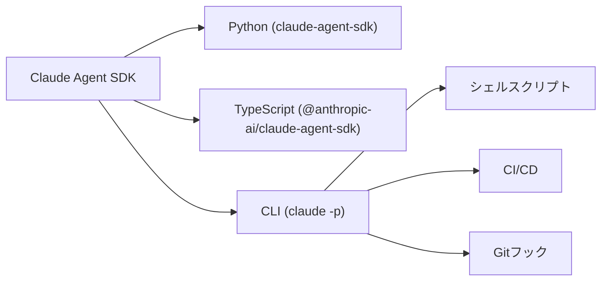

Claude Codeには `-p`（`--print`）という非対話実行フラグがあります。CIパイプライン、Gitフック、シェルスクリプトなど、人間がターミナルに張り付かなくても Claude にタスクを任せられる仕組みです。

以前は「ヘッドレスモード」と呼ばれていましたが、現在は[Claude Agent SDK](https://platform.claude.com/docs/en/agent-sdk/overview)エコシステムの一部として位置づけられています。単なる非対話実行ではなく、構造化出力・スキーマ指定・ストリーミング・会話継続まで備えた自動化インターフェースです。

この記事では、基本的な使い方から `--bare`・`--json-schema`・ファンアウトパターンまで、実際のCI・スクリプト用途に即した実践パターンを整理します。

## 前提・環境

| 項目 | 内容 |
|------|------|
| OS | macOS（Windows/Linuxでも動作） |
| Claude Code | v2.x 系（2026年4月時点） |
| 対象読者 | Claude Codeをインタラクティブに使っており、CI/スクリプト連携に興味があるエンジニア |

## `claude -p` とは — 非対話実行の基本

### 基本の動かし方

`claude -p` はプロンプトを引数に渡して、結果をstdoutに返すモードです。セッション管理は不要で、コマンド一発で完結します。

```bash
# 質問を投げて回答を得る
claude -p "What does the auth module do?"

# ツールを許可して実際にコードを操作させる
claude -p "Find and fix the bug in auth.py" --allowedTools "Read,Edit,Bash"
```

パイプでの入力も受け付けるため、他のコマンドの出力をそのまま渡せます。

```bash
# git diff の結果をレビューさせる
git diff | claude -p "Review these changes for potential issues"
```

### インタラクティブモードとの違い

通常の `claude` コマンド（インタラクティブモード）とは、以下の点が異なります。

| 項目 | インタラクティブ | `-p` モード |
|------|---------------|------------|
| セッション管理 | 自動 | 明示的（`--continue` / `--resume`） |
| CLAUDE.md | 自動ロード | 自動ロード（`--bare` で省略可） |
| スキル・フック | 利用可 | ロードされるが `/` コマンドは使えない |
| MCP サーバー | 設定通り起動 | 設定通り起動（`--bare` で省略可） |
| 権限プロンプト | 対話的に表示 | `--allowedTools` で事前指定 |

`-p` モードでもデフォルトではCLAUDE.md、フック、MCPサーバーがロードされます。これが次に紹介する `--bare` で変わります。

### Claude Agent SDKとの関係

`claude -p` は単独のフラグではなく、[Claude Agent SDK](https://platform.claude.com/docs/en/agent-sdk/overview)エコシステムの一部として位置づけられています。Claude Agent SDKはPython（`claude-agent-sdk`）とTypeScript（`@anthropic-ai/claude-agent-sdk`）のパッケージも提供しており、CLIはその中で最もシンプルなエントリーポイントです。



なお、以前は「Claude Code SDK」という名称でしたが、コーディング以外のエージェント用途にも対応するため「Claude Agent SDK」にリネームされています。SDKではデフォルトでClaude Codeのシステムプロンプトやファイルシステム設定（CLAUDE.md等）を読み込まない設計になっており、CLIの `--bare` と同じ方向性です。

CLIでプロトタイプを組んで、複雑な制御が必要になったらSDKに移行する——という段階的なアプローチが取れます。

## `--bare` モードを使う — CIで再現性を確保する

### `--bare` が解決する問題

通常の `-p` 実行は、ローカル環境のフック、スキル、MCP設定、CLAUDE.mdをすべてロードします。これは個人の開発マシンでは便利ですが、CIでは問題になります。

チームメンバーの `~/.claude` に特殊なフックが入っていたり、プロジェクトの `.mcp.json` がローカル前提のサーバーを参照していたりすると、「自分のマシンでは動いたのにCIで動かない」が発生します。

`--bare` はこれらをすべてスキップします。

```bash
# bare モード: 明示的に渡したものだけが有効
claude --bare -p "Summarize this file" --allowedTools "Read"
```

### bare モードで追加コンテキストを渡す方法

`--bare` で省略されたコンテキストは、必要に応じて個別に追加できます。

| 目的 | フラグ |
|------|--------|
| システムプロンプト追加 | `--append-system-prompt` |
| システムプロンプト（ファイル） | `--append-system-prompt-file` |
| 設定ファイル | `--settings <file-or-json>` |
| MCPサーバー | `--mcp-config <file-or-json>` |

認証もキーチェーン/OAuthをスキップするため、`ANTHROPIC_API_KEY` 環境変数で渡します。CI環境では GitHub Actions の `${{ secrets.ANTHROPIC_API_KEY }}` のようにシークレットマネージャー経由で渡すのが基本です。`.env` ファイルへの直書きやリポジトリへのコミットは避ける必要があります。

:::message
`--bare` は現時点ではオプトインですが、[公式ドキュメント](https://code.claude.com/docs/en/headless)では将来的に `-p` のデフォルト動作になる予定とされています（時期は未定）。今から `--bare` 前提でスクリプトを組んでおくと、移行時に変更が不要になります。
:::

### CI環境での推奨構成

GitHub Actionsでの典型的な構成はこのようになります。

```bash
# --bare + 明示的ツール指定 + JSON出力 + 安全ガード
claude --bare -p "Run lint and report failures" \
  --allowedTools "Bash(npm run lint)" \
  --output-format json \
  --max-turns 10 \
  --max-budget-usd 1.00
```

これらのフラグを組み合わせる理由は以下の通りです。

- `--bare`: 環境差を排除する
- `--allowedTools`: 実行可能なコマンドを絞る
- `--output-format json`: 後続処理でパースしやすくする
- `--max-turns`: ツール実行の最大回数を制限し、無限ループを防ぐ
- `--max-budget-usd`: コスト上限を設定し、暴走時のコスト爆発を防ぐ

`--max-turns` と `--max-budget-usd` は無人実行の安全ガードとして重要です。特にCIで権限を広めに設定する場合、この2つがないと意図しない長時間実行やコスト超過が発生するリスクがあります。

開発中のデバッグには `--verbose` を追加すると、ツール呼び出しの詳細が確認できます。

## 出力を制御する — `--output-format` と `--json-schema`

### 3つの出力形式

`--output-format` で出力のフォーマットを切り替えられます。

| フォーマット | 用途 | 特徴 |
|-----------|------|------|
| `text`（デフォルト） | 人間向け | Markdownテキストをそのまま出力 |
| `json` | スクリプト連携 | `result` フィールドにテキスト、メタデータ付き |
| `stream-json` | リアルタイム処理 | トークン単位で改行区切りJSON |

スクリプトで結果を使う場合は `json` を選び、`jq` で抽出するのが定番です。

```bash
# result フィールドからテキストを取得
claude -p "Summarize this project" --output-format json | jq -r '.result'
```

### `--json-schema` でスキーマ準拠の出力を得る

自動化で最も効果的なのが `--json-schema` です。任意のJSONスキーマを渡すと、レスポンスの `structured_output` フィールドにスキーマ準拠のデータが入ります。

```bash
# 関数名の配列を抽出する例
claude -p "Extract the main function names from auth.py" \
  --output-format json \
  --json-schema '{"type":"object","properties":{"functions":{"type":"array","items":{"type":"string"}}},"required":["functions"]}' \
  | jq '.structured_output'
```

テキストベースの出力を正規表現でパースする必要がなくなるため、後続処理の堅牢性が大きく向上します。活用場面としては以下のようなケースがあります。

- **コードレビュー結果の数値化**: 重要度・カテゴリをスキーマで定義してパース
- **テスト結果のサマリー**: pass/fail/件数を構造化データで受け取る
- **ファイル分析**: 依存関係やメトリクスを JSON 配列で返させる

### ストリーミングで大きなタスクを扱う

長時間実行するタスクでは `stream-json` を使うと、トークン単位でリアルタイムに出力を受信できます。

```bash
# テキストデルタだけを抽出してリアルタイム表示
claude -p "Write a detailed analysis" \
  --output-format stream-json --verbose --include-partial-messages | \
  jq -rj 'select(.type == "stream_event" and .event.delta.type? == "text_delta") | .event.delta.text'
```

APIリクエストが失敗した場合は `system/api_retry` イベントが発行されます。このイベントには `attempt`、`max_retries`、`retry_delay_ms`、`error_status` が含まれており、カスタムのリトライロジックに使えます。

なお、`--json-schema` と `stream-json` を併用した場合、`structured_output` は最終イベントにのみ含まれます。ストリーミング中に構造化データを逐次処理したい場合は、テキストデルタを受け取ってから最後にまとめてパースする設計にする必要があります。

## ツール権限を制限する — `--allowedTools` と permission mode

### `--allowedTools` で最小権限を指定する

無人実行では、Claudeが使えるツールを明示的に絞ることが重要です。`--allowedTools` はプレフィックスマッチングで動作します。

```bash
# git 操作のみ許可するコミット自動化
claude -p "Look at my staged changes and create an appropriate commit" \
  --allowedTools "Bash(git diff *),Bash(git log *),Bash(git commit *)"
```

:::message alert
`Bash(git diff *)` のようにスペース + `*` を付ける点に注意が必要です。`Bash(git diff*)` だと `git diffstat` など意図しないコマンドにもマッチします。
:::

### permission mode でベースラインを設定する

`--allowedTools` は個別のツール指定ですが、`--permission-mode` はベースラインのポリシーを設定します。

CI向けで主に使うのは以下の2つです。

| モード | 挙動 | CI向けの用途 |
|-------|------|-------------|
| `acceptEdits` | ファイル書き込みは自動承認、シェルコマンドは `--allowedTools` が必要 | Lint修正、コード生成 |
| `dontAsk` | `permissions.allow` にないツールは拒否（未許可ツールで即中止） | ロックダウンCI |

```bash
# lint 修正をファイルに書き込ませる（コマンド実行は不許可）
claude -p "Apply the lint fixes" --permission-mode acceptEdits
```

`acceptEdits` は「ファイル編集は信頼するが、任意のシェルコマンドは実行させたくない」場面に適しています。

:::message
他にも `default`、`plan`、`bypassPermissions`、`auto` モードがあります。`auto` モードは別の分類器モデルがリスク判定を行いますが、Teamプラン以上が必要です。詳細は[公式ドキュメント](https://code.claude.com/docs/en/permission-modes)を参照してください。
:::

### セキュリティ上の注意

CI環境で `--allowedTools` を省略して `--permission-mode` だけに頼るのは避けた方が安全です。特にファンアウト実行（後述）で多数のプロセスが並列に走る場合、各プロセスが触れる範囲を明示的に絞ることでリスクを限定できます。

`--bare` と `--allowedTools` を併用して、実行スコープを最小限にするのが基本方針です。

## 実践パターン集 — コミット・レビュー・ファンアウト

### PRレビュー自動化

GitHub CLIと組み合わせると、PRレビューを自動化できます。

```bash
# PR の diff をセキュリティ観点でレビュー
gh pr diff "$PR_NUMBER" | claude -p \
  --append-system-prompt "You are a security engineer. Review for vulnerabilities." \
  --output-format json
```

`--output-format json` で返すことで、結果をSlack通知やGitHub Commentに連携しやすくなります。`--json-schema` と組み合わせれば、重要度やカテゴリ別に構造化した結果を得ることもできます。

### ファンアウトパターン — 大量ファイルを並列処理する

多数のファイルに対して同じ操作を実行したい場合、ループで `-p` を回すパターンが使えます。

```bash
# ファイル単位でマイグレーション（while read でスペース含むパスにも対応）
while IFS= read -r file; do
  claude --bare -p "Migrate $file from React to Vue. Return OK or FAIL." \
    --allowedTools "Read,Edit" \
    --max-turns 15 \
    --max-budget-usd 0.50
done < files.txt
```

このパターンを実行する際のポイントは以下の通りです。

1. **まず少数で検証する**: 2-3ファイルでプロンプトの精度を確認してからフルスケールに移行する
2. **戻り値をシンプルに保つ**: `OK` / `FAIL` のように後続処理で扱いやすい形式にする
3. **権限を絞る**: 各プロセスが触れるツールを最小限にする
4. **ファイル単位で分離する**: 各プロセスが異なるファイルのみを操作するようにして、同じファイルへの同時編集（レースコンディション）を避ける
5. **コスト上限を設定する**: `--max-budget-usd` でファイル単位のコスト上限を設定する。2000ファイル × $0.50 = 最大$1000 のように全体のコスト感が見積もれる

:::message
並列実行する場合は `xargs -P` や GNU parallel との組み合わせも有効です。ただし、Anthropic APIにはレート制限があるため、並列度は3-5程度から始めて、`429 Too Many Requests` が返らない範囲で調整するのが現実的です。ストリーミングの `system/api_retry` イベントを監視すれば、プログラム的にスロットリングを実装することもできます。
:::

### Lint自動修正フック

pre-commitフックに組み込む場合、`--bare` が特に効果的です。ローカル環境の差異をフックレベルで吸収できます。

```bash:pre-commit
#!/bin/bash
staged=$(git diff --cached --name-only)
claude --bare -p "Fix lint errors in: $staged" \
  --allowedTools "Read,Edit,Bash(npm run lint)" \
  --permission-mode acceptEdits
```

### パイプライン統合

既存のデータ処理パイプラインに Claude を挟み込むことも可能です。

```bash
# 既存パイプラインに Claude を統合
cat report.csv | claude -p "Summarize the key trends" --output-format json | jq -r '.result' > summary.txt
```

入力をstdinから受け取り、出力をstdoutに返す——Unix哲学に沿った使い方ができます。

## 会話を継続する — `--continue` と `--resume`

### 直前の会話を引き継ぐ

`-p` モードでも会話のコンテキストを維持できます。`--continue` で直前の会話を引き継ぎます。

```bash
# ステップ1: コードベースをレビュー
claude -p "Review this codebase for performance issues"

# ステップ2: 前の結果を踏まえて深掘り
claude -p "Now focus on the database queries" --continue

# ステップ3: サマリーを生成
claude -p "Generate a summary of all issues found" --continue
```

段階的に分析を深めるワークフローで有用です。

### セッションIDで特定の会話を再開する

複数の並列レビューを管理する場合は、セッションIDを使って特定の会話を再開できます。

```bash
# セッションIDをキャプチャ
session_id=$(claude -p "Start a review" --output-format json | jq -r '.session_id')

# 後で再開
claude -p "Continue that review" --resume "$session_id"
```

`--output-format json` のレスポンスには `session_id` が含まれるため、これを変数やファイルに保存しておけば、任意のタイミングで会話を再開できます。

## まとめ

`claude -p` の実践パターンを用途別に整理しました。

| やりたいこと | 使うフラグ |
|------------|-----------|
| CIで再現性を確保 | `--bare` |
| スクリプトでパース | `--output-format json` |
| スキーマ準拠の出力 | `--json-schema` |
| ツールを絞る | `--allowedTools` |
| ファイル書き込みのみ許可 | `--permission-mode acceptEdits` |
| 大量ファイル処理 | while read ループ + `-p` |
| 会話を引き継ぐ | `--continue` / `--resume` |
| 無限ループ防止 | `--max-turns` |
| コスト上限 | `--max-budget-usd` |

`--bare` は将来的に `-p` のデフォルト動作になる予定です（時期は未定）。今のうちから `--bare` 前提で構成しておくと、移行時に変更が不要です。

`--json-schema` による構造化出力と組み合わせると、Claudeの出力を後続スクリプトが確実にパースできるパイプラインを構築できます。より複雑な制御が必要になった場合は、[Claude Agent SDK](https://platform.claude.com/docs/en/agent-sdk/overview)（`claude-agent-sdk` / `@anthropic-ai/claude-agent-sdk`）への移行も選択肢になります。

---
