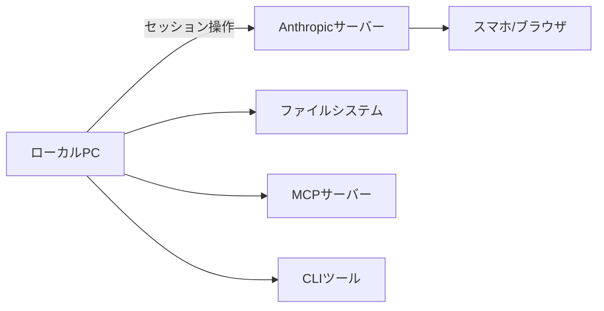

Claude Codeを毎日使っていても、チャット欄にプロンプトを打つだけで終わっていることは多いのではないでしょうか。Claude Codeにはチャットの外側に、作業効率を大きく変える機能がいくつもあります。会話履歴を汚さないサイドクエスチョン、スマホからのリモート操作、チェックポイントによる巻き戻しなど、知っているかどうかで日常の開発体験が変わります。

この記事では、チャット以外の便利機能を7つ厳選して紹介します。加えて、並列セッションを使ったレビューパターンやよくある失敗パターンも整理しました。

## 前提・環境

| 項目 | 内容 |
|------|------|
| OS | macOS（Windows/Linuxでも動作） |
| Claude Code | v2.x 系 |
| 対象読者 | Claude Codeを使い始めて数週間以上のエンジニア |

各機能で対応バージョンが異なる場合は、個別に記載しています。

## /btw — 会話を汚さないサイドクエスチョン

`/btw` は、メインの会話履歴に影響を与えずに質問できるスラッシュコマンドです。

### /btw の仕組み

実装作業中に「このライブラリのライセンスって何だっけ」「このHTTPステータスコードの意味は」といった、本筋と関係ない疑問が浮かぶことがあります。そのままチャットに打つと会話が脱線し、元の作業コンテキストが薄まってしまいます。

`/btw` を使うと、質問と回答がオーバーレイとして表示され、メインの会話履歴に蓄積されません。作業のコンテキストが薄まらないため、長時間セッションでも気兼ねなく使えます。v2.1.72以降で利用可能です。

```bash
# メインの会話を中断せずに質問
/btw MITライセンスとApache 2.0の違いを教えて
```

:::message
`/btw` ではファイル読み取りやコマンド実行はできません。既にコンテキスト内にある情報をもとに回答する仕組みです。コードの中身を確認したい場合は、メインの会話で質問する必要があります。
:::

### 使いどころ

`/btw` が特に役立つのは以下のような場面です。

- 実装中に浮かんだ技術的な疑問をその場で解消したい
- 作業の本筋から外れるが、今知っておきたいことがある
- 会話履歴をきれいに保ちたい（後から振り返りやすい）

`/btw` を使わずにそのまま質問すると、Claude は文脈を維持しようとして、元の作業に戻るときに混乱が生じることがあります。サイドクエスチョンはサイドクエスチョンとして分離するのが、コンテキスト管理の基本です。

## /rc — スマホからローカル環境をリモート操作

`/rc`（Remote Control）は、CLIセッションをスマホやブラウザからリモート操作できる機能です。

### Remote Control の概要

Remote Control を有効にすると、ローカルマシンで動いている Claude Code セッションに、スマホやタブレットのブラウザからアクセスできます。ファイルシステム、MCPサーバー、各種ツールはすべてローカルのものがそのまま使えます。ソースコードはクラウドに保存されませんが、セッションの操作（プロンプト入力、権限承認など）は[Anthropicのサーバーを経由](https://code.claude.com/docs/en/remote-control)します。



### セットアップと使い方

新規セッションでリモート操作を始める場合と、既存セッション内で有効化する場合の2パターンがあります。

```bash
# パターン1: 新規セッション開始
claude remote-control

# パターン2: 既存セッション内で有効化
/rc

# セッション名をつけてからリモート化（スマホから見つけやすい）
/rename feat/auth-refactor
/rc
```

全セッションで自動的にリモート操作を有効にしたい場合は、`/config` から「Enable Remote Control for all sessions」を有効にします。

### ユースケース

Remote Control は以下のような場面で活用できます。

- **長時間タスクの進捗確認**: ビルドやテスト実行中に、デスクから離れてもスマホで進捗を確認
- **権限承認**: ファイル書き込みやコマンド実行の許可をスマホからワンタップで承認
- **移動中の継続作業**: カフェやミーティングの合間にセッション状態を確認し、次の指示を出す

## /add-dir — 複数リポジトリを1セッションで扱う

`/add-dir` は、現在のセッションに別のディレクトリを追加するコマンドです。

フロントエンドとバックエンドが別リポジトリに分かれている構成は珍しくありません。従来はリポジトリごとに別セッションを立ち上げる必要がありましたが、`/add-dir` を使えば1セッションで横断的に作業できます。

```bash
# バックエンドリポジトリのセッション中に、フロントエンドを追加
/add-dir ~/Development/frontend-app
```

追加したディレクトリ内のファイルも読み書き対象になります。APIの仕様変更に伴うフロントエンドの型定義修正など、リポジトリをまたぐ作業が1つの会話の中で完結します。

:::message
`/add-dir` で追加したディレクトリは、そのセッション中のみ有効です。新しいセッションでは再度追加が必要です。常時追加したい場合は `settings.json` の `additionalDirectories` に設定する方法もあります。
:::

:::message alert
追加したディレクトリに CLAUDE.md がある場合、その内容も読み込まれます。信頼できるディレクトリのみを追加するようにしてください。
:::

## docs map — LLM向けドキュメントインデックス

docs map は、Claude Codeの公式ドキュメントをLLMが効率的に参照するためのメタドキュメントです。

### docs map とは

Claude Codeのドキュメントサイトには、LLM向けに構造化された `llms.txt` 形式のインデックスページが用意されています。

- URL: `https://code.claude.com/docs/en/claude_code_docs_map`

このページにはドキュメント全体の構造がまとめられており、Claude Code自身がドキュメントを効率的にナビゲートできます。

### 活用方法

Claude Codeの機能について調べたいとき、docs map のURLをプロンプトに含めると、Claudeがドキュメント構造を把握した上で回答してくれます。

```bash
# docs map を参照してフック機能について調べる
"https://code.claude.com/docs/en/claude_code_docs_map を参照して、
hookの設定方法を教えて"
```

この仕組みは、自分のプロジェクトでも参考になります。プロジェクトのドキュメントを `llms.txt` 形式で整理しておくと、Claude Codeがプロジェクト固有のドキュメントを効率的に参照できるようになります。

## /rewind — 会話とコードをチェックポイントで巻き戻す

`/rewind` は、会話とファイル変更をまとめて過去の状態に巻き戻せるコマンドです。

### /rewind の仕組み

Claude Codeはセッション中に自動でチェックポイントを作成しています。`/rewind` を実行すると、過去のチェックポイント一覧が表示され、任意の時点まで巻き戻せます。キーボードショートカット `Esc + Esc` でも呼び出し可能です。

巻き戻しには複数のモードがあります。

| モード | 動作 |
|--------|------|
| Restore code and conversation | 会話履歴とファイル変更の両方を巻き戻す |
| Restore code only | ファイル変更だけを巻き戻し、会話履歴はそのまま |
| Summarize from here | 選択したメッセージ以降を要約し、コンテキストを圧縮する |

:::message alert
`/rewind` はClaude のファイル編集ツール（Edit / Write）経由の変更のみを追跡します。Bash コマンド（`rm`、`mv`、`cp` など）による変更は巻き戻せません。また、チェックポイントはセッション内で保持されますが、git のバージョン管理の代替ではありません。
:::

### git との使い分け

`git stash` や `git reset` でもコードの巻き戻しは可能ですが、`/rewind` には会話の状態も含めて巻き戻せるという利点があります。

「さっきのアプローチは筋が悪かった、2つ前の方針に戻りたい」という場面で、git だとコードは戻せても会話のコンテキストは残ったままです。`/rewind` なら会話もコードもまとめて巻き戻せるので、Claudeが古い方針を引きずることがありません。

一方、コミット済みの変更を巻き戻す場合は git のほうが適切です。`/rewind` はあくまでセッション内のチェックポイント管理であり、git のバージョン管理とは役割が異なります。

## /compact — 指示付きコンテキスト圧縮

`/compact` は、コンテキストウィンドウの使用量を圧縮するコマンドです。引数に指示を渡すことで、残す情報の優先度をコントロールできます。

### 基本の /compact と指示付き /compact の違い

引数なしの `/compact` は、会話全体を均等に要約して圧縮します。一方、引数付きの `/compact` は、指定した内容を重点的に保持しつつ圧縮します。

```bash
# 引数なし: 全体を均等に圧縮
/compact

# 引数あり: API変更に関する議論を重点保持
/compact Focus on the API changes

# 引数あり: エラーハンドリングの議論を重点保持
/compact Keep the error handling discussion
```

この違いは、長時間セッションで特定のトピックに集中したいときに効果を発揮します。均等に圧縮すると、重要な議論の細部が失われることがありますが、指示付きなら必要な情報を選択的に残せます。

### コンテキスト管理の目安

コンテキストの使用状況は `/context` コマンドで確認できます。管理の目安は以下のとおりです。

| 使用率 | 推奨アクション |
|--------|--------------|
| ~60% | そのまま作業を継続 |
| 60~80% | 必要に応じて `/compact` を検討 |
| 80%~ | `/compact` で圧縮、またはタスク切り替えなら `/clear` |

:::message
タスクを大きく切り替える場合は、`/compact` よりも `/clear` でコンテキストをリセットするほうが効率的です。`/compact` は同じタスクの続きを行うときに使います。
:::

## claude -p — ヘッドレス実行（概要）

`claude -p` は、インタラクティブセッションなしで Claude Code を実行するフラグです。CI/CD パイプライン、シェルスクリプト、バッチ処理などで活用できます。

```bash
# 基本的な使い方
claude -p "What does the auth module do?"

# ツール許可付き
claude -p "Find and fix the bug in auth.py" --allowedTools "Read,Edit,Bash"
```

`--bare` フラグを組み合わせると、フック・スキル・MCP サーバーなどの自動読み込みをスキップして高速に起動できます。CI 環境など、最小限の構成で実行したい場面に向いています。

:::message
`claude -p` の詳細な使い方は、別記事「[claude -p 実践ガイド（ヘッドレスモード / Agent SDK CLI）](https://zenn.dev/takish/articles/claude-code-headless)」で解説しています。
:::

## 実践パターン — Writer/Reviewer とサブエージェント委譲

ここまで紹介した7つの機能を組み合わせた実践パターンを2つ紹介します。

### Writer/Reviewer パターン

1つのセッションでコードを書き（Writer）、別のセッションでレビューする（Reviewer）パターンです。同じ人が書いてレビューする場合でも、セッションを分けることでレビューの客観性が上がります。

Writer セッションにはコードの実装コンテキストが蓄積されていますが、Reviewer セッションは差分だけを見るため、コードの読みやすさや設計上の問題に気づきやすくなります。

```bash
# セッション1（Writer）: 実装
claude  # 通常どおり実装作業

# セッション2（Reviewer）: レビュー
claude -p "Review the changes in the last commit for security and readability issues" \
  --allowedTools "Read,Bash(git diff *),Bash(git log *)"
```

### サブエージェントへの調査委譲

メインの作業中に調査が必要になったとき、サブエージェントに調査を委譲できます。メインのコンテキストを汚さずに調査結果だけを受け取れるため、コンテキストの節約になります。

この委譲は Claude Code が自動的に行う場合もあります。プロンプトで「この問題を調べて」と依頼すると、Claude Code がサブエージェントを立ち上げて調査し、結果をメインセッションに返してくれることがあります。

## よくある失敗パターン5つ

Claude Code を使い込んでいく中で、陥りがちなパターンを5つ挙げます。

| # | パターン | 問題 | 回避策 |
|---|---------|------|--------|
| 1 | キッチンシンクセッション | 1セッションに全部詰め込み、コンテキストが溢れる | タスク単位でセッションを分ける |
| 2 | 微修正ループ | 「ここ直して」を何度も繰り返し、手戻りが増える | 最初に要件を明確に伝える |
| 3 | コンテキスト管理の放置 | `/compact` を使わず、応答品質が下がる | `/context` で定期的に確認 |
| 4 | 曖昧な指示 | 「いい感じにして」で意図と異なる結果に | 具体的なゴールと制約を伝える |
| 5 | 巨大変更の丸投げ | 大規模リファクタを一度に依頼して破綻 | 段階的に分割して進める |

これらのパターンの多くは、コンテキスト管理の問題に帰着します。この記事で紹介した `/compact` `/rewind` `/btw` を適切に使うことで、セッションの品質を維持しやすくなります。

## まとめ

この記事で紹介した7つの機能を一覧にまとめます。

| 機能 | ひとこと | 使いどころ |
|------|---------|-----------|
| `/btw` | 会話を汚さないサイドクエスチョン | 本筋と関係ない疑問の解消 |
| `/rc` | スマホからリモート操作 | 長時間タスクの進捗確認・承認 |
| `/add-dir` | 複数リポジトリを1セッションに | リポジトリ横断の作業 |
| docs map | LLM向けドキュメントインデックス | ドキュメント参照の効率化 |
| `/rewind` | 会話とコードの巻き戻し | 方針変更時のやり直し |
| `/compact` | 指示付きコンテキスト圧縮 | 長時間セッションの品質維持 |
| `claude -p` | ヘッドレス実行 | CI/CD・スクリプト連携 |

チャットでの対話はClaude Codeの主要な使い方ですが、それだけではこのツールの半分しか使えていません。自分のワークフローに合う機能から1つずつ取り入れていくと、日々の開発体験が変わっていきます。

---
