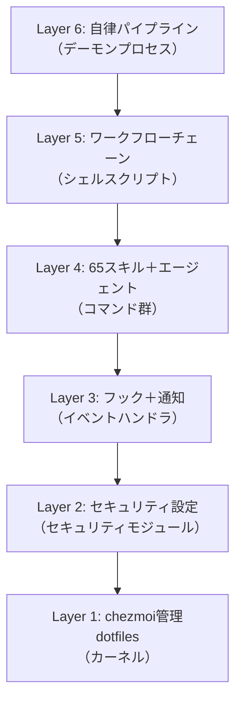
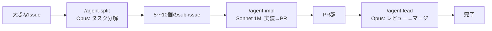

@[docswell](https://www.docswell.com/s/takish/TODO-dotfiles-aios)

## dotfilesは「設定ファイル集」から「開発OS」へ進化する

dotfilesといえば、`.zshrc` や `.vimrc` をGitHubで管理するもの。多くのエンジニアがそう認識しています。私もかつてはそうでした。

[chezmoi](https://www.chezmoi.io/)（シェモア）を導入してテンプレートやmodify_スクリプトで管理を効率化し、[Claude Code](https://code.claude.com/)（Anthropic社のAIコーディングエージェント）のスキルやフックを追加し、VOICEVOX（音声合成エンジン）による通知を載せ——気がつけば約310ファイル、65スキル、約170音声ファイルを管理するシステムになっていました。もはやこれは「設定ファイル集」ではありません。AI開発ワークフロー全体を駆動するオペレーティングシステムです。

この記事では、chezmoiをカーネル、Claude Codeをランタイムとする6層アーキテクチャの全体像と、その段階的な進化の軌跡を紹介します。「dotfilesの管理、もう少し何とかしたい」と感じている方に、新しい可能性を提示できれば幸いです。



## dotfilesの従来の管理手法には限界がある

### シェル設定管理ツールからの脱却が必要になった

従来のdotfiles管理は、シェル設定（`.zshrc`）やエディタ設定（`.vimrc`）をGitリポジトリに置くことが中心でした。シンボリックリンクを手動で張るか、GNU Stowのようなツールで管理する。それで十分な時代が長く続いていました。

しかしAIツールが開発環境の中核を占めるようになった2025年以降、状況は変わりました。Claude CodeのCLAUDE.md（AI向け指示書）、スキルファイル、フックスクリプト、MCP（Model Context Protocol）サーバー設定——これらはすべて「開発環境の設定」です。従来のdotfiles管理の枠組みでは、こうしたAI関連設定の管理には対応できませんでした。

### 「chezmoi apply 1コマンドで全環境再現」という体験

chezmoiを使えば、新しいマシンでのセットアップは1コマンドで完了できます。

```bash
chezmoi init --apply https://github.com/yourname/dotfiles
```

このコマンド1つで、以下のすべてが再現されます。

- シェル設定（80以上のエイリアス、カスタムプロンプト）
- ターミナル設定（Ghosttyの設定とカスタムテーマ）
- tmux設定（セッション別カラーテーマ）
- Claude Code 65スキル
- VOICEVOX 約170音声ファイル
- セキュリティ設定（パーミッション、フック）
- MCP接続設定（modify_スクリプトによる安全なマージ）

約310ファイルが一気にデプロイされる体験は、「設定ファイル管理」の枠を超えています。OSのインストーラーに近い感覚になります。

ただし「1コマンドで再現」には前提条件があります。`chezmoi apply` が再現するのはdotfilesの配置までです。以下は別途手動での設定が必要になります。

- **APIキー・トークン**: MCP接続設定の構造はchezmoiで管理していますが、APIキーやWebhook URLは各環境で手動設定が必要です
- **VOICEVOXエンジン**: 音声ファイル（wav）自体はchezmoi管理ですが、新規生成にはVOICEVOXエンジンのローカル起動が必要です
- **Homebrew・Xcode CLT**: 初回セットアップにはインターネット接続とXcode Command Line Toolsが前提です
- **Claude Codeバージョン**: スキルやフックの仕様はClaude Codeのバージョンに依存するため、バージョン更新時に動作確認が必要です

## 6層アーキテクチャで開発環境全体を構造化する

### OSメタファーで理解する設計思想

私のdotfilesは、以下の6層で構成しています。OSの概念に対応させると、それぞれの役割が明確になります。

| レイヤー | 役割 | OSでの対応概念 |
|---------|------|--------------|
| Layer 1 | chezmoi管理dotfiles（約310ファイル） | カーネル |
| Layer 2 | Claude Code設定・セキュリティ | セキュリティモジュール |
| Layer 3 | フック＋通知パイプライン | 割り込みハンドラ |
| Layer 4 | 65スキル＋エージェント | コマンド群 |
| Layer 5 | ワークフローチェーン | シェルスクリプト |
| Layer 6 | 自律パイプライン | デーモンプロセス |

chezmoiがカーネルとしてファイル状態を宣言的に管理し、Claude Codeがランタイムとしてスキルやワークフローを実行します。MCPサーバーはデバイスドライバのように外部サービス（GitHub、Slack、ブラウザ）との接続を担っています。

<!-- 画像: レイヤー対応表をビジュアル化した図。左にOS概念、右にdotfiles実装を並べる -->

### 主要な統計で見る規模感

現在のdotfilesリポジトリの規模を数字で示します。

- **管理ファイル数**: 約310
- **スキル数**: 65（サブファイル含め80以上）
- **音声ファイル**: 約170（7キャラクター × 24パターン）
- **フックイベント種**: 18（CLAUDE.mdで14カテゴリに整理して管理）
- **ワークフローチェーン**: 12本
- **ルーティングテーブル**: 37行（ユーザー意図 → スキル対応）
- **CLAUDE.md**: 約330行

「dotfilesリポジトリ」としては異例の規模です。しかし、すべてのファイルには明確な役割があり、6層のどこかに位置づけられています。

## Layer 1-2でファイル管理とセキュリティを確立する

### ソース状態からターゲット状態への宣言的管理

chezmoiの基本思想は「single source of truth」（唯一の信頼できるソース）です。`~/.local/share/chezmoi/` にあるソース状態から、`$HOME` のターゲット状態を再現します。OSのカーネルがハードウェア状態を管理するように、chezmoiがファイル状態を管理する仕組みになっています。

重要な特性として、chezmoiの操作は冪等（べきとう）です。`chezmoi apply` は何度実行しても同じ結果になります。また、`run_once_` プレフィックスを持つスクリプトは初回のみ実行される仕組みがあり、Homebrewのインストールのような一度だけ必要な初期化処理を安全に定義できます。

chezmoiのファイル名プレフィックスが、ファイルの属性を宣言的に定義します。

- **`dot_`**: ターゲットで `.` に変換されます（例: `dot_zshrc` → `.zshrc`）
- **`private_`**: 制限的なパーミッション（0600/0700）を付与します（例: `private_dot_config/ghostty/` → `~/.config/ghostty/`）
- **`executable_`**: 実行権限を付与します

このプレフィックス規則により、ファイル名だけで「何が」「どのような権限で」配置されるかを宣言できます。たとえばGhostty（GPUベースのターミナルエミュレータ）の設定ファイルとカスタムテーマは `private_dot_config/ghostty/` 配下で管理しており、`chezmoi apply` でパーミッション付きで配置されます。

### modify_スクリプトによる動的ファイル管理

chezmoiの強力な機能の1つに、modify_スクリプト（ファイル内容を動的に変換するスクリプト）があります。

私のdotfilesでは、`.claude.json`（Claude Codeの設定ファイル）の管理にmodify_スクリプトを活用しています。このファイルにはMCPサーバーの接続設定が含まれますが、APIキーなどの機密情報も混在しています。modify_スクリプトを使うことで、MCP設定の「構造」だけをchezmoiで管理し、機密情報はローカルに留める設計を実現しています。

この仕組みの詳細は、別記事「chezmoiのmodify_スクリプトで動的JSONを安全に管理する」で解説する予定です。

### パーミッション・フレームワークによるセキュリティ

AIエージェントに開発環境を操作させるには、安全なサンドボックスが不可欠です。私のdotfilesでは、Claude Codeのパーミッション設定を通じて、明確な許可・拒否ルールを定義しています。

**許可するオペレーション**:
- `Read(**)` — 全ファイルの読み取り
- `Write(src/**, docs/**)` — ソースコードとドキュメントへの書き込み
- `Bash(git push origin*:*)` — origin指定のgit pushのみ

**拒否するオペレーション**:
- `Bash(sudo:*)` — 特権昇格の禁止
- `Read/Write(.env*)` — 環境ファイルの保護
- `Read(id_rsa, id_ed25519)` — SSH鍵の保護
- `Bash(git push:*)` — origin未指定のpushを禁止

このルールにより、AIエージェントは「コードの読み書きとgit操作」に集中でき、システム破壊や機密情報漏洩のリスクを大幅に軽減しています。ただし、これらの制約にはハード制約（パーミッション設定による強制的な拒否）とソフト制約（CLAUDE.mdの指示による行動規範）の2種類がある点には注意が必要です。たとえば `Read(**)` で全ファイルの読み取りを許可しているため、機密ファイルの内容がコンテキストに含まれること自体は防げません。「出力しない」というルールはCLAUDE.mdによるソフト制約です。多層防御の設計思想として、ハード制約で致命的な操作をブロックし、ソフト制約で日常的な振る舞いを制御する構成を取っています。

<!-- 画像: パーミッション設定のコード例。許可と拒否が一目でわかる表形式 -->

## Layer 3-4で通知パイプラインとスキルシステムを構築する

### 最大3チャネル通知とVOICEVOX音声

Claude Codeがタスクを完了したり、ユーザーの操作を待っているとき、通知が届く仕組みを構築しています。通知は最大3つのチャネルで同時に発信されます（環境変数でVOICEVOXを効果音モードに切り替えたり、無効化することも可能です）。

1. **VOICEVOX音声通知** — 7キャラクター × 24パターン（約170ファイル）で、状況に応じた音声がバックグラウンドで再生されます
2. **macOSデスクトップ通知** — terminal-notifierを使った日本語メッセージです
3. **Slack Webhook通知** — リモートからもタスク状況を把握できます

Claude Codeのフックイベント（SessionStart、Stop、Notification、PermissionRequestなど18種類）をトリガーとして、これらの通知が自動的に発火します。キーボードから離れていても、AIの作業状況をリアルタイムに把握できるようになっています。

VOICEVOXキャラクターはセッションごとに自動で割り当てられるため、複数のClaude Codeセッションを同時に動かしているときも、音声だけでどのセッションの通知かを区別できます。この通知システムの構築詳細は、別記事「VOICEVOXでAIアシスタントに"声"を与える通知システム」で紹介する予定です。

### 65スキルの6カテゴリ分類

Claude Codeのスキル（Agent Skills）は、特定のタスクに対する専門的な指示セットです。私のdotfilesには65個のスキルが登録されており、以下の6カテゴリに分類しています（Privateスキル含む）。

| カテゴリ | 主なスキル | 使用モデル |
|---------|-----------|-----------|
| 設計・判断 | plan, code-review, arch-review, design, prompt-craft | Opus |
| 実行・実装 | engineer, debugger, test-coverage, chrome, agent-browser | Sonnet |
| コンテンツ | seo, aieo, spec-research, imagen-prompt, kling-prompt | Sonnet |
| チーム | team | Opus |
| ワークフロー | gate, kickoff, ship, issue-work, issue-sweep, commit | 混在 |
| @claudeパイプライン | agent-split, agent-impl, agent-lead, review-respond | Opus/Sonnet |

設計・判断系のスキルにはClaude Opus（高精度モデル）を、実行・実装系にはClaude Sonnet（高速モデル）を割り当てています。タスクの性質に応じてモデルを使い分けることで、コストと品質のバランスを取っています。

さらに、37行のルーティングテーブル（ユーザーの意図とスキルの対応表）を定義しています。ユーザーがスキルを明示的に指定しなくても、入力内容から適切なスキルを提案する仕組みになっています。このスキルシステムの設計思想は、別記事「Claude Code 60+スキルの設計哲学」で詳しく解説する予定です。

### CLAUDE.md — AIへの設定ファイル兼人間向けドキュメント

CLAUDE.md（Claude Codeのプロジェクト指示書）は、約330行に及ぶ設定ファイルです。このファイルの特殊性は、AIへの指示書と人間向けドキュメントの両方を兼ねている点にあります。

CLAUDE.mdには以下のような情報を記載しています。

- セキュリティポリシー（プロンプトインジェクション防御、認証情報保護）
- パーミッション設定（許可・拒否ルール）
- スキルルーティングテーブル（37行の意図→スキル対応表）
- ワークフローチェーン（12パターン）
- フックイベント一覧（18種類）
- chezmoi編集ルール

AIがこのファイルを読み込むことで、プロジェクトのルールを理解し、適切に振る舞ってくれます。同時に、人間の開発者がこのファイルを読めば、開発環境の全体像を把握できます。1つのMarkdownファイルが「設定」と「ドキュメント」の二重の役割を果たしているわけです。

<!-- 画像: CLAUDE.mdの構成をセクションごとに色分けした概要図 -->

## Layer 5-6でワークフローチェーンと自律パイプラインを実現する

### 12のワークフローチェーンで開発フローを定義する

個々のスキルを「コマンド」とすると、ワークフローチェーンは「シェルスクリプト」に相当します。よくある開発フローを、スキルの実行順序として明示的に定義しています。

代表的なワークフローチェーンは以下の通りです。

- **新機能開発**: `/kickoff` → `/engineer` → `/gate` → `/ship`
- **バグ修正**: `/debugger` → `/engineer` → `/gate` → `/ship`
- **設計からの実装**: `/plan` → `/kickoff` → `/engineer` → `/code-review` → `/ship`
- **Issue駆動（単発自動）**: `/issue-work <番号>`
- **Issue駆動（連続自動）**: `/issue-sweep`

`/kickoff` はブランチ作成と初期コミット、`/engineer` はコード実装、`/gate` はコミット前の品質チェック（複数のチェックを並列実行）、`/ship` はコミット・プッシュ・PR作成を一括実行するスキルになっています。

各スキルは独立して使えますが、ワークフローチェーンとして繋げることで、開発プロセス全体が再現可能になります。現在のステップが完了すると、次のステップが自動的に提案される仕組みも備えています。

### @claude自律パイプラインでIssueからマージまで自動化する

Layer 6は、人間の介入を最小限にした自律パイプラインです。大きなIssueを受け取り、分解・実装・レビュー・マージまでを一貫して実行してくれます。



このパイプラインには「1 Issue = 1 PR、変更ファイルは5つ以下、diffは200行以下」という制約を各スキルのSKILL.md内で定義しています。この制約により、各PRが小さく保たれ、レビューの品質が維持されます。大きな変更を小さなPRの集合に分解する設計は、人間のチーム開発のベストプラクティスと同じ考え方になっています。

`/agent-split` にはOpus（高精度モデル）を使い、タスクの分解精度を確保しています。`/agent-impl` にはSonnet 1M（100万トークンの長いコンテキスト）を使い、大規模なコードベースを理解した上で実装します。`/agent-lead` には再びOpusを使い、リスクサイズに応じた深度でレビューを行います。

### Agent Teamsとworktree分離で並列実行する

Claude Codeには複数のエージェントを同時に動かすAgent Teams機能があります。このとき問題になるのが、複数のエージェントが同じgitリポジトリで同時に作業するとコンフリクトが発生する点です。

この問題を、git worktree（1つのリポジトリから複数の作業ディレクトリを作成する機能）で解決しています。各エージェントが独立したworktreeで作業するため、互いのブランチ操作が干渉しません。OSのプロセス分離と同じ考え方になっています。

さらに、TeammateIdleフック（チームメイトのエージェントがアイドル状態になったときに発火するイベント）により、エージェントの稼働状況をリアルタイムに把握できます。スマートフォンからリモートで進捗を監視することも可能になっています。

<!-- 画像: Agent Teamsの並列実行イメージ。3つのworktreeが独立して動作する図 -->

## 段階的な進化の軌跡 — 一度に全部は作らない

### Phase 1〜3: dotfilesからAI統合へ

この6層アーキテクチャは、最初から設計したものではありません。約1年半をかけて段階的に進化してきました。

**Phase 1（伝統的dotfiles）**: `.zshrc`、`.tmux.conf`、`.vimrc` をGit管理するだけの段階です。多くのエンジニアがここからスタートされると思います。

**Phase 2（chezmoi導入）**: chezmoiを導入し、テンプレート機能やmodify_スクリプトで管理を高度化しました。マシン間の設定差異（macOS vs Linux）をテンプレートで吸収できるようになっています。

**Phase 3（Claude Code統合）**: Claude Codeの設定ファイル（CLAUDE.md）と、最初の10個程度のスキルを追加しました。この時点で「dotfilesにAI関連設定を入れる」というアイデアが固まりました。

### Phase 4〜6: 通知、体系化、自律化

**Phase 4（通知パイプライン構築）**: デスクトップ通知からSlack通知、VOICEVOX音声通知へと段階的に拡張しました。AIがバックグラウンドで動いている間の状況把握が課題だったため、必要に迫られて構築したレイヤーです。

**Phase 5（スキル体系化）**: スキルが60個を超えた時点で、6カテゴリ分類とルーティングテーブルを導入しました。スキルが増えるにつれ「どのスキルを使えばいいか」が分かりにくくなったため、自動提案の仕組みを整備しています。

**Phase 6（自律化）**: @claudeパイプライン（Issue分解→実装→レビュー→マージ）とAgent Teams（並列エージェント実行）を構築しました。人間がIssueを登録するだけで、実装からマージまでが自動的に進む段階になっています。

すべてのフェーズに共通しているのは「必要になったら足す」というアプローチです。最初から完璧な設計を目指すのではなく、課題に直面するたびにレイヤーを追加してきました。

### 始め方のガイド — Layer 1-2から

全部を一度に構築する必要はありません。以下の段階的なアプローチをおすすめします。

**ステップ1: chezmoiで基本dotfilesを管理する**
```bash
chezmoi init
chezmoi add ~/.zshrc
chezmoi add ~/.gitconfig
```

なお `.gitconfig` にはメールアドレスや credential helper の設定が含まれている場合があります。公開リポジトリで管理する場合は、`chezmoi edit ~/.gitconfig` でソースファイルを確認し、機密性のある行を `.tmpl` テンプレートに変換するか削除してからコミットしてください。

**ステップ2: CLAUDE.mdを追加する**
Claude Codeを使っているなら、プロジェクトルートにCLAUDE.mdを作成し、基本的なルールを書いてみてください。セキュリティポリシー（sudo禁止、.env保護）だけでも効果があります。

**ステップ3: 必要に応じて拡張する**
通知が欲しくなったらLayer 3を、スキルを体系化したくなったらLayer 4を追加していきます。すべてのレイヤーは独立しているため、必要なものだけを選んで構築できます。

## まとめ — dotfilesは「開発ワークフローの宣言的定義」になる

dotfilesは「設定ファイル集」ではなく、「開発ワークフローの宣言的定義」に進化できます。chezmoiがファイル状態を宣言的に管理し、Claude Codeがワークフローを実行し、`chezmoi apply` 1コマンドで全環境が再現される。これが6層アーキテクチャの本質になっています。

注意点として、この環境はmacOSに特化しています。Layer 3以上（通知パイプライン、VOICEVOX音声）はmacOS固有のツール（terminal-notifier等）に依存しており、LinuxやWSLで再現するには相応の修正が必要です。また、65スキルと約170音声ファイルの保守コストは小さくありません。Claude Codeの仕様変更があれば影響範囲の確認が必要ですし、CLAUDE.mdの肥大化にも継続的に向き合っています。

それでも、まずは `chezmoi init` と CLAUDE.md の作成から始めてみてください。Layer 1-2だけでも、開発環境の管理体験は大きく変わります。

