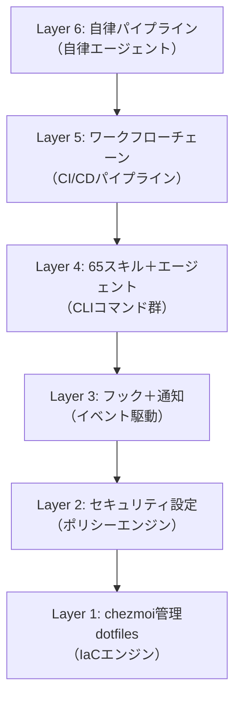

@[docswell](https://www.docswell.com/s/takish/TODO-dotfiles-aios)

## dotfilesは「設定ファイル集」から「AI OS as Code」へ進化する

dotfilesといえば、`.zshrc` や `.vimrc` をGitHubで管理するもの。多くのエンジニアがそう認識しています。私もかつてはそうでした。

[chezmoi](https://www.chezmoi.io/)（シェモア）を導入してテンプレートやmodify_スクリプトで管理を効率化し、[Claude Code](https://code.claude.com/)（Anthropic社のAIコーディングエージェント）のスキルやフックを追加し、VOICEVOX（音声合成エンジン）による通知を載せ——気がつけば約310ファイル、65スキル、約170音声ファイルを管理するシステムになっていました。もはやこれは「設定ファイル集」ではありません。AI開発ワークフロー全体を駆動するオペレーティングシステムです。

発端は「IaCの考え方はAIと親和性が高い」という気づきでした。IaCの本質は、望ましい状態をコードで宣言し、ツールに収束させること。これはAIエージェントの動作原理——指示（プロンプト）を宣言的に与え、エージェントに実行させる——と構造が同じです。Terraformが `terraform apply` でインフラを収束させるなら、開発環境だって `chezmoi apply` で収束させられるはず。そう考えて、dotfilesリポジトリをAI開発環境のIaCとして育て始めました。私はこのアプローチを **AI OS as Code** と呼んでいます。

そしてここに、従来のIaCにはなかった特性が生まれます。AIエージェントの設定をコードで管理しているということは、**AIエージェント自身がその設定を書き換えられる**ということです。スキルの改善、CLAUDE.mdの更新、フックの追加——これらをAIエージェントに任せると、改善された設定で次の仕事をこなし、そこで得た知見をまた設定に反映する。自己進化のループが回り始めます。

```
AIが作業する → 改善点に気づく → 設定をコードとして書き換える
      ↑                                    ↓
      ← chezmoi apply で反映 ←────────────┘
```

この記事では、chezmoiをIaCエンジン、Claude Codeをランタイムとする6層アーキテクチャの全体像と、その自己進化の仕組みを紹介します。「dotfilesの管理、もう少し何とかしたい」と感じている方に、新しい可能性を提示できれば幸いです。



## dotfilesの従来の管理手法には限界がある

### シェル設定管理ツールからの脱却が必要になった

従来のdotfiles管理は、シェル設定（`.zshrc`）やエディタ設定（`.vimrc`）をGitリポジトリに置くことが中心でした。シンボリックリンクを手動で張るか、GNU Stowのようなツールで管理する。それで十分な時代が長く続いていました。

しかしAIツールが開発環境の中核を占めるようになった2025年以降、状況は変わりました。Claude CodeのCLAUDE.md（AI向け指示書）、スキルファイル、フックスクリプト、MCP（Model Context Protocol）サーバー設定——これらはすべて「開発環境の設定」です。従来のdotfiles管理の枠組みでは、こうしたAI関連設定の管理には対応できませんでした。

### 「chezmoi apply 1コマンドで全環境再現」という体験

chezmoiを使えば、新しいマシンでのセットアップは1コマンドで完了できます。

```bash
chezmoi init --apply https://github.com/yourname/dotfiles
```

このコマンド1つで、以下のすべてが再現されます。

- シェル設定（80以上のエイリアス、カスタムプロンプト）
- ターミナル設定（Ghosttyの設定とカスタムテーマ）
- tmux設定（セッション別カラーテーマ）
- Claude Code 65スキル
- VOICEVOX 約170音声ファイル
- セキュリティ設定（パーミッション、フック）
- MCP接続設定（modify_スクリプトによる安全なマージ）

約310ファイルが一気にデプロイされる体験は、「設定ファイル管理」の枠を超えています。

> **注**: `chezmoi apply` が再現するのはファイルの配置までです。APIキーやWebhook URLの設定、VOICEVOXエンジンのインストール、Homebrew等の前提ツールは別途必要です。

## 6層アーキテクチャで開発環境全体を構造化する

### IaCの視点で理解する設計思想

私のdotfilesは、以下の6層で構成しています。それぞれをIaC/DevOpsの概念に対応させると、役割が明確になります。

| レイヤー | 役割 | 対応する概念 |
|---------|------|------------|
| Layer 1 | chezmoi管理dotfiles（約310ファイル） | IaCエンジン（Terraform的） |
| Layer 2 | Claude Code設定・セキュリティ | ポリシーエンジン（OPA/SELinux的） |
| Layer 3 | フック＋通知パイプライン | イベント駆動（Webhook/EventBridge的） |
| Layer 4 | 65スキル＋エージェント | CLIコマンド群 |
| Layer 5 | ワークフローチェーン | CI/CDパイプライン |
| Layer 6 | 自律パイプライン | 自律エージェント |

chezmoiがLayer 1でファイル状態を宣言的に管理し、Claude Codeがその上でランタイムとして動きます。MCPサーバーは外部サービス（GitHub、Slack、ブラウザ）との接続を担う、いわばAPIゲートウェイです。

<!-- 画像: レイヤー対応表をビジュアル化した図。左にIaC/DevOps概念、右にdotfiles実装を並べる -->

冒頭で触れた約310ファイルは、すべてこの6層のどこかに位置づけられています。以降のセクションで、各レイヤーの中身を掘り下げていきます。

## Layer 1-2でファイル管理とセキュリティを確立する

### ソース状態からターゲット状態への宣言的管理

chezmoiの基本思想は「single source of truth」（唯一の信頼できるソース）です。`~/.local/share/chezmoi/` にあるソース状態が正で、`chezmoi apply` を実行すると `$HOME` がその状態に収束します。冒頭で触れたIaCと同じ構造です。

重要な特性として、chezmoiの操作は冪等（べきとう）です。`chezmoi apply` は何度実行しても同じ結果になります。また、`run_once_` プレフィックスを持つスクリプトは初回のみ実行される仕組みがあり、Homebrewのインストールのような一度だけ必要な初期化処理を安全に定義できます。

chezmoiのファイル名プレフィックスが、ファイルの属性を宣言的に定義します。

- **`dot_`**: ターゲットで `.` に変換されます（例: `dot_zshrc` → `.zshrc`）
- **`private_`**: 制限的なパーミッション（0600/0700）を付与します（例: `private_dot_config/ghostty/` → `~/.config/ghostty/`）
- **`executable_`**: 実行権限を付与します

このプレフィックス規則により、ファイル名だけで「何が」「どのような権限で」配置されるかを宣言できます。たとえばGhostty（GPUベースのターミナルエミュレータ）の設定ファイルとカスタムテーマは `private_dot_config/ghostty/` 配下で管理しており、`chezmoi apply` でパーミッション付きで配置されます。

### modify_スクリプトによる動的ファイル管理

chezmoiの強力な機能の1つに、modify_スクリプト（ファイル内容を動的に変換するスクリプト）があります。

私のdotfilesでは、`.claude.json`（Claude Codeの設定ファイル）の管理にmodify_スクリプトを活用しています。このファイルにはMCPサーバーの接続設定が含まれますが、APIキーなどの機密情報も混在しています。modify_スクリプトを使うことで、MCP設定の「構造」だけをchezmoiで管理し、機密情報はローカルに留める設計を実現しています。

この仕組みの詳細は、別記事「chezmoiのmodify_スクリプトで動的JSONを安全に管理する」で解説する予定です。

### パーミッション・フレームワークによるセキュリティ

AIエージェントに開発環境を操作させるには、安全なサンドボックスが不可欠です。私のdotfilesでは、Claude Codeのパーミッション設定を通じて、明確な許可・拒否ルールを定義しています。

これらのルールは CLAUDE.md 内に以下のように記述しています。

```markdown
### Allowed Operations
- `Read(**)`: Universal read access
- `Write(src/**)`: Source code modifications
- `Write(docs/**)`: Documentation updates
- `Bash(git push origin*:*)`: Safe git push with explicit origin

### Denied Operations
- `Bash(sudo:*)`: No elevated privileges
- `Read/Write(.env*)`: Environment files protection
- `Read(id_rsa, id_ed25519)`: SSH key protection
- `Bash(git push:*)`: Direct push without origin specification
```

これにより、AIエージェントは「コードの読み書きとgit操作」に集中でき、システム破壊や機密情報漏洩のリスクを大幅に軽減できます。

ただし制約には2種類あります。パーミッション設定による**ハード制約**（強制的な拒否）と、CLAUDE.mdの指示による**ソフト制約**（行動規範）です。たとえば `Read(**)` で全ファイルの読み取りを許可しているため、機密ファイルの内容がコンテキストに含まれること自体は防げません。「出力しない」はソフト制約です。ハード制約で致命的な操作をブロックし、ソフト制約で日常の振る舞いを制御する——多層防御の構成を取っています。

<!-- 画像: パーミッション設定のコード例。許可と拒否が一目でわかる表形式 -->

## Layer 3-4で通知パイプラインとスキルシステムを構築する

### 最大3チャネル通知とVOICEVOX音声

Claude Codeがタスクを完了したり、ユーザーの操作を待っているとき、最大3チャネルで同時に通知が届きます。

1. **VOICEVOX音声通知** — 7キャラクター × 24パターン（約170ファイル）。状況に応じた音声がバックグラウンドで再生される
2. **macOSデスクトップ通知** — terminal-notifierによる日本語メッセージ
3. **Slack Webhook通知** — リモートからもタスク状況を把握できる

トリガーはClaude Codeのフックイベント（SessionStart、Stop、Notification、PermissionRequestなど18種類）です。フックは `settings.json` に定義します。

```jsonc
// ~/.claude/settings.json（抜粋）
{
  "hooks": {
    "Notification": [
      {
        "type": "command",
        "command": "~/.claude/hooks/terminal-notify.sh \"$CLAUDE_NOTIFICATION_TITLE\" \"$CLAUDE_NOTIFICATION_BODY\""
      }
    ],
    "Stop": [
      {
        "type": "command",
        "command": "~/.claude/hooks/voicevox-play.sh completion"
      }
    ]
  }
}
```

`Notification` はClaude Codeがユーザーの注意を引きたいとき、`Stop` は応答が完了したときに発火します。キーボードから離れていても、AIの作業状況がリアルタイムにわかります。

VOICEVOXキャラクターはセッションごとに自動で割り当てられるため、複数セッションを同時に動かしても音声だけでどの通知かを区別できます。構築の詳細は別記事「VOICEVOXでAIアシスタントに"声"を与える通知システム」で紹介予定です。

### 65スキルの6カテゴリ分類

Claude Codeのスキル（Agent Skills）は、特定のタスクに対する専門的な指示セットです。`.claude/skills/{name}/SKILL.md` に配置すると、Claude Codeが自動的に認識します。

```markdown
<!-- .claude/skills/ask/SKILL.md -->
---
name: ask
description: ちょっとした質問にサクッと回答。コード以外の一般的な疑問にも気軽に答える。
model: claude-sonnet-4-6
---

# Quick Q&A Assistant

簡潔に回答する。必要に応じて具体例を添える。専門用語は噛み砕いて説明する。
```

frontmatter の `name` と `description` は常にコンテキストに含まれ、本文はスキル起動時にだけ読み込まれる Progressive Disclosure（段階的開示）の設計です。私のdotfilesには65個のスキルが登録されており、以下の6カテゴリに分類しています（Privateスキル含む）。

| カテゴリ | 主なスキル | 使用モデル |
|---------|-----------|-----------|
| 設計・判断 | plan, code-review, arch-review, design, prompt-craft | Opus |
| 実行・実装 | engineer, debugger, test-coverage, chrome, agent-browser | Sonnet |
| コンテンツ | seo, aieo, spec-research, imagen-prompt, kling-prompt | Sonnet |
| チーム | team | Opus |
| ワークフロー | gate, kickoff, ship, issue-work, issue-sweep, commit | 混在 |
| @claudeパイプライン | agent-split, agent-impl, agent-lead, review-respond | Opus/Sonnet |

設計・判断系にはClaude Opus（高精度モデル）、実行・実装系にはClaude Sonnet（高速モデル）を割り当て、コストと品質のバランスを取っています。

さらに、37行のルーティングテーブル（ユーザーの意図とスキルの対応表）があり、スキルを明示的に指定しなくても入力内容から適切なスキルが提案されます。このスキルシステムの設計思想は、別記事「Claude Code 60+スキルの設計哲学」で詳しく解説予定です。

### CLAUDE.md — AIへの設定ファイル兼人間向けドキュメント

CLAUDE.md（Claude Codeのプロジェクト指示書）は、約330行に及ぶ設定ファイルです。このファイルの特殊性は、AIへの指示書と人間向けドキュメントの両方を兼ねている点にあります。

CLAUDE.mdには以下のような情報を記載しています。

- セキュリティポリシー（プロンプトインジェクション防御、認証情報保護）
- パーミッション設定（許可・拒否ルール）
- スキルルーティングテーブル（37行の意図→スキル対応表）
- ワークフローチェーン（12パターン）
- フックイベント一覧（18種類）
- chezmoi編集ルール

AIがこのファイルを読み込むことで、プロジェクトのルールを理解し、適切に振る舞ってくれます。同時に、人間の開発者がこのファイルを読めば、開発環境の全体像を把握できます。1つのMarkdownファイルが「設定」と「ドキュメント」の二重の役割を果たしているわけです。

ここに冒頭で触れた自己進化ループの具体例があります。CLAUDE.mdもSKILL.mdもMarkdownファイルなので、Claude Code自身が読み書きできます。実際の運用では、新しいスキルを作ったあと「CLAUDE.mdのルーティングテーブルに追記して」と頼むだけで、AIが自分のルーティング定義を更新します。ワークフローの改善も同様です。設定する側と設定される側が同じ存在なので、改善のサイクルが速い。

<!-- 画像: CLAUDE.mdの構成をセクションごとに色分けした概要図 -->

## Layer 5-6でワークフローチェーンと自律パイプラインを実現する

### 12のワークフローチェーンで開発フローを定義する

個々のスキルを「コマンド」とすると、ワークフローチェーンは「シェルスクリプト」に相当します。よくある開発フローを、スキルの実行順序として明示的に定義しています。

代表的なワークフローチェーンは以下の通りです。

- **新機能開発**: `/kickoff` → `/engineer` → `/gate` → `/ship`
- **バグ修正**: `/debugger` → `/engineer` → `/gate` → `/ship`
- **設計からの実装**: `/plan` → `/kickoff` → `/engineer` → `/code-review` → `/ship`
- **Issue駆動（単発自動）**: `/issue-work <番号>`
- **Issue駆動（連続自動）**: `/issue-sweep`

`/kickoff` はブランチ作成と初期コミット、`/engineer` はコード実装、`/gate` はコミット前の品質チェック（複数のチェックを並列実行）、`/ship` はコミット・プッシュ・PR作成を一括実行するスキルになっています。

各スキルは独立して使えますが、チェーンとして繋げることで開発プロセス全体が再現可能になります。現在のステップが完了すると、次のステップが自動的に提案されます。

### @claude自律パイプラインでIssueからマージまで自動化する

Layer 6は、人間の介入を最小限にした自律パイプラインです。大きなIssueを受け取り、分解・実装・レビュー・マージまでを一貫して実行してくれます。


このパイプラインには「1 Issue = 1 PR、変更ファイルは5つ以下、diffは200行以下」という制約を各スキルのSKILL.md内で定義しています。この制約により、各PRが小さく保たれ、レビューの品質が維持されます。大きな変更を小さなPRの集合に分解する設計は、人間のチーム開発のベストプラクティスと同じ考え方になっています。

`/agent-split` にはOpus（高精度モデル）を使い、タスクの分解精度を確保しています。`/agent-impl` にはSonnet 1M（100万トークンの長いコンテキスト）を使い、大規模なコードベースを理解した上で実装します。`/agent-lead` には再びOpusを使い、リスクサイズに応じた深度でレビューを行います。

### Agent Teamsとworktree分離で並列実行する

Claude Codeには複数のエージェントを同時に動かすAgent Teams機能があります。このとき問題になるのが、複数のエージェントが同じgitリポジトリで同時に作業するとコンフリクトが発生する点です。

この問題を、git worktree（1つのリポジトリから複数の作業ディレクトリを作成する機能）で解決しました。各エージェントが独立したworktreeで作業するため、互いのブランチ操作が干渉しません。CI/CDで並列ジョブごとにワークスペースを分離するのと同じ発想です。

TeammateIdleフック（チームメイトがアイドル状態になったとき発火するイベント）で稼働状況もリアルタイムに把握でき、スマートフォンからリモートで進捗を監視することも可能です。

<!-- 画像: Agent Teamsの並列実行イメージ。3つのworktreeが独立して動作する図 -->

## 結果的にこうなった — 最初から設計したわけではない

### 既存のdotfiles管理にAIが乗っかった

6層アーキテクチャという整理は後付けです。最初から設計したものではありません。

dotfilesのGit管理自体はずっと前からやっていました。`.zshrc` や `.tmux.conf` をリポジトリに置いて、途中でchezmoiに移行してテンプレートやmodify_スクリプトを使うようになった。ここまでは多くのエンジニアと同じ流れです。

転機になったのは、Claude Codeを本格的に使い始めたタイミングでした。CLAUDE.mdやスキルファイルを書くうちに、「これもdotfilesリポジトリに入れればchezmoiで管理できる」と気づいた。既存のdotfiles管理基盤にAI関連の設定が乗っかった、という方が実態に近いです。

### 必要に迫られて層が増えた

そこから先は、課題が出るたびに対処した結果です。

- AIがバックグラウンドで動いている間の状況がわからない → **通知パイプライン**を構築した
- スキルが60個を超えて「どれを使えばいいか」わからなくなった → **ルーティングテーブル**を整備した
- Issue単位で実装からマージまで自動化したくなった → **@claudeパイプライン**を構築した

振り返ると6層に整理できますが、実際には「困ったから足した」の繰り返しです。そしてこの「足す」作業自体を、途中からClaude Codeに任せるようになりました。新しいスキルのSKILL.mdを書かせ、CLAUDE.mdのルーティングテーブルを更新させ、フックスクリプトを追加させる。AIエージェントが自分の動作環境を拡張していく。このループが回り始めてから、dotfilesリポジトリの成長速度は明らかに上がりました。

## 始め方 — Layer 1-2から

全部を一度に構築する必要はありません。以下の段階的なアプローチで始められます。

**ステップ1: chezmoiで基本dotfilesを管理する**
```bash
chezmoi init
chezmoi add ~/.zshrc
chezmoi add ~/.gitconfig
```

なお `.gitconfig` にはメールアドレスや credential helper の設定が含まれている場合があります。公開リポジトリで管理する場合は、`chezmoi edit ~/.gitconfig` でソースファイルを確認し、機密性のある行を `.tmpl` テンプレートに変換するか削除してからコミットしてください。

**ステップ2: CLAUDE.mdを追加する**
Claude Codeを使っているなら、プロジェクトルートにCLAUDE.mdを作成し、基本的なルールを書いてみてください。セキュリティポリシー（sudo禁止、.env保護）だけでも効果があります。

**ステップ3: 必要に応じて拡張する**
通知が欲しくなったらLayer 3を、スキルを体系化したくなったらLayer 4を追加していきます。すべてのレイヤーは独立しているため、必要なものだけを選んで構築できます。

## まとめ — 自己進化するAI OS as Code

AI OS as Codeの本質は、宣言的な環境管理だけではありません。AIエージェントが自分の動作定義を書き換え、改善された環境でまた仕事をする——この自己進化ループにあります。

従来のIaCでは、設定ファイルを改善するのは常に人間でした。AI OS as Codeでは、スキル、CLAUDE.md、フック、ワークフローをAIエージェント自身が改善できます。使えば使うほど環境が育つ。これが決定的な違いです。

注意点として、この環境はmacOSに特化しています。Layer 3以上（通知パイプライン、VOICEVOX音声）はmacOS固有のツール（terminal-notifier等）に依存しており、LinuxやWSLで再現するには相応の修正が必要です。また、65スキルと約170音声ファイルの保守コストは小さくありません。Claude Codeの仕様変更があれば影響範囲の確認が必要ですし、CLAUDE.mdの肥大化にも継続的に向き合っています。

それでも、まずは `chezmoi init` と CLAUDE.md の作成から始めてみてください。Layer 1-2だけでも、宣言的な開発環境管理が手に入ります。そしてAIエージェントにその環境自体の改善を任せ始めたとき、dotfilesは単なる設定ファイルではなくなります。

