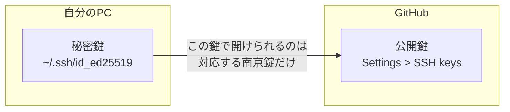

プログラミングを始めて間もない頃、「GitHubにコードを上げて」と言われて戸惑った経験はないでしょうか。授業の課題提出、チーム開発への参加、ポートフォリオの公開——きっかけは人それぞれですが、GitHubの前に「ターミナルって何？」「Gitって何？」「SSH鍵って何？」と疑問が連鎖して、最初の一歩でつまずく人は少なくありません。

この記事では、macOSでターミナルを開くところから、GitHubにコードをpushするところまでを一本道で案内します。寄り道せず、最短で「自分のコードがGitHubに載っている」状態を目指します。

## この記事のゴール

**ゴール**: 自分で書いたコードをGitHubにpushできる状態になること。

| 項目 | 内容 |
|------|------|
| 前提 | macOS（Intel / Apple Silicon 問わず） |
| 経験 | プログラミング経験ゼロでもOK |
| 所要時間 | 30〜60分 |

この記事では、ブランチ運用やチーム開発の話は扱いません。まずは「自分のコードをGitHubに置ける」というゴールだけに集中します。

全体の流れは以下のとおりです。


## ターミナルとHomebrewを用意する

### ターミナルはコンピュータとの対話窓口

普段Macを操作するとき、マウスやトラックパッドでアイコンをクリックしています。これがGUI（グラフィカル・ユーザー・インターフェース）です。一方、ターミナルは**文字を打ってコンピュータに指示を出す**ための窓口です。こちらをCLI（コマンドライン・インターフェース）と呼びます。

開発ではCLI操作が避けられません。理由はシンプルで、「手順を文字で記録できる」「同じ操作を正確に繰り返せる」「GUIより速い」からです。最初は戸惑いますが、この記事のコマンドをひとつずつ打っていけば慣れていきます。

### Ghosttyをインストールする（おすすめ）

macOSには「ターミナル.app」が最初から入っています。それをそのまま使っても、この記事の手順はすべて進められます。

ただ、これから長く使うものなので、モダンなターミナルアプリを最初から入れておくのもおすすめです。ここでは**Ghostty**を紹介します。

Ghosttyの特徴は3つです。

- **高速**: GPU描画で動作が軽い
- **設定がシンプル**: テキストファイル1つで設定が完結する
- **フォント内蔵**: JetBrains Monoフォント内蔵、Nerd Fontsアイコンにも対応

:::message
Ghosttyのインストールには後述するHomebrewが必要です。「まずは標準ターミナルで始めたい」という場合は、Spotlightで「ターミナル」と検索して起動してください。Homebrewの導入後にGhosttyをインストールすることもできます。
:::

Homebrewの導入が済んでいれば、以下のコマンドでインストールできます。

```bash
brew install --cask ghostty
```

インストール後、アプリケーションフォルダからGhosttyを起動します。黒い画面にカーソルが点滅していれば準備完了です。

:::details Ghosttyのおすすめ初期設定（コピペOK）

設定ファイルの場所は `~/.config/ghostty/config` です。まずファイルを作成します。

```bash
mkdir -p ~/.config/ghostty && touch ~/.config/ghostty/config
```

以下の内容をコピーして貼り付けてください。

```txt:~/.config/ghostty/config
# テーマ（ダークテーマ）
theme = Catppuccin Mocha

# フォントサイズ
font-size = 14

# ウィンドウ余白（文字が端に張り付かなくなる）
window-padding-x = 8
window-padding-y = 4
```

Ghosttyはデフォルトで JetBrains Mono が使えるため、フォント指定は省略しています。好みのフォントがあれば `font-family = "フォント名"` で変更できます。

テーマ一覧は以下のコマンドで確認できます。

```bash
ghostty +list-themes
```
:::

### Homebrewを入れる

Homebrewは、macOS用の**パッケージマネージャ**です。「アプリストアのCLI版」とイメージしてください。Git、GitHub CLI、その他の開発ツールを、すべて `brew install` で一元管理できます。

ターミナルを開いて以下のコマンドを貼り付けます。

```bash
/bin/bash -c "$(curl -fsSL https://raw.githubusercontent.com/Homebrew/install/HEAD/install.sh)"
```

:::message
このコマンドは公式サイト（https://brew.sh）に掲載されているものです。途中でmacOSのパスワード入力を求められます。
:::

インストールが終わったら、確認します。

```bash
brew --version
```

`Homebrew 4.x.x` のようにバージョンが表示されれば成功です。

:::message alert
Apple Silicon（M1以降）のMacでは、Homebrewのインストール後にパスの設定が必要な場合があります。インストール完了時に画面に表示される「Next steps」の指示に従ってください。
:::

## GitとGitHub CLIをインストールする

### Gitをインストールする

ここで、GitとGitHubの違いを整理しておきます。

| 名前 | 何をするもの | どこで動く |
|------|------------|----------|
| **Git** | ファイルの変更履歴を記録するツール | 自分のPC（ローカル） |
| **GitHub** | Gitのリポジトリをインターネット上で共有するサービス | クラウド |

Gitはバージョン管理の「エンジン」で、GitHubはそのエンジンで管理したコードを「公開・共有する場所」です。

Homebrewを使ってGitをインストールします。

```bash
brew install git
```

インストール後、バージョンを確認します。

```bash
git --version
```

`git version 2.x.x` と表示されればOKです。

次に、Gitに自分の名前とメールアドレスを登録します。これはコミット（変更の記録）に「誰が変更したか」を残すための設定です。

```bash
git config --global user.name "Your Name"
git config --global user.email "your-email@example.com"
```

上の `"Your Name"` と `"your-email@example.com"` は自分の情報に置き換えてください。

:::message
`Your Name` はGitHub上で公開される名前になります。本名でもハンドルネームでも構いません。メールアドレスはGitHubアカウントに登録するものと同じにしておくと管理しやすいです。
:::

### GitHub CLI（gh）をインストールする

GitHub CLI（コマンド名: `gh`）は、GitHub公式のコマンドラインツールです。このあとのGitHub認証やリポジトリ作成で使います。

```bash
brew install gh
```

```bash
gh --version
```

`gh version 2.x.x` と表示されればインストール完了です。

## GitHubアカウントを作る

### アカウント登録の手順

ブラウザで https://github.com にアクセスし、「Sign up」からアカウントを作成します。

入力する情報は以下の3つです。

| 項目 | ポイント |
|------|---------|
| メールアドレス | 大学のメール or 個人メール。Student Developer Packの申請には学校メールが有利 |
| ユーザー名 | 英数字とハイフンのみ。後から変更可能だが、URLが変わるため最初に決めておくのがおすすめ |
| パスワード | 15文字以上、または8文字以上で数字と小文字を含む |

登録後、入力したメールアドレスに確認メールが届きます。メール内のリンクをクリックして認証を完了してください。

### 学生ならGitHub Student Developer Packを申請する

学生は**GitHub Student Developer Pack**に申請できます。審査を通過すると、GitHub Copilot（AIコード補完）をはじめとする開発ツールが無料で使えるようになります。

申請はGitHubの設定画面から行えます。ただし、審査に数日かかることがあるため、この記事の続きは申請前でも問題なく進められます。

:::message
Student Developer Packの詳細と申請手順は別記事でまとめる予定です。
:::

## gh auth loginでGitHubにログインする

### 認証コマンドの実行

ここが最も重要なステップです。ターミナルからGitHubに接続するための認証を行います。

以下のコマンドを実行します。

```bash
gh auth login
```

対話形式でいくつかの質問が表示されます。以下のように選択してください。

```
? What account do you want to log into?
> GitHub.com                        ← そのままEnter

? What is your preferred protocol for Git operations on this host?
> SSH                               ← SSHを選択

? Generate a new SSH key to add to your GitHub account?
> Yes                               ← Yesを選択

? Enter a passphrase for your new SSH key (Optional):
>                                   ← 空のままEnterでOK

? Title for your SSH key:
> (GitHub CLI)                      ← そのままEnterでOK

? How would you like to authenticate GitHub CLI?
> Login with a web browser          ← ブラウザを選択
```

最後の選択をすると、`XXXX-XXXX` 形式の**ワンタイムコード**が表示されます。ブラウザが自動で開くので、そのコードを入力して「Authorize」をクリックしてください。

ターミナルに以下のようなメッセージが表示されれば認証完了です。

```
✓ Authentication complete.
✓ Configured git protocol
✓ Uploaded the SSH key to your GitHub account
- gh config set -h github.com git_protocol ssh
✓ Logged in as your-username
```

:::message
パスフレーズは「SSH鍵に追加するパスワード」です。空にしておくと操作がシンプルになります。ただし、空の場合はPCが盗難・不正アクセスされたときに鍵がそのまま使われるリスクがあります。共有PCでは必ず設定してください。設定すると、SSH接続のたびにパスフレーズの入力が求められます（macOSのキーチェーンに保存する設定も可能です）。
:::

### 接続テスト

認証がうまくいったか確認します。

```bash
ssh -T git@github.com
```

以下のように表示されれば成功です。

```
Hi your-username! You've successfully authenticated, but GitHub does not provide shell access.
```

初回接続時に `Are you sure you want to continue connecting (yes/no)?` と聞かれることがあります。これはGitHubサーバーの身元確認です。`yes` と入力してEnterを押してください。

:::details うまくいかない場合のチェックリスト

| 症状 | 原因と対処 |
|------|----------|
| `Permission denied (publickey)` | SSH鍵が正しく登録されていない。`gh auth login` をもう一度実行する |
| `ssh: connect to host github.com port 22: Connection refused` | ネットワークがSSH（ポート22）をブロックしている。学外のネットワークやモバイル回線で試す |
| `gh: command not found` | GitHub CLIがインストールされていない、またはパスが通っていない。`brew install gh` を再実行する |
| Homebrewのコマンドが見つからない | Apple Siliconの場合、パス設定が必要。ターミナルを再起動し、Homebrew導入時の「Next steps」を確認する |

認証状態は `gh auth status` コマンドでいつでも確認できます。
:::

## SSH鍵の仕組みを理解する

前のステップで `gh auth login` を実行したとき、裏ではSSH鍵の生成と登録が自動的に行われていました。ここでは「あのコマンドが裏で何をやったのか」を説明します。

### 公開鍵と秘密鍵 ── 南京錠と鍵のたとえ

SSH鍵は**2つでワンセット**です。



| 鍵の種類 | たとえ | 保管場所 | 他人に見せて良いか |
|---------|-------|---------|--------------|
| **秘密鍵** | 鍵（自分だけが持つ） | `~/.ssh/id_ed25519` | 絶対にダメ |
| **公開鍵** | 南京錠（相手に渡す） | GitHubに登録 | 見せてOK |

仕組みはシンプルです。GitHubに「南京錠」を渡しておき、接続時に自分のPCが「この南京錠を開けられる鍵を持っている」ことを証明します。パスワードをネットワーク上に流さずに認証できるため、安全性が高い方式です。

:::message alert
秘密鍵（`~/.ssh/id_ed25519`）は絶対に他人に送らないでください。メール添付やチャットでの共有もNGです。もし漏洩した場合は、GitHubの Settings > SSH keys から該当の公開鍵を削除し、新しい鍵ペアを作り直してください。
:::

### gh auth loginが自動でやったこと

手動で同じことをやると、以下の4ステップが必要です。

| ステップ | 手動でやる場合のコマンド | gh auth loginの場合 |
|---------|---------------------|-------------------|
| 1. 鍵ペアを生成 | `ssh-keygen -t ed25519 -C "email"` | 自動 |
| 2. 公開鍵をコピー | `pbcopy < ~/.ssh/id_ed25519.pub` | 自動 |
| 3. GitHubに公開鍵を登録 | ブラウザでSettings > SSH keysに貼り付け | 自動 |
| 4. 接続テスト | `ssh -T git@github.com` | 手動で確認 |

`gh auth login` は1〜3をすべて自動でやってくれます。GitHubの Settings > SSH and GPG keys を開くと、「GitHub CLI」というタイトルで鍵が登録されていることを確認できます。

## 最初のリポジトリを作ってpushする

ここまでの準備がすべて整いました。実際にコードをGitHubにpushしてみます。

### プロジェクトフォルダを作る

ターミナルで以下のコマンドを実行します。

```bash
mkdir ~/my-first-repo
cd ~/my-first-repo
```

`mkdir` はフォルダを作るコマンド、`cd` はそのフォルダに移動するコマンドです。

次に、ファイルを1つ作成します。

```bash
echo "# My First Repo" > README.md
```

この時点では、`my-first-repo` はただのフォルダです。GitにもGitHubにも、まだ何も関係していません。

### Gitで管理を始める（init → add → commit）

3つのコマンドを順番に実行します。

**1. `git init` — Gitで管理すると宣言する**

```bash
git init
```

```
Initialized empty Git repository in /Users/your-name/my-first-repo/.git/
```

このコマンドで、フォルダ内に `.git` という隠しフォルダが作られます。ここにGitが変更履歴を記録していきます。

**2. `git add` — 変更をステージングする**

```bash
git add README.md
```

`git add` は「この変更を次の記録（コミット）に含める」という指示です。写真の撮影前に「この人たちを撮るよ」と集合させるイメージです。

**3. `git commit` — 変更を記録する**

```bash
git commit -m "first commit"
```

```
[main (root-commit) abc1234] first commit
 1 file changed, 1 insertion(+)
 create mode 100644 README.md
```

`-m` のあとの文字列はコミットメッセージです。「何をしたか」を短く書きます。これで変更がローカルのGitに記録されました。

### GitHubにリポジトリを作ってpushする

ここで `gh` コマンドの出番です。以下の1行で、GitHubにリポジトリを作成し、コードをpushするところまで完了します。

```bash
gh repo create my-first-repo --public --source=. --push
```

```
✓ Created repository your-username/my-first-repo on GitHub
✓ Added remote git@github.com:your-username/my-first-repo.git
✓ Pushed commits to git@github.com:your-username/my-first-repo.git
```

このコマンドが裏でやっていることは以下の3つです。

| やっていること | 手動でやる場合の相当コマンド |
|-------------|----------------------|
| GitHubにリポジトリを作る | ブラウザでNew repositoryをクリック |
| ローカルとGitHubを紐づける | `git remote add origin git@github.com:...` |
| コードをGitHubに送る | `git push -u origin main` |

ブラウザで `https://github.com/your-username/my-first-repo` を開いてみてください。自分のREADME.mdが表示されていれば、**初pushは成功**です。

## よく使うGitコマンド早見表

日常的に使うコマンドをまとめておきます。

### 状態を確認する

| コマンド | 何がわかるか |
|---------|------------|
| `git status` | 変更されたファイル、ステージングの状態 |
| `git log --oneline` | コミット履歴を1行ずつ表示 |
| `git diff` | まだステージングしていない変更の内容 |

### 変更を記録・共有する

| コマンド | 何をするか |
|---------|----------|
| `git add ファイル名` | 変更をステージに追加 |
| `git add .` | すべての変更をステージに追加 |
| `git commit -m "メッセージ"` | ステージの内容を記録 |
| `git push` | ローカルの記録をGitHubに送る |
| `git pull` | GitHubの最新をローカルに取得する |

:::message
`git add .`（ドット付き）はフォルダ内のすべての変更を一括でステージングします。便利ですが、意図しないファイル（パスワードを含む設定ファイルなど）を含めてしまうリスクがあります。慣れるまではファイル名を指定する `git add ファイル名` を使うのが安全です。プロジェクトに `.gitignore` ファイルを作成して、追跡対象外のファイルを指定する方法もあります。
:::

## 次のステップ

この記事で扱った内容は、Git/GitHubのほんの入口です。ここから先に広がる世界を簡単に紹介します。

- **ブランチ**: `git branch` / `git checkout` で作業を分岐させる。チーム開発の基本
- **Pull Request**: GitHubの機能。コードの変更を他の人にレビューしてもらう仕組み
- **GitHub Copilot**: AIがコードの続きを提案してくれるツール。学生は無料で使える
- **ターミナルのカスタマイズ**: Ghosttyの設定やtmuxを使った画面分割で、開発効率が上がる

どれもこの記事の延長線上にあります。まずは今回の環境で何かコードを書いてpushすることを繰り返してみてください。

---

