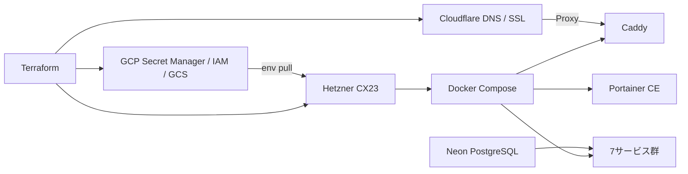
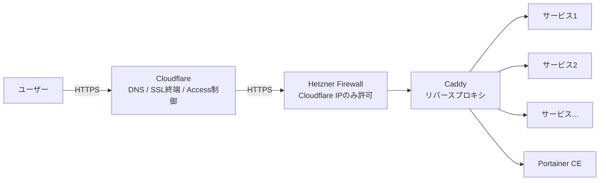
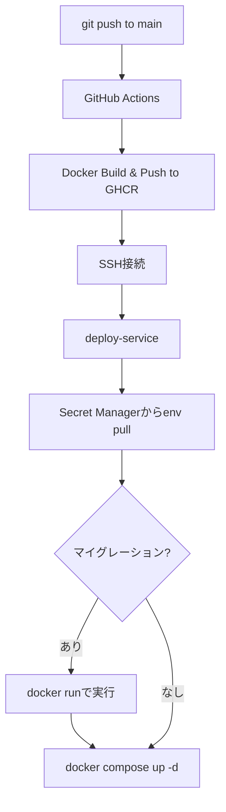

個人開発でWebサービスを量産したい。でも Cloud Run に常時起動サービスを10個並べると月1万円。GCE の無料枠は3つが限界——。Hetzner CX23（月€5）+ Cloudflare + GCP Secret Manager + Terraform を組み合わせたら、**7サービスが月額約700円で動く**マルチクラウド構成ができました。GCP の好きな部分は残したまま、コンピュートだけ安くする。この記事ではその設計と構築手順を、手元で再現できるレベルで共有します。

## 個人開発のコンピュートコスト問題は深刻

個人開発を続けていると、小さなWebサービスがどんどん増えていきます。

GitHub リポジトリの可視性を監視するツール、AI ロゴジェネレーター、数学学習アプリ、3Dモデルのポーズ変換ツール、LP のヒーローショット生成、Slack のカスタム絵文字 API、プロンプト共有ツール——。どれも単体では軽いサービスです。しかし数が増えると「どこで動かすか」が切実な問題になります。

最初は Google Cloud Run を使っていました。コンテナをデプロイするだけで動く手軽さは最高です。しかし常時起動のサービスを並べると、最小インスタンス数の設定次第では月額が想定以上に膨らみます。10サービスで月1万円が見えてきた時点で、個人開発としては厳しいと判断しました。

次に試したのが GCE e2-micro（Google Compute Engine の最小インスタンス）です。Always Free 枠（Billing Account あたり1台無料）を使えばタダですが、2 vCPU（共有、CPU 時間 25%）/ メモリ 1GB では2つのサービスを載せた時点で限界でした。3つ目を入れたら OOM（Out of Memory）で落ちます。

「GCP のエコシステムは好きだけど、コンピュートだけ安くできないか？」

この問いから、マルチクラウド構成にたどり着きました。

## Hetzner CX23 は月€5で 2vCPU / 4GB を提供する

Hetzner（ヘッツナー）はドイツのホスティング会社です。ヨーロッパでは有名ですが、日本ではまだマイナーな存在です。

CX23 という共有 vCPU プランのスペックは以下の通りです。

- 2 vCPU（共有）
- 4GB RAM
- 40GB SSD
- ヘルシンキリージョン
- **月額 €4.49（IPv4 アドレス込み、約700円）**

Cloud Run で月1万円かかっていた構成が、700円で収まります。10サービスどころか余裕があります。

ヘルシンキリージョンのため、日本からのレイテンシは約200〜250msあります。東京リージョンと比べると体感できる差です。ただし、自分のユースケースでは以下の理由で許容しています。

- ユーザー数が限定的で、大量の同時リクエストが発生しない
- API 中心の構成で、リアルタイム性が求められるサービスがない
- コストメリット（月700円 vs 月1万円）がレイテンシのデメリットを大きく上回る

レイテンシがクリティカルなサービスが出てきたら、そのサービスだけ Cloud Run や国内 VPS に分離する選択肢もあります。

:::message
2026年4月の価格改定で CX23 は €3.49 → €3.99 に値上がりします（IPv4 アドレス €0.50/月は別料金）。記事公開時点（2026年3月）の価格は €3.49 + €0.50 = €3.99/月です。ハードウェアコストの高騰が背景にありますが、それでも Cloud Run と比較すれば圧倒的に安価です。
:::

ただし Hetzner はただの VPS（Virtual Private Server）です。Cloud Run のようなマネージドサービスではありません。デプロイの仕組み、シークレット管理、SSL、DNS——全部自分で構築する必要があります。

ここで重要な設計判断をしました。

**GCP のエコシステムは捨てない。コンピュートだけを Hetzner に外出しする。**

## 設計方針は「好きなエコシステムの好きな部分だけ残す」

自分が GCP を好きな理由は明確です。

- **Terraform で全てを IaC 管理できる**こと
- **Secret Manager** でシークレットを安全に一元管理できること
- **IAM**（Identity and Access Management）で権限を最小限に制御できること
- **GCS**（Google Cloud Storage）で Terraform state をバージョニング管理できること

これらを手放して全部を Hetzner に寄せるのは嫌でした。`.env` ファイルをサーバーに直置きするような運用には戻りたくありません。逆に、全部を GCP に寄せるとコンピュートコストが跳ね上がります。

答えは「いいとこ取り」のマルチクラウドでした。各レイヤーの担当は以下の通りです。

- **シークレット管理**: GCP Secret Manager（Terraform で管理可能、IAM で権限制御）
- **権限管理**: GCP IAM（SA + secretAccessor で最小権限の原則を実現）
- **Terraform state**: GCS バケット（バージョニング有効、5世代まで保持）
- **DNS**: Cloudflare（無料、高速、Terraform プロバイダー対応）
- **SSL / CDN / WAF**: Cloudflare + Caddy（Full (strict) で end-to-end 暗号化、証明書は Caddy が自動管理、DDoS 防御付き）
- **死活監視**: GCE e2-micro + Uptime Kuma（Always Free で無料）
- **コンテナ管理 UI**: Portainer CE on Hetzner（ブラウザからログ・再起動・リソース監視）
- **メール送信**: AWS SES（$0.10/1,000通、月数百通なら実質数円）
- **DB**: Neon（外部 PostgreSQL。無料枠あり）
- **コンピュート**: **Hetzner CX23（€5/月で7サービス + Caddy + Portainer を集約）**

サーバーに載せるのは Docker Compose だけです。「状態を持たないコンピュートノード」として扱います。シークレットは GCP、DNS は Cloudflare、DB は Neon。サーバーが壊れても `terraform apply` で同じ環境を再構築できます。



## Cloudflare はこの構成の要になる



Cloudflare は DNS だけではありません。この構成では4つの役割を担っています。

### DNS の一元管理

全てのサブドメイン（`app1.example.com`、`app2.example.com` など）の A レコードを Cloudflare で管理しています。Terraform の Cloudflare プロバイダーを使って、サービスレジストリ（`var.services`）から DNS レコードを自動生成します。

サービスを1つ追加すれば、DNS レコードも自動的に作られます。手動で Cloudflare のダッシュボードを操作する必要はありません。

### SSL 終端（Full (strict) モード）

Cloudflare の SSL/TLS 暗号化モードは **Full (strict)** を採用しています。

- ユーザー → Cloudflare 間: **HTTPS**（Cloudflare が証明書を自動管理）
- Cloudflare → Hetzner（オリジン）間: **HTTPS**（Caddy が証明書を自動管理）

当初は Flexible モード（Cloudflare-オリジン間は HTTP）で運用していました。しかし認証機能を持つサービス（Better Auth 等）が増えてきたタイミングで、Cloudflare-オリジン間の通信も暗号化すべきと判断し、Full (strict) に移行しました。

「Full (strict) にすると証明書管理が面倒になるのでは？」と思うかもしれません。実際には、Caddy の **Cloudflare DNS チャレンジ**を使えば証明書の取得・更新が完全に自動化されます。Let's Encrypt の証明書を Caddy が自動で取得・更新し、手動での証明書管理は一切不要です。

```txt:Caddyfile
app1.example.com {
    reverse_proxy 127.0.0.1:3001
    tls {
        dns cloudflare {env.CF_API_TOKEN}
    }
}
```

Caddy の Docker イメージには DNS チャレンジ用のプラグインが必要です。`caddy-dns/cloudflare` モジュールを含むカスタムイメージをビルドするか、`caddy-docker-proxy` のようなプラグイン同梱イメージを使います。`CF_API_TOKEN` には Cloudflare API トークン（Zone:DNS:Edit 権限）を環境変数として渡します。

### Proxy モードによるオリジン IP の秘匿

Cloudflare の Proxy モード（`proxied = true`）を有効にすることで、Hetzner サーバーの実 IP アドレスが DNS から見えなくなります。

これにより、DDoS 攻撃がオリジンに直接到達することを防げます。さらに、Hetzner のファイアウォールで HTTPS ポート（443）への接続を **Cloudflare の IP レンジのみに制限**しています。Full (strict) 構成のため、80番ポートは開放していません。

:::details Hetzner Firewall の Cloudflare IP 制限（HCL）
```hcl:firewall.tf
# Hetzner Firewall: HTTPS は Cloudflare IP のみ許可
rule {
  direction = "in"
  protocol  = "tcp"
  port      = "443"
  source_ips = [
    "173.245.48.0/20",
    "103.21.244.0/22",
    "103.22.200.0/22",
    "103.31.4.0/22",
    "141.101.64.0/18",
    "108.162.192.0/18",
    "190.93.240.0/20",
    "188.114.96.0/20",
    "197.234.240.0/22",
    "198.41.128.0/17",
    "162.158.0.0/15",
    "104.16.0.0/13",
    "104.24.0.0/14",
    "172.64.0.0/13",
    "131.0.72.0/22",
    # https://www.cloudflare.com/ips-v4/
  ]
}
```
:::

Cloudflare を経由しない直接アクセスは全てブロックされます。SSH（ポート22）だけは全 IP から許可しています。

### Zero Trust Access による管理画面の保護

Uptime Kuma（死活監視ツール）の管理画面には、Cloudflare Access（Zero Trust）でアクセス制限をかけています。

指定したメールアドレスにワンタイムコードを送信し、認証を通過しないとページにアクセスできません。VPN や Basic 認証を設定する手間なく、管理画面を保護できます。Terraform でポリシーを定義するだけです。

## GHCR を選んだ理由——Artifact Registry からの移行

当初は GCP の Artifact Registry（AR）にコンテナイメージを保存していました。「GCP エコシステムに寄せる」方針に沿った選択です。

しかし Hetzner に移行した時点で、AR を使い続けるメリットが薄くなりました。

- **認証の複雑さ**: Hetzner 側で `docker pull` するために gcloud 認証が必要になる。GHCR（GitHub Container Registry）なら `docker login` だけで済む
- **GitHub Actions との親和性**: GHCR は `GITHUB_TOKEN` で認証が完結する。AR だと Workload Identity Federation か SA キーの設定が必要
- **コスト**: AR にはストレージ費用がかかる。GHCR は GitHub の無料枠で十分

設計方針の「GCP エコシステム維持」は Secret Manager・IAM・Terraform state が核心です。コンテナレジストリはコンピュートに付随するもので、VM を Hetzner に出した以上、レジストリも GitHub に寄せる方が自然でした。

移行作業は簡単で、GitHub Actions の `docker build & push` 先を `ghcr.io` に変えるだけです。Hetzner 側の `docker login` 先も変更しました。

## Docker Compose + Caddy + Terraform テンプレートでサービスを集約する

Hetzner サーバーでは、全サービスを1つの `docker-compose.yml` で宣言的に管理しています。

```yaml:docker-compose.yml
services:
  my-app:
    image: ghcr.io/takish/my-app:latest
    restart: unless-stopped
    ports:
      - "127.0.0.1:3001:3000"
    env_file:
      - /opt/my-app.env

  another-app:
    image: ghcr.io/takish/another-app:latest
    restart: unless-stopped
    ports:
      - "127.0.0.1:3002:3000"
    env_file:
      - /opt/another-app.env

  # 他のサービスも同じパターン

  caddy:
    image: ghcr.io/takish/caddy-cloudflare:latest  # caddy-dns/cloudflare プラグイン同梱
    restart: unless-stopped
    network_mode: "host"
    env_file:
      - /opt/caddy.env  # CF_API_TOKEN を含む
    volumes:
      - /opt/caddy/Caddyfile:/etc/caddy/Caddyfile:ro
      - caddy_data:/data  # 証明書の永続化
```

ポイントは2つあります。

- **ポートバインドは `127.0.0.1` に限定**: 外部から直接コンテナにアクセスさせない。全て Caddy 経由
- **`restart: unless-stopped`**: サーバーが再起動しても自動で復帰する

### 単一ソースの原則

この構成で最も重要なのは、**サービスの定義を1箇所にまとめる**ことです。

Terraform の `var.services` にサービスレジストリを定義し、そこから docker-compose.yml、Caddyfile、DNS レコード、deploy-service スクリプトを全て自動生成しています。

```hcl:variables.tf
variable "services" {
  type = map(object({
    host_port      = number
    container_port = number
    secret_name    = optional(string)  # null = env 不要
    image          = string
    subdomain      = string
  }))
  default = {
    my-app = {
      host_port      = 3001
      container_port = 3000
      secret_name    = "my-app-env"
      image          = "ghcr.io/takish/my-app:latest"
      subdomain      = "app1"
    }
    static-tool = {
      host_port      = 8080
      container_port = 8080
      secret_name    = null  # env 不要なサービス
      image          = "ghcr.io/takish/static-tool:latest"
      subdomain      = "tool"
    }
    # ...
  }
}
```

Terraform の `templatefile` 関数で、この変数からテンプレートを展開します。新しいサービスを追加するときは、ここに1エントリ追加して `terraform apply` するだけです。compose も Caddyfile も DNS も全部自動で追従します。

さらに `terraform apply` 時に `terraform_data.sync_configs` が自動実行され、変更があったファイル（compose、Caddyfile、deploy-service）を SSH でサーバーに配布し、Caddy を再起動します。手動でサーバーにファイルを配置する作業は不要です。


## Reusable Workflow + deploy-service でデプロイを統一する



GitHub Actions から SSH でサーバーに接続してデプロイしています。ただし、各リポジトリに同じ deploy.yml をコピペするのは避けたいところです。

そこで Reusable Workflow を作りました。デプロイのロジックは Organization の `.github` リポジトリに集約しています。各サービスの deploy.yml はこれだけで完結します。

```yaml:deploy.yml
name: Deploy to Hetzner

on:
  push:
    branches: [main]

permissions:
  contents: read
  packages: write

jobs:
  deploy:
    uses: <org>/.github/.github/workflows/hetzner-deploy.yml@main  # Organization の .github リポジトリ
    with:
      service: my-app                         # var.services のキー名
      migrate: "npx drizzle-kit migrate"      # DB なしなら行ごと削除
    secrets: inherit
```

Reusable Workflow の中で、GHCR へのビルド & プッシュ、SSH 接続、`deploy-service` コマンドの実行まで全て行います。サービス側リポジトリは `service` 名と（必要なら）マイグレーションコマンドを指定するだけです。

### deploy-service コマンドの仕組み

サーバー上の `deploy-service` コマンドが実際のデプロイを担います。これも Terraform テンプレートから自動生成されたスクリプトです。

```bash:deploy-serviceの使用例
# フルデプロイ（env pull + イメージ pull + compose up）
deploy-service <service> ghcr.io/takish/<app>:latest

# マイグレーション付きデプロイ（migrate → deploy の順で安全に実行）
deploy-service <service> ghcr.io/takish/<app>:latest --migrate "npx drizzle-kit migrate"

# 環境変数のみ更新（Secret Manager から pull + force-recreate）
deploy-service <service> --env-only
```

`deploy-service` は以下の流れで動作します。

1. GCP Secret Manager からサービスの環境変数を pull
2. サーバー上の所定パスに env ファイルを書き込み（パーミッション 600）
3. `--migrate` 指定時は `docker run` でマイグレーションを実行（失敗したらデプロイ中止）
4. `docker compose up -d` でコンテナを起動

`--env-only` モードでは、環境変数だけを更新して `docker compose up -d --force-recreate` でコンテナを再作成します。`restart` ではなく `force-recreate` を使うのは、env_file の変更を確実に反映させるためです。

### 共通環境変数の自動マージ

Terraform 側では `locals` で共通の環境変数（メール送信の SMTP 設定など）を定義し、各サービスの Secret Manager エントリに自動マージしています。

```hcl:gcp_secrets.tf
locals {
  shared_env = <<-EOT
    SMTP_HOST=<smtp-endpoint>
    SMTP_USER=<smtp-user>
    SMTP_PASSWORD=<smtp-password>
    FROM_EMAIL=noreply@example.com
  EOT
}

resource "google_secret_manager_secret_version" "my_app_env" {
  secret_data = "${local.shared_env}\n${var.my_app_env}"
}
```

これにより、サービス側で SMTP 設定を個別に記述する必要がありません。新しいサービスを追加するときも、`secret_data` に共通設定をマージするだけで全ての環境変数が自動的に含まれます。

## 監視は Uptime Kuma + Portainer CE の2本立て

サービスを量産すると、「今どれが生きているか」「ログを見たい」という場面が頻繁に発生します。

### Uptime Kuma で死活監視とステータスページを提供する

GCE e2-micro（Always Free、オレゴンリージョン）で Uptime Kuma を動かしています。**Hetzner とは別のクラウドに置くのがポイント**です。Hetzner が落ちても監視まで止まってしまうことを防げます。

- 各サービスのヘルスチェック URL を1分間隔で HTTP 監視
- ダウンを検知したら Slack に通知
- 専用サブドメインでステータスページを公開
- Cloudflare Access（Zero Trust）でアクセスを制限

### Portainer CE でコンテナ管理を GUI 化する

Hetzner 上に Portainer CE（Community Edition）を同居させています。ブラウザからコンテナの状態確認、リアルタイムログの閲覧、ワンクリック再起動ができます。

SSH でサーバーに入って `docker logs` するのは面倒です。7サービスもあると、Portainer の GUI がないとやっていけません。

## IaC で完全再現可能——startup script が全てを自動構築する

このインフラの最大の特徴は、**サーバーを壊しても `terraform apply` で完全に復活する**ことです。

Hetzner サーバーの `user_data`（起動スクリプト）に、環境構築の全手順を Terraform テンプレートとして記述しています。

1. Docker CE のインストール
2. gcloud CLI のインストール
3. サービスアカウントキー（JSON）の配置と認証（パーミッション 600 で保護）
4. Caddyfile の配置
5. docker-compose.yml の配置
6. Secret Manager から全サービスの env を pull
7. deploy-service スクリプトの配置
8. `docker compose up -d` で全サービス起動

サーバーの中で手作業した設定は一切ありません。全てがコードとして Terraform テンプレートに記述されています。

:::message
ステップ3のサービスアカウント（SA）キーについて補足します。Google は SA キーの利用を非推奨としており、Workload Identity Federation の利用を推奨しています。しかし Workload Identity Federation は GCP 内のリソース（Cloud Run、GKE など）や、対応する外部 IdP（AWS、Azure、GitHub Actions など）を前提としています。Hetzner のような外部 VM から GCP API に直接アクセスする場合、現時点では SA キーのファイル配置が唯一の実用的な手段です。キーファイルはパーミッション 600 で保護し、startup script 内で配置しています。
:::


さらに、日常的なインフラ変更（サービス追加、Caddyfile の変更など）では `terraform apply` 時に `terraform_data.sync_configs` が自動実行されます。テンプレートの内容に変更があった場合のみ SSH でファイルを配布し、Caddy を再起動します。サーバーの再構築は不要で、設定ファイルの差分だけが反映されます。

### tfvars は GCS で管理する

`terraform.tfvars` にはシークレット情報が含まれるため `.gitignore` 対象です。代わりに GCS バケットにアップロードして管理しています。

```bash:tfvarsのGCS管理
# アップロード（terraform apply の後に必ず実行）
gsutil cp terraform.tfvars gs://<bucket>/tfvars/core/terraform.tfvars

# ダウンロード（新しい PC でのセットアップ時）
gsutil cp gs://<bucket>/tfvars/core/terraform.tfvars terraform.tfvars
```

バケットはバージョニング有効で5世代まで保持しているため、誤って上書きしても復元できます。

なお、現状は `terraform apply` の後に `gsutil cp` を手動で実行しており、アップロードを忘れるリスクがあります。Makefile の `apply` ターゲットに `gsutil cp` を組み込めば忘れを防げるため、今後改善する予定です。

## テンプレートリポジトリで新サービスの立ち上げを高速化する

新しいサービスを作るたびにゼロからセットアップするのは面倒です。そこで GitHub のテンプレートリポジトリ機能を使った `hetzner-app-template` を用意しました。

このテンプレートには以下が含まれています。

- **Frontend**: React + Vite + Tailwind CSS + Radix UI
- **Backend**: Express 5 (TypeScript)
- **認証**: Better Auth（email/password + Google OAuth）
- **DB**: Neon PostgreSQL + Drizzle ORM
- **CI/CD**: Reusable Workflow 対応の deploy.yml + Dependabot
- **Docker**: マルチステージビルド（drizzle ディレクトリ含む）
- **運用**: CLAUDE.md テンプレート、環境変数バリデーション（Zod）

GitHub の "Use this template" ボタンから新しいリポジトリを作成し、`var.services` にエントリを追加して `terraform apply` すれば、認証付きの Web アプリがデプロイできる状態になります。

テンプレートには「踏んだ罠」のナレッジも含まれています。Express 5 の `*splat` 構文、Terraform テンプレートの `$$` エスケープ問題、Better Auth のリバースプロキシ設定（`trust proxy` + `baseURL` + `useSecureCookies`）など、初見で嵌まりやすいポイントが CLAUDE.md に記録されており、Claude Code を使った開発でも同じ罠を踏まないようになっています。

## コスト比較——月1万円が700円になった

実際にかかっている月額コストの内訳です。

| サービス | 用途 | 月額コスト |
|---------|------|-----------|
| Hetzner CX23 | 7サービス + Caddy + Portainer | €4.49（約700円） |
| GCE e2-micro | Uptime Kuma（死活監視） | 無料（Always Free 枠） |
| GCP Secret Manager | シークレット管理 | 無料（10,000回/月の無料枠内） |
| GCS | Terraform state + tfvars | ほぼ無料（数円/月） |
| Cloudflare | DNS + SSL + Access + Proxy | 無料（Free プラン） |
| GitHub | GHCR + Actions | 無料（Free プラン） |
| AWS SES | メール送信 | ほぼ無料（$0.10/1,000通） |
| Neon | PostgreSQL | 無料（Free プラン） |
| **合計** | | **約700円/月** |

Cloud Run で同じ構成を組んだ場合の月1万円前後と比較すると、**約14分の1** のコストです。

## 新サービスの追加は6ステップで完了する

最後に、新しいサービスを追加するときの実際の手順を書いておきます。

1. `hetzner-app-template` から新リポジトリを作成（GitHub の "Use this template"）
2. `terraform/hetzner/variables.tf` の `var.services` に1エントリ追加
3. `terraform/core/gcp_secrets.tf` に Secret Manager リソース追加 + `gcp_iam.tf` に SA 権限追加（env が必要な場合）
4. `terraform apply`（compose / Caddyfile / DNS が自動生成 → `terraform_data.sync_configs` でサーバーに自動配布）
5. GitHub Secrets にデプロイ用 SSH 鍵とホスト情報を設定（SSH 鍵は定期的にローテーションし、GitHub Secrets を更新する運用にしている）
6. deploy.yml の `service` 名を変更して `git push` → GitHub Actions が GHCR push → SSH で deploy-service 実行 → 自動デプロイ

ステップ4までがインフラ側の作業で、`terraform apply` が compose / Caddyfile / DNS / サーバー配布まで全部やってくれます。ステップ5-6がサービス側リポジトリの作業です。

## まとめ——好きなエコシステムは捨てなくていい

GCP が好きだからといって、全部を GCP で動かす必要はありません。

Secret Manager は最高だからそのまま使います。Terraform state は GCS に置きます。でもコンピュートは高いから Hetzner に出します。DNS と SSL は Cloudflare + Caddy で end-to-end 暗号化しつつ証明書管理も自動化します。メール送信は AWS SES を使います。

**好きなエコシステムの「好きな部分」だけを残して、足りないところを別のサービスで補う。**

個人開発こそ、このマルチクラウドの恩恵が大きいです。月700円でサービスを量産できるインフラが手に入ります。サーバーは使い捨て可能で、IaC で完全再現できます。テンプレートリポジトリを使えば、認証・DB・CI/CD 付きの新サービスが数十分で立ち上がります。

Cloud Run のコストが気になったら、この構成を試してみてください。
