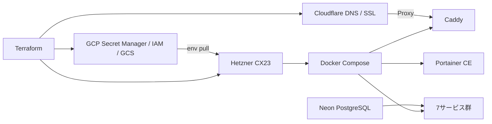
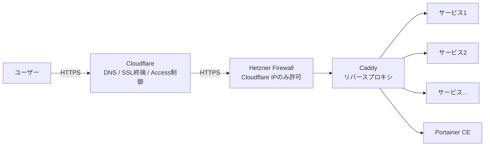
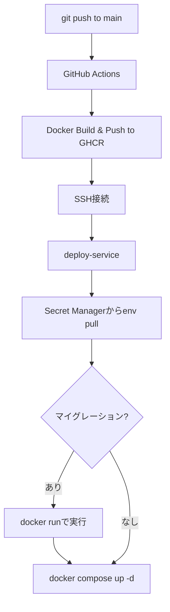

@[docswell](https://www.docswell.com/s/takish/TODO-hetzner-multicloud)

個人開発でWebサービスを量産したい。でも Cloud Run に常時起動サービスを10個並べると月1万円。GCE の無料枠は3つが限界——。Hetzner CX23（月€3.99）+ Cloudflare + GCP Secret Manager + Terraform を組み合わせたら、**7サービスが月額約600円で動く**マルチクラウド構成ができました。GCP の好きな部分は残したまま、コンピュートだけ安くする。この記事ではその設計と構築手順をまとめます。

## 個人開発のコンピュートコスト問題は深刻

個人開発を続けていると、小さなWebサービスがどんどん増えていきます。

GitHub リポジトリの可視性を監視するツール、AI ロゴジェネレーター、数学学習アプリ、3Dモデルのポーズ変換ツール、LP のヒーローショット生成、Slack のカスタム絵文字 API、プロンプト共有ツール——。どれも単体では軽いサービスです。しかし数が増えると「どこで動かすか」が切実な問題になります。

最初は Google Cloud Run を使っていました。コンテナをデプロイするだけで動く手軽さは最高です。しかし常時起動のサービスを並べると、最小インスタンス数の設定次第では月額が想定以上に膨らみます。

内訳はこんな感じでした。

| 項目 | 内容 | 月額目安 |
|------|------|----------|
| vCPU | 0.5 vCPU × 7サービス × 常時起動 | 約 ¥5,500 |
| メモリ | 256MB × 7サービス × 常時起動 | 約 ¥2,000 |
| リクエスト | 月数万リクエスト | 約 ¥500 |
| Cloud SQL（Postgres） | db-f1-micro + ストレージ | 約 ¥1,500 |
| **合計** | | **約 ¥9,500〜10,000** |

※ 最小インスタンス数=1、常時起動で試算。コールドスタートを許容すればもう少し下がりますが、認証付きサービスではセッション切れの問題があり現実的ではありませんでした。

10サービスで月1万円が見えてきた時点で、個人開発としては厳しいと判断しました。

次に試したのが GCE e2-micro（Google Compute Engine の最小インスタンス）です。Always Free 枠（Billing Account あたり1台、米国リージョン限定で無料）を使えばタダですが、2 vCPU（共有、ベースライン CPU 25%）/ メモリ 1GB では2つのサービスを載せた時点で限界でした。3つ目を入れたら OOM（Out of Memory）で落ちます。

「GCP のエコシステムは好きだけど、コンピュートだけ安くできないか？」——この問いから、マルチクラウド構成にたどり着きました。

## Hetzner CX23 は月€4で 2vCPU / 4GB を提供する

Hetzner（ヘッツナー）はドイツのホスティング会社です。1997年創業で、ヨーロッパでは老舗のクラウドプロバイダーとして広く利用されています。日本ではまだマイナーな存在ですが、[Hetzner Status](https://status.hetzner.com/) で公開されている稼働実績は安定しています。

CX23 という共有 vCPU プランのスペックは以下の通りです。

- 2 vCPU（共有）
- 4GB RAM
- 40GB SSD
- ヘルシンキリージョン
- **月額 €3.99（ベースプラン €3.49 + IPv4 アドレス €0.50、約600円）**

Cloud Run で月1万円かかっていた構成が、約600円で収まります。

実際の負荷を `docker stats` で見ると、7サービス + Caddy + Portainer が同居した状態でもリソースには余裕があります。

```
CONTAINER       CPU %   MEM USAGE / LIMIT   MEM %
caddy           0.05%   30MiB / 3.8GiB      0.77%
my-app          0.10%   120MiB / 3.8GiB     3.08%
another-app     0.08%   95MiB / 3.8GiB      2.44%
logo-gen        0.03%   80MiB / 3.8GiB      2.05%
math-app        0.05%   85MiB / 3.8GiB      2.18%
pose-tool       0.02%   60MiB / 3.8GiB      1.54%
emoji-api       0.04%   70MiB / 3.8GiB      1.79%
prompt-share    0.06%   90MiB / 3.8GiB      2.31%
portainer       0.01%   25MiB / 3.8GiB      0.64%
```

合計メモリ使用量は約 655MiB で、4GB 中の約16%。CPU もほぼアイドルです。個人開発の規模感なら、まだ余裕を持ってサービスを追加できます。

ヘルシンキリージョンのため、日本からのレイテンシは約200〜250msあります。東京リージョンと比べると体感できる差です。ただし、以下の理由で許容しています。

- ユーザー数が限定的で、大量の同時リクエストが発生しない
- API 中心の構成で、リアルタイム性が求められるサービスがない
- コストメリット（月約600円 vs 月1万円）がレイテンシのデメリットを大きく上回る

レイテンシがクリティカルなサービスが出てきたら、そのサービスだけ Cloud Run や国内 VPS に分離する選択肢もあります。

なお、全7サービスを1台に集約しているため、Hetzner の障害時は全サービスが同時にダウンします。個人開発で SLA が不要なため許容していますが、可用性が必要な場合は複数台構成や Cloud Run とのハイブリッドを検討すべきです。復旧は `terraform apply` で可能ですが、Docker のインストール・イメージの pull・証明書取得などで数十分のダウンタイムが発生します。

:::message
2026年4月の価格改定で CX23 のベースプランは €3.49 → €3.99 に値上がりします。記事公開時点（2026年3月）の価格はベースプラン €3.49 + IPv4 アドレス €0.50 = **€3.99/月**です。価格改定後は €3.99 + €0.50 = €4.49/月になりますが、それでも Cloud Run と比較すれば圧倒的に安価です。
:::

ただし Hetzner はただの VPS（Virtual Private Server）です。Cloud Run のようなマネージドサービスではありません。デプロイの仕組み、シークレット管理、SSL、DNS——全部自分で構築する必要があります。

ここで重要な設計判断をしました。

**GCP のエコシステムは捨てない。コンピュートだけを Hetzner に外出しする。**

## 設計方針は「好きなエコシステムの好きな部分だけ残す」

自分が GCP を好きな理由は明確です。

- **Terraform で全てを IaC 管理できる**こと
- **Secret Manager** でシークレットを安全に一元管理できること
- **IAM**（Identity and Access Management）で権限を最小限に制御できること
- **GCS**（Google Cloud Storage）で Terraform state をバージョニング管理できること

これらを手放して全部を Hetzner に寄せるのは嫌でした。`.env` ファイルを手動でサーバーに直置き管理するような運用には戻りたくありません。逆に、全部を GCP に寄せるとコンピュートコストが跳ね上がります。

答えは「いいとこ取り」のマルチクラウドでした。各レイヤーの担当は以下の通りです。

- **シークレット管理**: GCP Secret Manager（Terraform で管理可能、IAM で権限制御）
- **権限管理**: GCP IAM（SA + secretAccessor で最小権限の原則を実現）
- **Terraform state**: GCS バケット（バージョニング有効、5世代まで保持）
- **DNS**: Cloudflare（無料、高速、Terraform プロバイダー対応）
- **SSL / CDN / WAF**: Cloudflare + Caddy（Full (strict) で end-to-end 暗号化、証明書は Caddy が自動管理、DDoS 防御付き）
- **死活監視**: GCE e2-micro + Uptime Kuma（Always Free で無料）
- **コンテナ管理 UI**: Portainer CE on Hetzner（ブラウザからログ・再起動・リソース監視）
- **メール送信**: AWS SES（$0.10/1,000通、月数百通なら実質数円）
- **DB**: Neon（外部 PostgreSQL。Hetzner 上に DB を立てると「使い捨て可能なコンピュートノード」の設計が崩れるため、外部 DB を選択。無料枠あり）
- **コンテナレジストリ**: GHCR（GitHub Container Registry。`GITHUB_TOKEN` で認証完結、GitHub Actions との親和性が高い）
- **コンピュート**: **Hetzner CX23（€3.99/月で7サービス + Caddy + Portainer を集約）**

コンテナレジストリは当初 GCP の Artifact Registry（AR）を使っていましたが、Hetzner 移行後に GHCR へ切り替えました。AR だと Hetzner 側で `docker pull` するために gcloud 認証が必要になり、GHCR なら `docker login` だけで済みます。設計方針の「GCP エコシステム維持」は Secret Manager・IAM・Terraform state が核心であり、レジストリはコンピュートに付随するものなので、GitHub に寄せる方が自然でした。

サーバーに載せるのは Docker Compose だけです。「状態を持たないコンピュートノード」として扱います。厳密には Caddy の証明書キャッシュ（named volume）が唯一の状態ですが、再構築時は Let's Encrypt から自動で再取得されます（同一ドメインで週50枚のレート制限に注意）。シークレットは GCP、DNS は Cloudflare、DB は Neon。サーバーが壊れても `terraform apply` で同じ環境を再構築できます。



## Cloudflare はこの構成の要になる



Cloudflare は DNS だけではありません。この構成では4つの役割を担っています。

:::details DNS の一元管理
全てのサブドメイン（`app1.example.com`、`app2.example.com` など）の A レコードを Cloudflare で管理しています。Terraform の Cloudflare プロバイダーを使って、サービスレジストリ（`var.services`）から DNS レコードを自動生成します。サービスを1つ追加すれば、DNS レコードも自動的に作られます。
:::

:::details SSL 終端（Full (strict) モード）
Cloudflare の SSL/TLS 暗号化モードは **Full (strict)** を採用しています。

- ユーザー → Cloudflare 間: **HTTPS**（Cloudflare が証明書を自動管理）
- Cloudflare → Hetzner（オリジン）間: **HTTPS**（Caddy が証明書を自動管理）

当初は Flexible モード（Cloudflare-オリジン間は HTTP）で運用していました。しかし認証機能を持つサービス（Better Auth 等）が増えてきたタイミングで、Cloudflare-オリジン間の通信も暗号化すべきと判断し、Full (strict) に移行しました。

Caddy の **Cloudflare DNS チャレンジ**を使えば、証明書の取得・更新は完全に自動化されます。

```txt:Caddyfile
app1.example.com {
    reverse_proxy 127.0.0.1:3001
    tls {
        dns cloudflare {env.CF_API_TOKEN}
    }
}
```

Caddy の Docker イメージには DNS チャレンジ用のプラグインが必要です。`caddy-dns/cloudflare` モジュールを含むカスタムイメージをビルドするか、`caddy-docker-proxy` のようなプラグイン同梱イメージを使います。
:::

:::details Proxy モードによるオリジン IP の秘匿
Cloudflare の Proxy モード（`proxied = true`）を有効にすることで、Hetzner サーバーの実 IP アドレスが DNS から見えなくなります。DDoS 攻撃がオリジンに直接到達することを防げます。

さらに、Hetzner のファイアウォールで HTTPS ポート（443）への接続を **Cloudflare の IP レンジのみに制限**しています。

```hcl:firewall.tf
# Hetzner Firewall: HTTPS は Cloudflare IP のみ許可
rule {
  direction = "in"
  protocol  = "tcp"
  port      = "443"
  source_ips = [
    "173.245.48.0/20",
    "103.21.244.0/22",
    "103.22.200.0/22",
    "103.31.4.0/22",
    "141.101.64.0/18",
    "108.162.192.0/18",
    "190.93.240.0/20",
    "188.114.96.0/20",
    "197.234.240.0/22",
    "198.41.128.0/17",
    "162.158.0.0/15",
    "104.16.0.0/13",
    "104.24.0.0/14",
    "172.64.0.0/13",
    "131.0.72.0/22",
    # https://www.cloudflare.com/ips-v4/
  ]
}
```

Cloudflare を経由しない直接アクセスは全てブロックされます。SSH（ポート22）だけは全 IP から許可していますが、鍵認証のみ有効（パスワード認証は無効化）、fail2ban でブルートフォース攻撃を自動ブロック、root ログインは無効化——というハードニング策を適用しています。
:::

:::details Zero Trust Access による管理画面の保護
Uptime Kuma（死活監視ツール）や Portainer CE の管理画面には、Cloudflare Access（Zero Trust）でアクセス制限をかけています。指定したメールアドレスにワンタイムコードを送信し、認証を通過しないとページにアクセスできません。VPN や Basic 認証を設定する手間なく、管理画面を保護できます。Terraform でポリシーを定義するだけです。
:::

## Docker Compose + Caddy + Terraform テンプレートでサービスを集約する

Hetzner サーバーでは、全サービスを1つの `docker-compose.yml` で宣言的に管理しています。

```yaml:docker-compose.yml
services:
  my-app:
    image: ghcr.io/takish/my-app:latest
    restart: unless-stopped
    ports:
      - "127.0.0.1:3001:3000"
    env_file:
      - /opt/my-app.env

  another-app:
    image: ghcr.io/takish/another-app:latest
    restart: unless-stopped
    ports:
      - "127.0.0.1:3002:3000"
    env_file:
      - /opt/another-app.env

  # 他のサービスも同じパターン

  caddy:
    image: ghcr.io/takish/caddy-cloudflare:latest  # caddy-dns/cloudflare プラグイン同梱
    restart: unless-stopped
    network_mode: "host"
    env_file:
      - /opt/caddy.env  # CF_API_TOKEN を含む
    volumes:
      - /opt/caddy/Caddyfile:/etc/caddy/Caddyfile:ro
      - caddy_data:/data  # 証明書の永続化
```

ポイントは2つあります。

- **ポートバインドは `127.0.0.1` に限定**: 外部から直接コンテナにアクセスさせない。全て Caddy 経由
- **`restart: unless-stopped`**: サーバーが再起動しても自動で復帰する

### 単一ソースの原則——`var.services` から全て自動生成する

この構成で最も重要なのは、**サービスの定義を1箇所にまとめる**ことです。

Terraform の `var.services` にサービスレジストリを定義し、そこから docker-compose.yml、Caddyfile、DNS レコード、deploy-service スクリプトを全て自動生成しています。

```hcl:variables.tf
variable "services" {
  type = map(object({
    host_port      = number
    container_port = number
    secret_name    = optional(string)  # null = env 不要
    image          = string
    subdomain      = string
  }))
  default = {
    my-app = {
      host_port      = 3001
      container_port = 3000
      secret_name    = "my-app-env"
      image          = "ghcr.io/takish/my-app:latest"
      subdomain      = "app1"
    }
    static-tool = {
      host_port      = 8080
      container_port = 8080
      secret_name    = null  # env 不要なサービス
      image          = "ghcr.io/takish/static-tool:latest"
      subdomain      = "tool"
    }
    # ...
  }
}
```

Terraform の `templatefile` 関数で、この変数からテンプレートを展開します。Caddyfile は `for` ループで全サービス分を自動生成する仕組みです。

```hcl:Caddyfileテンプレートの展開（HCL）
locals {
  caddyfile = templatefile("${path.module}/templates/Caddyfile.tpl", {
    services = var.services
    domain   = var.domain
  })
}

# templates/Caddyfile.tpl
# %{ for name, svc in services ~}
# ${svc.subdomain}.${domain} {
#     reverse_proxy 127.0.0.1:${svc.host_port}
#     tls {
#         dns cloudflare {env.CF_API_TOKEN}
#     }
# }
# %{ endfor ~}
```

新しいサービスを追加するときは、`var.services` に1エントリ追加して `terraform apply` するだけです。compose も Caddyfile も DNS も全部自動で追従します。

`terraform apply` 時には `terraform_data.sync_configs` が自動実行され、変更があったファイル（compose、Caddyfile、deploy-service）を SSH でサーバーに配布し、Caddy を再起動します。手動でサーバーにファイルを配置する作業は不要です。

## Reusable Workflow + deploy-service でデプロイを統一する



GitHub Actions から SSH でサーバーに接続してデプロイしています。各リポジトリに同じ deploy.yml をコピペするのは避けたいので、Reusable Workflow を Organization の `.github` リポジトリに集約しました。各サービスの deploy.yml はこれだけで完結します。

```yaml:deploy.yml
name: Deploy to Hetzner

on:
  push:
    branches: [main]

permissions:
  contents: read
  packages: write

jobs:
  deploy:
    uses: <org>/.github/.github/workflows/hetzner-deploy.yml@main
    with:
      service: my-app                         # var.services のキー名
      migrate: "npx drizzle-kit migrate"      # DB なしなら行ごと削除
    secrets: inherit
```

Reusable Workflow の中で、GHCR へのビルド & プッシュ、SSH 接続、`deploy-service` コマンドの実行まで全て行います。サービス側リポジトリは `service` 名と（必要なら）マイグレーションコマンドを指定するだけです。

### deploy-service コマンドの仕組み

サーバー上の `deploy-service` コマンドが実際のデプロイを担います。Terraform テンプレートから自動生成されたスクリプトです。

```bash:deploy-serviceの使用例
# フルデプロイ（env pull + イメージ pull + compose up）
deploy-service <service> ghcr.io/takish/<app>:latest

# マイグレーション付きデプロイ（migrate → deploy の順で安全に実行）
deploy-service <service> ghcr.io/takish/<app>:latest --migrate "npx drizzle-kit migrate"

# 環境変数のみ更新（Secret Manager から pull + force-recreate）
deploy-service <service> --env-only
```

`deploy-service` は以下の流れで動作します。

1. GCP Secret Manager からサービスの環境変数を pull
2. サーバー上の所定パスに env ファイルを書き込み（パーミッション 600 で root のみ読み取り可能）
3. `--migrate` 指定時は `docker run` でマイグレーションを実行（失敗したらデプロイ中止）
4. `docker compose up -d` でコンテナを起動

最終的にはサーバー上に env ファイルが平文で存在します。手動管理との違いは Secret Manager が SSOT（Single Source of Truth）である点です。Secret Manager 側を更新すれば `deploy-service --env-only` で即座に反映されます。Docker secrets や tmpfs マウントなど、よりセキュアな代替手段は認識していますが、個人開発の規模感ではこの方式で十分と判断しました。

`--env-only` モードでは、環境変数だけを更新して `docker compose up -d --force-recreate` でコンテナを再作成します。`restart` ではなく `force-recreate` を使うのは、env_file の変更を確実に反映させるためです。

なお、上記の例では `:latest` タグを使っていますが、GitHub Actions の CI ではコミット SHA もタグとして付与しています。ロールバックが必要な場合は `deploy-service <service> ghcr.io/takish/<app>:<前回のSHA>` で前バージョンに切り戻せます。

:::details 共通環境変数の自動マージ
Terraform 側では `locals` で共通の環境変数（メール送信の SMTP 設定など）を定義し、各サービスの Secret Manager エントリに自動マージしています。

```hcl:gcp_secrets.tf
locals {
  shared_env = <<-EOT
    SMTP_HOST=${var.smtp_host}
    SMTP_USER=${var.smtp_user}
    SMTP_PASSWORD=${var.smtp_password}
    FROM_EMAIL=noreply@example.com
  EOT
  # 実際の値は terraform.tfvars から注入
}

resource "google_secret_manager_secret_version" "my_app_env" {
  secret_data = "${local.shared_env}\n${var.my_app_env}"
}
```

新しいサービスを追加するときも、`secret_data` に共通設定をマージするだけで全ての環境変数が自動的に含まれます。
:::

## 監視は Uptime Kuma + Portainer CE の2本立て

サービスを量産すると、「今どれが生きているか」「ログを見たい」という場面が頻繁に発生します。

**Uptime Kuma**は GCE e2-micro（Always Free、オレゴンリージョン）で動かしています。Hetzner とは別のクラウドに配置しているのがポイントです。Hetzner が落ちても監視まで止まることを防げます。各サービスのヘルスチェック URL を1分間隔で HTTP 監視し、ダウン検知時は Slack に通知します。

**Portainer CE**は Hetzner 上に同居させています。ブラウザからコンテナの状態確認、リアルタイムログの閲覧、ワンクリック再起動ができます。SSH でサーバーに入って `docker logs` を叩く手間が省けるので、7サービスの運用では重宝しています。

どちらの管理画面も Cloudflare Access（Zero Trust）でアクセスを制限しています。

## IaC で完全再現可能——startup script が全てを自動構築する

このインフラの最大の特徴は、**サーバーを壊しても `terraform apply` で完全に復活する**ことです。

Hetzner サーバーの `user_data`（起動スクリプト）に、環境構築の全手順を Terraform テンプレートとして記述しています。

```hcl:startup_script.tf
resource "hetzner_server" "main" {
  # ...
  user_data = templatefile("${path.module}/templates/cloud-init.yml.tpl", {
    sa_key_json         = var.gcp_sa_key_json
    docker_compose_yaml = local.docker_compose
    caddyfile           = local.caddyfile
    deploy_service_sh   = local.deploy_service
    services            = var.services
    ghcr_token          = var.ghcr_token
    ghcr_user           = var.ghcr_user
  })
}
```

```yaml:templates/cloud-init.yml.tpl（抜粋）
#cloud-config
package_update: true

packages:
  - fail2ban
  - apt-transport-https
  - ca-certificates
  - curl
  - gnupg

runcmd:
  # Docker CE インストール
  - curl -fsSL https://download.docker.com/linux/ubuntu/gpg | gpg --dearmor -o /usr/share/keyrings/docker.gpg
  - echo "deb [signed-by=/usr/share/keyrings/docker.gpg] https://download.docker.com/linux/ubuntu $(lsb_release -cs) stable" > /etc/apt/sources.list.d/docker.list
  - apt-get update && apt-get install -y docker-ce docker-ce-cli containerd.io docker-compose-plugin

  # gcloud CLI インストール
  - curl -fsSL https://packages.cloud.google.com/apt/doc/apt-key.gpg | gpg --dearmor -o /usr/share/keyrings/cloud.google.gpg
  - echo "deb [signed-by=/usr/share/keyrings/cloud.google.gpg] https://packages.cloud.google.com/apt cloud-sdk main" > /etc/apt/sources.list.d/google-cloud-sdk.list
  - apt-get update && apt-get install -y google-cloud-cli

  # SA キー配置 & 認証
  - mkdir -p /opt/gcp
  - chmod 700 /opt/gcp
  # SA キーは write_files で /opt/gcp/sa-key.json に配置済み（パーミッション 600）
  - gcloud auth activate-service-account --key-file=/opt/gcp/sa-key.json

  # GHCR ログイン
  - echo "${ghcr_token}" | docker login ghcr.io -u "${ghcr_user}" --password-stdin

  # 設定ファイル配置（write_files で /opt/ 以下に配置済み）
  # Secret Manager から全サービスの env を pull
%{ for name, svc in services ~}
%{ if svc.secret_name != null ~}
  - gcloud secrets versions access latest --secret="${svc.secret_name}" > /opt/${name}.env
  - chmod 600 /opt/${name}.env
%{ endif ~}
%{ endfor ~}

  # 全サービス起動
  - cd /opt && docker compose up -d
```

サーバーの中で手作業した設定は一切ありません。全てがコードとして Terraform テンプレートに記述されています。

:::message
サービスアカウント（SA）キーについて補足します。Google は SA キーの利用を非推奨としており、Workload Identity Federation の利用を推奨しています。しかし Workload Identity Federation は GCP 内のリソース（Cloud Run、GKE など）や、対応する外部 IdP（AWS、Azure、GitHub Actions など）を前提としています。Hetzner のような外部 VM から GCP API に直接アクセスする場合、現時点では SA キーのファイル配置が唯一の実用的な手段です。なお、SA キーは `user_data` 経由で配置するため Terraform state に平文で含まれます。state を保存する GCS バケットの IAM を最小権限に設定し、Google-managed encryption を有効にしてアクセスを制限しています。
:::

日常的なインフラ変更（サービス追加、Caddyfile の変更など）では `terraform apply` 時に `terraform_data.sync_configs` が自動実行されます。テンプレートの内容に変更があった場合のみ SSH でファイルを配布し、Caddy を再起動します。サーバーの再構築は不要で、設定ファイルの差分だけが反映されます。

### tfvars は GCS で管理する

`terraform.tfvars` にはシークレット情報が含まれるため `.gitignore` 対象です。代わりに GCS バケットにアップロードして管理しています。

```bash:tfvarsのGCS管理
# アップロード（terraform apply の後に必ず実行）
gsutil cp terraform.tfvars gs://<bucket>/tfvars/core/terraform.tfvars

# ダウンロード（新しい PC でのセットアップ時）
gsutil cp gs://<bucket>/tfvars/core/terraform.tfvars terraform.tfvars
```

バケットはバージョニング有効で5世代まで保持しているため、誤って上書きしても復元できます。現状は `terraform apply` の後に `gsutil cp` を手動で実行しており、アップロードを忘れるリスクがあります。Makefile に組み込めば忘れを防げます。

```makefile:Makefile
apply:
	terraform apply && gsutil cp terraform.tfvars gs://<bucket>/tfvars/core/terraform.tfvars
```

## テンプレートリポジトリで新サービスの立ち上げを高速化する

新しいサービスを作るたびにゼロからセットアップするのは面倒です。そこで GitHub のテンプレートリポジトリ機能を使った `hetzner-app-template` を用意しました。

このテンプレートには以下が含まれています。

- **Frontend**: React + Vite + Tailwind CSS + Radix UI
- **Backend**: Express 5 (TypeScript)
- **認証**: Better Auth（email/password + Google OAuth）
- **DB**: Neon PostgreSQL + Drizzle ORM
- **CI/CD**: Reusable Workflow 対応の deploy.yml + Dependabot
- **Docker**: マルチステージビルド（drizzle ディレクトリ含む）
- **運用**: CLAUDE.md テンプレート、環境変数バリデーション（Zod）

GitHub の "Use this template" ボタンから新しいリポジトリを作成し、`var.services` にエントリを追加して `terraform apply` すれば、認証付きの Web アプリがデプロイできる状態になります。

テンプレートには「踏んだ罠」のナレッジも含まれています。Express 5 の `*splat` 構文、Terraform テンプレートの `$$` エスケープ問題、Better Auth のリバースプロキシ設定（`trust proxy` + `baseURL` + `useSecureCookies`）など、初見で嵌まりやすいポイントが CLAUDE.md に記録されており、Claude Code を使った開発でも同じ罠を踏まないようになっています。

## コスト比較——月1万円が約600円になった

実際にかかっている月額コストの内訳です。

| サービス | 用途 | 月額コスト |
|---------|------|-----------|
| Hetzner CX23 | 7サービス + Caddy + Portainer | €3.99（約600円） |
| GCE e2-micro | Uptime Kuma（死活監視） | 無料（Always Free 枠） |
| GCP Secret Manager | シークレット管理 | 無料（6アクティブバージョン + 10,000回/月の無料枠内） |
| GCS | Terraform state + tfvars | ほぼ無料（数円/月） |
| Cloudflare | DNS + SSL + Access + Proxy | 無料（Free プラン） |
| GitHub | GHCR + Actions | 無料（Free プラン） |
| AWS SES | メール送信 | ほぼ無料（$0.10/1,000通） |
| Neon | PostgreSQL | 無料（Free プラン） |
| **合計** | | **約600円/月** |

Cloud Run で同じ構成を組んだ場合の月1万円前後と比較すると、**約17分の1** のコストです。

## 新サービスの追加は6ステップで完了する

最後に、新しいサービスを追加するときの実際の手順です。

1. `hetzner-app-template` から新リポジトリを作成（GitHub の "Use this template"）
2. `terraform/hetzner/variables.tf` の `var.services` に1エントリ追加
3. `terraform/core/gcp_secrets.tf` に Secret Manager リソース追加 + `gcp_iam.tf` に SA 権限追加（env が必要な場合）
4. `terraform apply`（compose / Caddyfile / DNS が自動生成 → `terraform_data.sync_configs` でサーバーに自動配布）
5. GitHub Secrets にデプロイ用 SSH 鍵とホスト情報を設定（SSH 鍵は定期的にローテーションし、GitHub Secrets を更新する運用にしている）
6. deploy.yml の `service` 名を変更して `git push` → GitHub Actions が GHCR push → SSH で deploy-service 実行 → 自動デプロイ

ステップ4までがインフラ側の作業で、`terraform apply` が compose / Caddyfile / DNS / サーバー配布まで全部やってくれます。ステップ5-6がサービス側リポジトリの作業です。

## まとめ——好きなエコシステムは捨てなくていい

GCP が好きだからといって、全部を GCP で動かす必要はありません。

Secret Manager は最高だからそのまま使う。Terraform state は GCS に置く。でもコンピュートは高いから Hetzner に出す。DNS と SSL は Cloudflare + Caddy で end-to-end 暗号化しつつ証明書管理も自動化する。メール送信は AWS SES。

**好きなエコシステムの「好きな部分」だけを残して、足りないところを別のサービスで補う。**

個人開発こそ、このマルチクラウドの恩恵が大きいと感じています。月約600円でサービスを量産できるインフラが手に入りました。サーバーは使い捨て可能で、IaC で完全再現できます。テンプレートリポジトリを使えば、認証・DB・CI/CD 付きの新サービスが数十分で立ち上がります。

同じようにクラウドのコンピュートコストに悩んでいる方の参考になれば幸いです。
