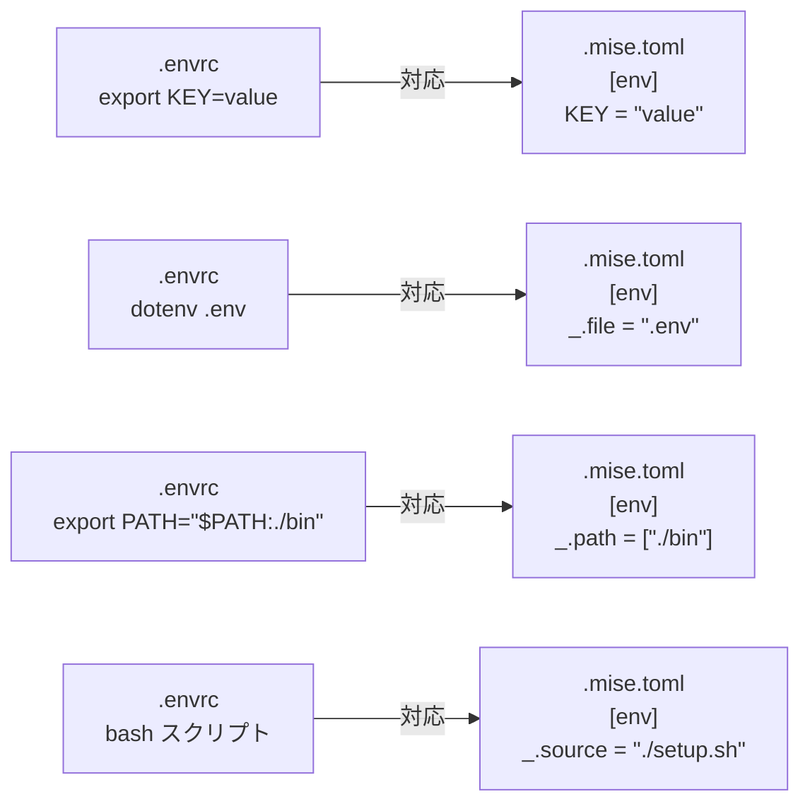

direnv を使ってプロジェクトごとに環境変数を切り替えています。動いてはいる。でも `cd` のたびに感じる微妙なもたつきが気になっていました。`direnv: loading .envrc` が表示されるまでの一瞬が、何度も積み重なるとじわじわとストレスになります。

`nvm` → `fnm`、`rbenv` → `mise` と同じ流れで、Rust 製の mise には direnv 相当の環境変数管理機能も備わっています。`.mise.toml` の `[env]` セクションに変数を宣言するだけで、ディレクトリに入ると自動でセット、出ると解除されます。

この記事では、direnv で行っていた GCP 複数アカウント切替と Claude Code ライセンス管理を mise に移行する手順を紹介します。あわせて、`XDG_CONFIG_HOME` でプロジェクト単位に設定をまとめる応用パターンも取り上げます。

:::message
GCP 複数アカウント管理の詳細な背景（gcloud auth と ADC の違いなど）は [GCP複数アカウントをdirenvで自動切替](https://zenn.dev/takish/articles/gcp-multi-account-direnv) で解説しています。この記事では「環境変数の管理を direnv から mise に切り替える」部分に絞ります。
:::

## mise の [env] セクションとは — direnv との対応

mise の環境変数管理機能は、`.mise.toml` の `[env]` セクションで実現します。direnv の `.envrc` に対応するものと考えると分かりやすいです。

### direnv との記法対応

まず、direnv で書いていた内容と mise での記法の対応を整理します。



基本的な変数宣言は `export` を取り除いて TOML 形式に書き直すだけです。

```diff:.envrc → .mise.toml
- export CLOUDSDK_ACTIVE_CONFIG_NAME=work
- export GOOGLE_APPLICATION_CREDENTIALS="${HOME}/.config/gcloud/adc-work.json"
```

```toml:.mise.toml
[settings]
env_shell_expand = true  # ${HOME} などの変数展開を有効化

[env]
CLOUDSDK_ACTIVE_CONFIG_NAME = "work"
GOOGLE_APPLICATION_CREDENTIALS = "${HOME}/.config/gcloud/adc-work.json"
```

### TOML で宣言的に書けることの利点

`.envrc` はシェルスクリプトです。条件分岐もループも書けるため、何でも書けてしまう半面、パッと読んで何が起きるか分かりにくくなりがちです。`.mise.toml` の `[env]` セクションは宣言的で、変数名と値の対応だけを記述します。

mise には direnv にない機能もあります。

| 機能 | direnv | mise |
|------|--------|------|
| 変数宣言 | `export KEY=value` | `KEY = "value"` |
| .env ファイル読込 | `dotenv` | `_.file = ".env"` |
| PATH 追加 | `export PATH="$PATH:./bin"` | `_.path = ["./bin"]` |
| 機密値の非表示 | なし | `redact = true` |
| 必須変数の検知 | なし | `required = true` |
| 信頼の付与 | `direnv allow` | `mise trust` |

`redact = true` は mise の出力から機密値を隠す機能です。API キーやトークンを設定しているときにログに残したくない場合に使えます。

### env._.file で既存の .env をそのまま使う

direnv から移行するとき、`.env` ファイルを書き直す必要はありません。`_.file` ディレクティブでそのまま読み込めます。

```toml:.mise.toml（単一ファイル）
[env]
_.file = ".env"
```

```toml:.mise.toml（複数ファイル・redact）
[env]
_.file = [
    ".env",
    ".env.local",
    { path = ".secrets", redact = true }
]
```

dotenv 形式の他、JSON・YAML 形式にも対応しています。

## セットアップ

### mise のインストールとシェルフックの追加

```bash
# Homebrew でインストール
brew install mise
```

使用しているシェルに合わせてフックを追加します。

```bash:~/.zshrc（zsh の場合）
eval "$(mise activate zsh)"
```

```bash:~/.bashrc（bash の場合）
eval "$(mise activate bash)"
```

```fish:~/.config/fish/config.fish（fish の場合）
mise activate fish | source
```

追加後はシェルを再起動するか `source ~/.zshrc` を実行します。

### シェル変数展開の有効化

`${HOME}` や `${PWD}` のような変数をパスに使うには、`env_shell_expand` を有効にする必要があります。これを忘れると `${HOME}` が文字列として展開されずにエラーになります。

```toml:.mise.toml
[settings]
env_shell_expand = true

[env]
SOME_PATH = "${HOME}/.config/something"
```

全プロジェクト共通にしたい場合はグローバル設定ファイルに追記します。

```toml:~/.config/mise/config.toml
[settings]
env_shell_expand = true
```

:::message
mise の設定ファイルは `~/.config/mise/config.toml`（グローバル）→ プロジェクト親ディレクトリ → `.mise.toml`（プロジェクト固有）の順に読み込まれ、下位が上位を上書きします。`env_shell_expand` のように全体に適用したい設定はグローバルに書くのが便利です。
:::

## GCP 複数アカウント切替を mise で再現する

gcloud の認証設定（configurations）は既にセットアップ済みの前提で進めます。direnv で管理していた `.envrc` を `.mise.toml` に置き換えます。

### 業務用プロジェクトの .mise.toml

```toml:~/work/company-project/.mise.toml
[settings]
env_shell_expand = true

[env]
CLOUDSDK_ACTIVE_CONFIG_NAME = "work"
GOOGLE_APPLICATION_CREDENTIALS = "${HOME}/.config/gcloud/adc-work.json"
```

### 個人プロジェクトの .mise.toml

```toml:~/personal/side-project/.mise.toml
[settings]
env_shell_expand = true

[env]
CLOUDSDK_ACTIVE_CONFIG_NAME = "personal"
GOOGLE_APPLICATION_CREDENTIALS = "${HOME}/.config/gcloud/adc-personal.json"
```

### 動作確認

`.mise.toml` を配置したら、初回のみ `mise trust` で信頼を付与します。

```bash
cd ~/work/company-project
mise trust
```

その後は `cd` するだけで環境変数が切り替わります。

```bash
$ cd ~/work/company-project

$ gcloud config get account
your-email@company.com

$ mise env | grep CLOUDSDK
CLOUDSDK_ACTIVE_CONFIG_NAME=work

$ cd ~/personal/side-project

$ gcloud config get account
your-personal@gmail.com

$ cd ~
# ホームディレクトリに出ると設定が解除される
$ echo $CLOUDSDK_ACTIVE_CONFIG_NAME
（空）
```

`mise env` コマンドで現在セットされている環境変数の一覧を確認できます。direnv には同等のコマンドがなく、`printenv` で全変数から探す必要があったので、これは地味に便利です。

:::message
`GOOGLE_APPLICATION_CREDENTIALS` のパスには `~` ではなく `${HOME}` を使ってください。チルダ展開はシェルの機能で、一部の SDK がパス内のチルダを展開しないことがあります。この点は direnv の場合と同様です。
:::

## Claude Code ライセンス切替を mise で再現する

`CLAUDE_CONFIG_DIR` 環境変数を使うと、Claude Code の設定ディレクトリをプロジェクトごとに分離できます。仕組みの詳細は [tanakakc さんの記事](https://zenn.dev/tanakakc/articles/3e0e12df2f1bcd) が詳しいです。

:::message
ここで想定しているのは、個人契約のライセンスと会社契約のライセンスなど、**正規に保有している複数のアカウントを切り替える**ケースです。1つのライセンスを複数環境で共有するような使い方は利用規約に抵触する可能性があるため、ご自身の契約内容を確認してください。
:::

### プロジェクトごとに .mise.toml を配置

```toml:~/work/client-a/.mise.toml
[settings]
env_shell_expand = true

[env]
CLAUDE_CONFIG_DIR = "${HOME}/.claude-config/client-a"
```

```toml:~/work/client-b/.mise.toml
[settings]
env_shell_expand = true

[env]
CLAUDE_CONFIG_DIR = "${HOME}/.claude-config/client-b"
```

個人ライセンスを使うディレクトリには `.mise.toml` を置きません。`CLAUDE_CONFIG_DIR` が未設定のときは `~/.claude/` がデフォルトで使われるためです。

### .gitignore の扱い

`CLAUDE_CONFIG_DIR` の値はマシン固有のパスです。チームリポジトリにコミットするのは避けた方が良い場合があります。

```gitignore:.gitignore
.mise.toml
```

チームで共有したい場合は `.mise.toml.example` をコミットしておくと親切です。

```toml:.mise.toml.example
[settings]
env_shell_expand = true

[env]
# ~/.claude-config/{プロジェクト名} に Claude Code の設定を分離する
# CLAUDE_CONFIG_DIR = "${HOME}/.claude-config/your-project-name"
```

:::message
`[tools]` セクション（Node.js や Python のバージョン指定）はチームで共有したい設定です。`[env]` セクションに機密情報やマシン固有の値が含まれる場合は、ファイルを分けることを検討してください。`env._.file` で外部 `.env` を読み込む方法もあります。
:::

## XDG_CONFIG_HOME でプロジェクトの設定をまとめる（応用）

ここまでは「特定のツールの環境変数を mise で切り替える」話でした。GCP や Claude Code のように切り替えたいツールが決まっているなら、これで十分です。

ここからは応用的な話になります。私物 PC で業務をする場合など、Git のユーザー名やエディタの設定も含めて**設定全体をプロジェクト単位で隔離したい**ケースです。

### XDG_CONFIG_HOME とは

`~/.config/` ディレクトリの場所を指定する環境変数です。[XDG Base Directory Specification](https://specifications.freedesktop.org/basedir/latest/) で定義されています。

普段あまり意識しませんが、`~/.config/git/`、`~/.config/nvim/`、`~/.config/tmux/` のように多くの CLI ツールがこのディレクトリに設定を保存しています。`XDG_CONFIG_HOME` が未設定の場合は `~/.config` がデフォルトとして使われます。

つまり、この環境変数を別のパスに向けるだけで、対応ツールの設定の読み書き先をまとめて変更できます。

### mise の [env] で個別指定するだけでは足りないのか

ほとんどのケースでは足ります。GCP と Claude Code を切り替えるだけなら `CLOUDSDK_ACTIVE_CONFIG_NAME` と `CLAUDE_CONFIG_DIR` を設定すれば済みます。

`XDG_CONFIG_HOME` が有効なのは、こうしたケースです。

- 私物 PC で業務をしていて、個人の Git 設定（`user.name`、`user.email`）と業務の設定を混ぜたくない
- プロジェクト終了時にディレクトリごと削除して、設定の残骸を `~/.config/` に残したくない
- 切り替えたいツールが多く、個別に環境変数を列挙するのが煩雑になってきた

一方で、デメリットもあります。

- すべてのツールが対応しているわけではない（gcloud、Claude Code 等は個別に環境変数を設定する必要がある）
- Git のグローバル設定（`~/.config/git/config`）も切り替わるため、普段使っているエイリアスやユーザー名が効かなくなる
- 仕組みを理解していないとトラブルシュートが難しくなる

### .mise.toml の設定例

```toml:~/work/client-project/.mise.toml
[env]
# XDG 対応ツールの設定先をプロジェクト内に切り替える
XDG_CONFIG_HOME = "{{config_root}}/.config"

# XDG 非対応ツールは個別に指定
CLAUDE_CONFIG_DIR = "{{config_root}}/.config/claude"
CLOUDSDK_CONFIG = "{{config_root}}/.config/gcloud"
CLOUDSDK_ACTIVE_CONFIG_NAME = "client"
```

`{{config_root}}` は mise のテンプレート変数で、`.mise.toml` が置かれたディレクトリを指します。`${PWD}` と違い、サブディレクトリに `cd` しても値が変わらないため安定しています。テンプレート変数を使う場合は `env_shell_expand` の設定は不要です。

### ツールごとの XDG_CONFIG_HOME 対応状況

| ツール | XDG_CONFIG_HOME 対応 | 個別環境変数 |
|-------|:-------------------:|------------|
| Git | ✓ | — |
| Vim / Neovim | ✓ | — |
| tmux | ✓ | — |
| gcloud CLI | ✗ | `CLOUDSDK_CONFIG` |
| Claude Code | ✗ | `CLAUDE_CONFIG_DIR` |
| AWS CLI | ✗ | `AWS_CONFIG_FILE` |

XDG 非対応のツールは `{{config_root}}` を使って個別に環境変数を設定します。

:::message alert
`XDG_CONFIG_HOME` を切り替えると、Git のグローバル設定（`~/.config/git/config` の `user.name` や `user.email`）も読まれなくなります。プロジェクト内に `.config/git/config` を用意するか、`.gitconfig` をプロジェクトルートに置いて対処してください。
:::

### プロジェクト終了後の後片付け

プロジェクトディレクトリを削除するだけで、まとめた設定も一緒に消えます。

```bash
rm -rf ~/work/client-project
```

:::message alert
gcloud の認証トークンはディレクトリ削除で消えますが、Google アカウント側のアクセス許可は残ります。セキュリティ上重要なプロジェクトの場合は、Google アカウントの設定からアプリのアクセス許可を取り消してください。
:::

## direnv と mise の使い分け

### mise に移行すると良いケース

- すでに mise でツールバージョンを管理している（`.mise.toml` 一本に集約できる）
- `.envrc` に `export KEY=value` しか書いていない（TOML 記法で代替できる）
- `direnv allow` の手間を省きたい
- `mise env` で現在の環境変数一覧をすぐ確認したい
- `redact = true` で機密値をログに残したくない

### direnv のままで良いケース

- バージョン管理ツールが不要で環境変数だけ切り替えたい（direnv は軽量で導入しやすい）
- チームで direnv が標準になっていて `.envrc` を共有している
- `layout python` や `layout node` など direnv の高度なレイアウト機能を使っている
- 既存の `.envrc` が複雑なシェルスクリプトになっていて移行コストが高い

### mise と direnv の混在は避ける

mise 公式ドキュメントには「mise と direnv を一緒に使うべきではない」と記載されています。同じ変数を両方で管理すると、どちらが後から上書きするかが分かりにくくなります。どちらかに統一するのが無難です。

完全に mise へ移行する場合は、シェル設定から direnv のフックを削除します。

```diff:~/.zshrc
- eval "$(direnv hook zsh)"
+ eval "$(mise activate zsh)"
```

## まとめ

| 用途 | direnv での設定 | mise での設定 |
|------|---------------|-------------|
| 環境変数の宣言 | `export KEY=value` | `KEY = "value"` |
| .env ファイル読込 | `dotenv` | `_.file = ".env"` |
| GCP アカウント切替 | `export CLOUDSDK_ACTIVE_CONFIG_NAME=work` | `CLOUDSDK_ACTIVE_CONFIG_NAME = "work"` |
| Claude Code 切替 | `export CLAUDE_CONFIG_DIR=...` | `CLAUDE_CONFIG_DIR = "..."` |
| 信頼の付与 | `direnv allow` | `mise trust` |

ポイントを整理します。

1. **mise の `[env]` は direnv の `.envrc` の代替になります** — `export` を取り除いて TOML に書き直すだけです
2. **既存の `.env` ファイルは `_.file` でそのまま読み込めます** — 移行コストはほぼありません
3. **GCP・Claude Code の切替の仕組み自体は変わりません** — gcloud configurations や CLAUDE_CONFIG_DIR の設計はそのままです
4. **XDG_CONFIG_HOME によるプロジェクト隔離はツールの対応確認が必要です** — 対応していないツールは個別の環境変数で補います
5. **direnv が現役なシーンもあります** — バージョン管理が不要なら direnv は軽量で導入しやすいです。mise の真価はバージョン管理・環境変数・タスクランナーを一本化できる点にあります

---

## 関連記事

- [GCP複数アカウントをdirenvで自動切替 — gcloud authとADCの違いも解説](https://zenn.dev/takish/articles/gcp-multi-account-direnv)
- [Claude Codeで複数ライセンスをプロジェクトごとに切り替える方法](https://zenn.dev/tanakakc/articles/3e0e12df2f1bcd)（tanakakc）

## 参考

- [mise 公式: Environments](https://mise.jdx.dev/environments/)
- [mise 公式: direnv との関係](https://mise.jdx.dev/direnv.html)
- [mise 公式: Configuration](https://mise.jdx.dev/configuration.html)
- [mise GitHub](https://github.com/jdx/mise)
