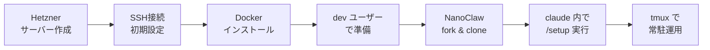
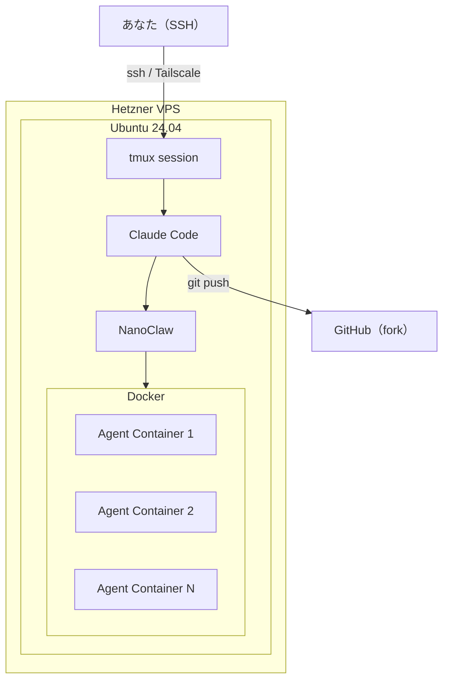

@[docswell](https://www.docswell.com/s/takish/TODO-nanoclaw-hetzner)

## Hetzner に NanoClaw を立てると、AIエージェントが24時間コードを書いてくれる

NanoClaw は Anthropic Claude Agent SDK ベースの軽量パーソナルAIアシスタントです。エージェントをDockerコンテナで分離して安全に動かす設計になっています。これを Hetzner の VPS に載せると、月€5程度（サーバー費用のみ）で常時稼働のAI開発環境が手に入ります。

ローカルマシンを閉じてもエージェントが動き続ける。tmux でセッションを保持して、好きなときに SSH で戻る。この記事では、サーバー作成からNanoClawの `/setup` 完了までの手順をまとめます。

:::message
サーバー費用とは別に、Anthropic API の利用料が発生します。Claude Code Pro/Max プランを利用する場合は API キー不要で利用できます。
:::

## セットアップの全体像



やることはシンプルです。

1. Hetzner でサーバー作成
2. SSH で接続して初期設定（root）
3. Docker を入れる（root）
4. dev ユーザーを作成し、以降は dev で作業
5. Node.js / Claude Code / GitHub CLI を入れる（dev）
6. GitHub から NanoClaw を fork / clone（dev）
7. `claude` を起動して `/setup`
8. tmux で常駐運用
9. 必要なら Tailscale で閉域化

## サーバー構成はこれで十分

| 項目 | 値 |
|------|-----|
| OS | Ubuntu 24.04 |
| メモリ | 4GB |
| vCPU | 2以上 |
| ディスク | 40GB前後 |
| 接続 | SSHキーのみ |
| 公開ポート | 22番だけ |

:::message
Hetzner Cloud Console の GUI からは、サーバー作成時にしか SSH キーを紐づけられません。作成後に追加するには手動で `authorized_keys` を編集する必要があるため、最初にキーを登録しておくのが確実です。
:::

## Hetzner でサーバーを作る

Hetzner Cloud Console から以下の設定で作成します。

- **Image**: Ubuntu 24.04
- **Type**: CX23（2 vCPU / 4GB RAM / 40GB NVMe SSD）
- **SSH Key**: 自分の公開鍵を登録
- **Name**: `nanoclaw-dev-01` など
- **Backups**: 必要に応じて有効化

CX23 は月額 €3.49（2026年4月以降 €3.99）。IPv4 アドレスの追加料金が €0.50/月 程度かかるため、合計で月€4〜5 程度になります。

ローカルに SSH キーがない場合は先に作っておきます。

```bash:SSHキー生成
ssh-keygen -t ed25519 -C "hetzner-nanoclaw"
cat ~/.ssh/id_ed25519.pub
```

## サーバーに接続して初期設定する

ここから dev ユーザー作成までは root で作業します。

```bash:初期接続
ssh root@<サーバーIP>
```

```bash:パッケージ更新と基本ツール
apt update && apt upgrade -y
apt install -y git curl unzip tmux ufw fail2ban
timedatectl set-timezone Asia/Tokyo
```

## セキュリティを固める

VPS を公開インターネットに置く以上、初期設定の段階でセキュリティを確保しておきます。ファイアウォール、SSH ブルートフォース対策、自動セキュリティアップデートの3点です。

```bash:UFW設定
ufw default deny incoming
ufw default allow outgoing
ufw allow 22/tcp
ufw enable
ufw status
```

`ufw enable` 時に「既存の SSH 接続が切断される可能性があります」と表示されますが、先に 22 番を許可しているので問題ありません。`y` で続行してください。

```bash:fail2ban設定
systemctl enable fail2ban
systemctl start fail2ban

# SSH 向けのカスタム設定
cat > /etc/fail2ban/jail.local << 'EOF'
[sshd]
enabled = true
port = 22
maxretry = 5
bantime = 3600
findtime = 600
EOF

systemctl restart fail2ban
```

5回失敗で1時間 BAN する設定です。デフォルトより厳しくしています。

```bash:自動セキュリティアップデート
apt install -y unattended-upgrades
dpkg-reconfigure -plow unattended-upgrades
```

セキュリティパッチが自動適用されるようになります。VPS は放置する時間が長くなりがちなので、これは入れておくのが安全です。

:::message alert
root での運用は避けましょう。専用ユーザーを作成して、以降はそのユーザーで作業します。
:::

```bash:devユーザー作成
adduser dev
usermod -aG sudo dev
mkdir -p /home/dev/.ssh
cp /root/.ssh/authorized_keys /home/dev/.ssh/
chown -R dev:dev /home/dev/.ssh
chmod 700 /home/dev/.ssh
chmod 600 /home/dev/.ssh/authorized_keys
```

dev ユーザーで SSH 接続できることを確認してから、root ログインとパスワード認証を無効化します。

```bash:SSHハードニング
sed -i 's/^#*PermitRootLogin.*/PermitRootLogin no/' /etc/ssh/sshd_config
sed -i 's/^#*PasswordAuthentication.*/PasswordAuthentication no/' /etc/ssh/sshd_config
systemctl restart sshd
```

:::message alert
この手順を実行する前に、必ず別のターミナルから `ssh dev@<サーバーIP>` で接続できることを確認してください。ロックアウトされると Hetzner コンソールからの復旧が必要になります。
:::

## Docker を入れる

NanoClaw はエージェントをコンテナで分離して動かす設計です。Docker が標準ランタイムになっています。

```bash:Dockerインストール（root）
curl -fsSL https://get.docker.com -o get-docker.sh
sh get-docker.sh
systemctl enable docker
systemctl start docker
docker --version
```

```bash:devユーザーにDocker権限を付与
usermod -aG docker dev
```

:::message
`docker` グループに追加すると Docker ソケットへの直接アクセス権が付与され、実質 root 相当の権限を持つことになります。NanoClaw の用途上必要ですが、共有サーバーでは注意してください。
:::

**ここから先は dev ユーザーに切り替えて作業します。**

```bash:devユーザーに切り替え
su - dev
```

## Node.js 20+ を入れる

NanoClaw の前提条件として Node.js 20 以上が必要です。

```bash:Node.jsインストール（dev）
curl -fsSL https://deb.nodesource.com/setup_20.x | sudo bash -
sudo apt install -y nodejs
node --version
```

## Claude Code を入れる

```bash:Claude Codeインストール（dev）
curl -fsSL https://claude.ai/install.sh | bash
claude --version
```

npm でインストールする場合はこちらです。

```bash:npm経由のインストール
npm install -g @anthropic-ai/claude-code
```

## GitHub CLI を入れて認証する

```bash:GitHub CLIインストール（dev）
sudo mkdir -p /etc/apt/keyrings
curl -fsSL https://cli.github.com/packages/githubcli-archive-keyring.gpg \
  | sudo tee /etc/apt/keyrings/githubcli-archive-keyring.gpg > /dev/null
sudo chmod go+r /etc/apt/keyrings/githubcli-archive-keyring.gpg
echo "deb [arch=$(dpkg --print-architecture) signed-by=/etc/apt/keyrings/githubcli-archive-keyring.gpg] https://cli.github.com/packages stable main" \
  | sudo tee /etc/apt/sources.list.d/github-cli.list > /dev/null
sudo apt update
sudo apt install gh -y
gh auth login
```

## NanoClaw を fork して clone する

```bash:NanoClaw取得（dev）
cd /opt
sudo mkdir -p /opt/nanoclaw
sudo chown dev:dev /opt/nanoclaw
gh repo fork qwibitai/nanoclaw --clone -- /opt/nanoclaw
cd /opt/nanoclaw
```

## .env と API トークンを設定する

NanoClaw は `.env` ファイルで設定を管理します。

```bash:環境変数の設定
cd /opt/nanoclaw
cp .env.example .env
nano .env
```

```env:.envの設定例
ANTHROPIC_AUTH_TOKEN=sk-ant-xxxxx
```

:::message
`/setup` が対話的にトークン設定を処理する場合もありますが、事前に `.env` を用意しておくと確実です。Claude Code Pro/Max プランで OAuth 認証する場合は API キーの設定は不要です。
:::

## Claude Code 内で /setup を実行する

```bash:セットアップ実行
cd /opt/nanoclaw
claude
```

Claude Code が起動したら、プロンプト内で `/setup` と入力します。`/setup` は dependencies のインストール、認証設定、コンテナセットアップ、サービス設定を自動で処理します。

:::message alert
`/setup` はシェルコマンドではありません。必ず Claude Code のプロンプト内で実行してください。bash で直接打つとエラーになります。
:::

## 全体のアーキテクチャはこうなる



## 常駐運用は tmux で十分

```bash:tmuxセッション作成
tmux new -s nanoclaw
cd /opt/nanoclaw
claude
```

- `Ctrl-b d` でセッションから抜ける
- `tmux attach -t nanoclaw` で戻る

SSH を切断しても tmux セッションは生き続けます。好きなタイミングで接続して作業を再開できます。

:::message
tmux セッションはサーバー再起動で消えます。再起動後は `tmux new -s nanoclaw` からやり直してください。本格運用なら systemd でのサービス化も選択肢です。
:::

## GitHub は fork 運用で管理する

NanoClaw を使った開発フローはシンプルです。

1. GitHub に NanoClaw の自分 fork を持つ
2. Hetzner 上でその fork を clone
3. Claude Code + NanoClaw にコード修正させる
4. `git commit` / `git push`
5. 必要なら別リポジトリも clone して管理する

## 公開ポートは増やさない

最初は 22番だけで十分です。Web UIが必要になっても、SSH トンネル経由でアクセスするのが安全です。

```bash:SSHトンネル例
ssh -L 8080:localhost:8080 dev@<サーバーIP>
```

## さらに安全にするなら Tailscale

Tailscale を入れると、SSH ポートすら閉じられます。

```bash:Tailscaleインストール
curl -fsSL https://tailscale.com/install.sh | sh
sudo tailscale up --ssh
```

Tailscale SSH を使う場合は、UFW で 22 番を閉じるとさらに安全です。

```bash:SSHポートを閉じる（Tailscale接続を確認してから）
sudo ufw delete allow 22/tcp
```

## 詰まったらここを確認する

| 症状 | 原因と対処 |
|------|-----------|
| `claude: command not found` | ターミナル（シェル）を再起動してください |
| `/setup` がエラーになる | bash ではなく Claude Code 内で実行してください |
| Docker 権限エラー | `usermod -aG docker dev` 後に再ログインしてください |
| メモリ不足 | 4GBで開始し、並列作業が増えたら8GBにスケールアップしてください |
| `gh` で認証エラー | dev ユーザーで `gh auth login` を実行してください |

## コピペで使える最短コマンド集

:::details root での初期セットアップ（まとめて実行）
```bash:rootセットアップ
apt update && apt upgrade -y
apt install -y git curl unzip tmux ufw fail2ban unattended-upgrades
timedatectl set-timezone Asia/Tokyo

# ファイアウォール
ufw default deny incoming
ufw default allow outgoing
ufw allow 22/tcp
ufw enable

# fail2ban（SSH向けカスタム設定）
cat > /etc/fail2ban/jail.local << 'JAIL'
[sshd]
enabled = true
port = 22
maxretry = 5
bantime = 3600
findtime = 600
JAIL
systemctl enable fail2ban && systemctl restart fail2ban

# 自動セキュリティアップデート
dpkg-reconfigure -plow unattended-upgrades

# Docker
curl -fsSL https://get.docker.com -o get-docker.sh
sh get-docker.sh
systemctl enable docker && systemctl start docker

# dev ユーザー作成
adduser dev
usermod -aG sudo dev && usermod -aG docker dev
mkdir -p /home/dev/.ssh
cp /root/.ssh/authorized_keys /home/dev/.ssh/
chown -R dev:dev /home/dev/.ssh
chmod 700 /home/dev/.ssh && chmod 600 /home/dev/.ssh/authorized_keys

# SSH ハードニング（dev で接続できることを確認してから）
sed -i 's/^#*PermitRootLogin.*/PermitRootLogin no/' /etc/ssh/sshd_config
sed -i 's/^#*PasswordAuthentication.*/PasswordAuthentication no/' /etc/ssh/sshd_config
systemctl restart sshd
```
:::

:::details dev ユーザーでの NanoClaw セットアップ
```bash:devセットアップ
# Node.js
curl -fsSL https://deb.nodesource.com/setup_20.x | sudo bash -
sudo apt install -y nodejs

# Claude Code
curl -fsSL https://claude.ai/install.sh | bash

# GitHub CLI
sudo mkdir -p /etc/apt/keyrings
curl -fsSL https://cli.github.com/packages/githubcli-archive-keyring.gpg \
  | sudo tee /etc/apt/keyrings/githubcli-archive-keyring.gpg > /dev/null
sudo chmod go+r /etc/apt/keyrings/githubcli-archive-keyring.gpg
echo "deb [arch=$(dpkg --print-architecture) signed-by=/etc/apt/keyrings/githubcli-archive-keyring.gpg] https://cli.github.com/packages stable main" \
  | sudo tee /etc/apt/sources.list.d/github-cli.list > /dev/null
sudo apt update && sudo apt install gh -y
gh auth login

# NanoClaw
sudo mkdir -p /opt/nanoclaw && sudo chown dev:dev /opt/nanoclaw
gh repo fork qwibitai/nanoclaw --clone -- /opt/nanoclaw
cd /opt/nanoclaw
cp .env.example .env
nano .env  # ANTHROPIC_AUTH_TOKEN を設定

# セットアップ
claude
# → Claude Code 内で /setup
```
:::

## まとめ

Hetzner CX23 + Ubuntu 24.04 + Docker + Claude Code + NanoClaw。この組み合わせで、月€4〜5程度の常時AI開発環境が完成します（API 利用料は別途）。SSH キーだけで接続し、公開ポートは増やさず、tmux でセッションを保持する。必要に応じて Tailscale で閉域化すれば、セキュリティも十分です。
