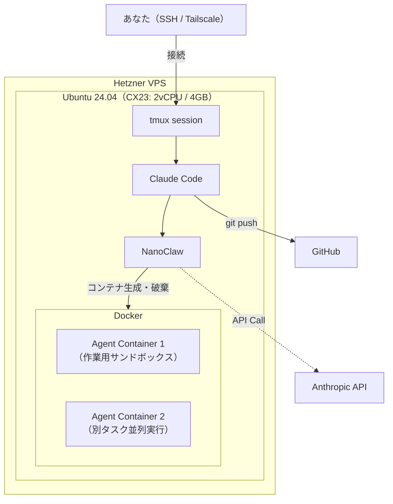
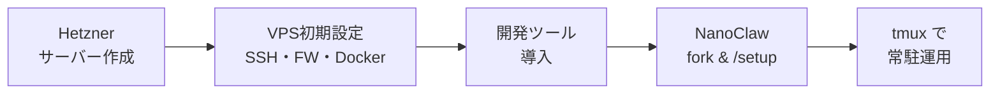

@[docswell](https://www.docswell.com/s/takish/TODO-nanoclaw-hetzner)

## NanoClaw とは何か

[NanoClaw](https://github.com/qwibitai/nanoclaw) は、Anthropic Claude Agent SDK をベースにしたセルフホスト型のAI開発アシスタントです。特徴はエージェントの実行環境をDockerコンテナで完全に分離する設計にあります。

エージェントがファイルを書き換える、npm install を走らせる、テストを実行する。こうした操作がすべてコンテナの中で完結します。ホスト環境を汚さず、仮にエージェントが破壊的な操作をしてもコンテナを捨てればよいだけという安心感があります。

Claude Code 単体でも十分にコードは書けます。ただ、長時間の自律タスクをリモートサーバーで走らせる場合、コンテナ分離がないとホスト環境のリスクが気になります。NanoClaw はその一点に特化した軽量ツールです。

## なぜ Hetzner なのか

月€5以下という価格は最大の理由ですが、それだけではありません。

| 観点 | Hetzner CX23 | DigitalOcean Basic | Vultr Cloud Compute |
|------|-------------|-------------------|-------------------|
| スペック | 2 vCPU / 4GB / 40GB NVMe | 2 vCPU / 4GB / 80GB | 2 vCPU / 4GB / 60GB |
| 月額 | €3.49 + IPv4 €0.50 ≈ **€4** | $24 | $24 |
| データセンター | EU（フィンランド / ドイツ） | 世界各地 | 世界各地 |
| NVMe SSD | 標準 | 追加料金 | 標準 |

NanoClaw のワークロードは CPU もディスク I/O もそこまで要求しません。エージェントの実際の「考える」処理は Anthropic の API 側で行われ、VPS はコンテナの起動・ファイル操作・git 操作を処理するだけです。4GB メモリで十分動く理由はここにあります。

Hetzner は日本からの SSH レイテンシが 200-300ms 程度になりますが、tmux 経由でエージェントを放置する使い方なら体感上の問題はありませんでした。

:::message
サーバー費用とは別に、Anthropic API の利用料が発生します。Claude Code Pro プランの場合は月額 $20 で API キー不要、Max プランは月額 $100/$200 です。API キー従量課金の場合、軽めのタスク（ファイル修正・テスト実行程度）で1日あたり $1-3 程度が目安でした。
:::

## アーキテクチャの全体像

先に完成形を示します。



SSH でサーバーに入り、tmux セッション内で Claude Code を起動し、NanoClaw がタスクごとにコンテナを生成する。エージェントの作業はコンテナ内で完結し、成果物は git push で GitHub に送られます。

ポイントは、NanoClaw がコンテナのライフサイクルを管理している点です。タスクの開始でコンテナが立ち上がり、完了で停止する。並列に複数タスクを走らせれば、それぞれ独立したコンテナが割り当てられます。

## セットアップの流れ



1. Hetzner でサーバー作成（CX23, Ubuntu 24.04）
2. VPS 初期設定：SSH ハードニング、UFW、fail2ban、Docker
3. 開発ツール導入：Node.js、Claude Code、GitHub CLI
4. NanoClaw を fork / clone し、Claude Code 内で `/setup`
5. tmux で常駐運用

ステップ2と3はVPSの汎用的な初期設定です。手順の詳細は末尾の「コピペで使える最短コマンド集」にまとめています。ここでは Hetzner 固有の注意点と NanoClaw 固有の設定に絞って解説します。

## Hetzner でサーバーを作る

Hetzner Cloud Console から以下の設定で作成します。

- **Image**: Ubuntu 24.04
- **Type**: CX23（2 vCPU / 4GB RAM / 40GB NVMe SSD）
- **Location**: Falkenstein または Helsinki（好みで選択）
- **SSH Key**: 自分の公開鍵を登録
- **Name**: `nanoclaw-dev-01` など

CX23 は月額 €3.49（2026年4月以降 €3.99）。IPv4 アドレスの追加料金が €0.50/月かかり、合計で月€4〜5 程度になります。

:::message
Hetzner Cloud Console の GUI からは、サーバー作成時にしか SSH キーを紐づけられません。作成後に追加するには手動で `authorized_keys` を編集する必要があるため、最初にキーを登録しておくのが確実です。
:::

## VPS 初期設定（概要）

VPS を公開インターネットに置く以上、セキュリティの初期設定は必須です。以下の4点を実施します。

1. **UFW**: 22番ポートのみ許可、他は全拒否
2. **fail2ban**: SSH ブルートフォース対策（5回失敗で1時間BAN）
3. **dev ユーザー作成 + SSH ハードニング**: root ログイン無効化、パスワード認証無効化
4. **Docker インストール**: NanoClaw のコンテナランタイム

具体的なコマンドは末尾の「コピペで使える最短コマンド集」を参照してください。

:::message alert
SSH ハードニング（root ログイン無効化）の前に、必ず別ターミナルから `ssh dev@<サーバーIP>` で接続できることを確認してください。ロックアウトされると Hetzner コンソールからの復旧が必要になります。
:::

:::message
`docker` グループに追加すると Docker ソケットへの直接アクセス権が付与され、実質 root 相当の権限を持つことになります。NanoClaw の用途上必要ですが、共有サーバーでは注意してください。
:::

## 開発ツールの導入（概要）

dev ユーザーに切り替えたら、以下の3つをインストールします。

- **Node.js 20+**: NanoClaw の前提条件
- **Claude Code**: `curl -fsSL https://claude.ai/install.sh | bash`
- **GitHub CLI**: `gh auth login` で認証（SSH 環境ではブラウザが使えないため、device flow での認証を選択）

各ツールのインストールコマンドも末尾のコマンド集にまとめています。

## NanoClaw を fork して /setup を実行する

ここからが NanoClaw 固有の手順です。

```bash:NanoClaw取得
cd /opt
sudo mkdir -p /opt/nanoclaw
sudo chown dev:dev /opt/nanoclaw
gh repo fork qwibitai/nanoclaw --clone -- /opt/nanoclaw
cd /opt/nanoclaw
```

### .env の設定

NanoClaw は `.env` ファイルで設定を管理します。

```bash:環境変数の設定
cp .env.example .env
nano .env
```

```env:.envの主要な設定項目
# Anthropic API キーを使う場合（Pro/Max プランなら不要）
ANTHROPIC_AUTH_TOKEN=sk-ant-xxxxx

# エージェントが使うモデル（デフォルト: claude-sonnet-4-20250514）
# MODEL=claude-sonnet-4-20250514

# コンテナのメモリ制限（デフォルト: 2GB）
# CONTAINER_MEMORY_LIMIT=2g
```

Claude Code Pro/Max プランで OAuth 認証する場合は `ANTHROPIC_AUTH_TOKEN` の設定は不要です。`claude` を起動した際の対話的な認証フローで処理されます。

### /setup の実行

```bash:Claude Code起動
cd /opt/nanoclaw
claude
```

Claude Code が起動したら、プロンプト内で `/setup` と入力します。

:::message alert
`/setup` はシェルコマンドではありません。必ず Claude Code のプロンプト内で実行してください。bash で直接打つと `command not found` になります。
:::

`/setup` が実行する処理は以下の通りです。

1. **依存パッケージのインストール**: `npm install` で Node.js 依存を解決
2. **Docker イメージのビルド**: エージェント用のベースコンテナイメージを作成（初回は2-3分程度）
3. **認証設定**: Anthropic API または OAuth の認証情報を確認
4. **動作確認**: テスト用コンテナを起動して正常に動作することを検証

### /setup の完了を確認する

`/setup` が正常に完了すると、Claude Code のプロンプトに戻ります。完了の判断基準は以下の通りです。

```bash:確認コマンド（別ターミナルから）
# Docker イメージが作成されていること
docker images | grep nanoclaw

# NanoClaw のコンテナが動作可能なこと
docker ps -a | grep nanoclaw
```

`docker images` に NanoClaw 関連のイメージが表示されていれば、セットアップは成功しています。

## NanoClaw のコンテナ構成を理解する

`/setup` 完了後の Docker 環境を確認してみます。

```
$ docker images | grep nanoclaw
nanoclaw-agent    latest    xxx    2 minutes ago    850MB

$ docker ps --format "table {{.Names}}\t{{.Status}}\t{{.Ports}}"
NAMES              STATUS          PORTS
（タスク実行時のみコンテナが表示される）
```

NanoClaw は「常駐するコンテナ」を持ちません。タスクを受け取るたびにコンテナを起動し、完了したら停止する設計です。これがメモリ消費を抑える鍵になっています。

### コンテナ内部の構成

エージェントコンテナの中には以下が含まれます。

- **作業ディレクトリ**: ホストの `/opt/nanoclaw` からマウントされたプロジェクトファイル
- **Node.js ランタイム**: エージェントのスクリプト実行環境
- **git**: 成果物のコミット・プッシュ用
- **ネットワーク**: ホストネットワークへのアクセス（API 呼び出し用）

ホストのファイルシステムへのアクセスはマウントされたディレクトリに限定されます。エージェントが `/etc` を書き換えたり、他のプロジェクトに干渉することはありません。

## 実際にタスクを実行してみる

セットアップが完了したら、実際にタスクを投げてみます。

```
> このリポジトリの README.md を日本語に翻訳してください
```

エージェントがタスクを受け取ると、NanoClaw が新しいコンテナを起動します。別ターミナルから `docker ps` を見ると、コンテナが動いているのを確認できます。

### CX23 でのリソース消費

実際に24時間運用してみた結果、リソース消費は以下のようになりました。

| 状態 | メモリ使用量 | CPU使用率 |
|------|------------|----------|
| アイドル時（Claude Code + tmux のみ） | 約 1.2GB / 4GB | 1-2% |
| エージェント1タスク実行中 | 約 2.0-2.5GB / 4GB | 10-30% |
| エージェント2タスク並列実行 | 約 3.2-3.5GB / 4GB | 30-60% |

4GB メモリの CX23 で、エージェント1タスクなら余裕があります。2タスク並列は動くものの、メモリが逼迫する場面がありました。並列実行を常用するなら CX33（8GB）へのスケールアップが安全です。Hetzner はサーバーのスケールアップが管理画面からワンクリックで完了するため、まずは CX23 で始めて様子を見るのが現実的でした。

### ディスク使用量

```
$ df -h /
Filesystem      Size  Used  Avail  Use%
/dev/sda1        38G   12G    24G   34%
```

Docker イメージとコンテナのレイヤーで 8-10GB 程度を消費します。40GB のディスクなら当面は問題ありませんが、複数プロジェクトを clone して作業する場合は残容量を意識する必要があります。

## 運用のポイント

### tmux で常駐する

```bash:tmuxセッション作成
tmux new -s nanoclaw
cd /opt/nanoclaw
claude
```

- `Ctrl-b d` でセッションから抜ける
- `tmux attach -t nanoclaw` で戻る

SSH を切断しても tmux セッションは生き続けます。朝タスクを投げて、夕方に SSH で戻って結果を確認する。そういう使い方が自然にできます。

:::message
tmux セッションはサーバー再起動で消えます。再起動後は `tmux new -s nanoclaw` からやり直してください。本格運用なら systemd でのサービス化も選択肢です。
:::

### GitHub は fork 運用で管理する

1. GitHub に NanoClaw の自分 fork を持つ
2. Hetzner 上でその fork を clone
3. Claude Code + NanoClaw にコード修正させる
4. `git commit` / `git push`
5. 必要なら別リポジトリも clone して管理する

NanoClaw 本体の更新は upstream からの pull で取り込みます。

### 公開ポートは増やさない

22番ポートだけで運用します。Web UI やデバッグサーバーが必要になっても、SSH トンネル経由でアクセスするのが安全です。

```bash:SSHトンネル例
ssh -L 8080:localhost:8080 dev@<サーバーIP>
```

### さらに安全にするなら Tailscale

Tailscale を入れると、SSH ポートすら閉じられます。

```bash:Tailscaleインストール
curl -fsSL https://tailscale.com/install.sh | sh
sudo tailscale up --ssh
```

Tailscale SSH 経由で接続できることを確認したら、UFW で 22 番を閉じるとさらに安全です。

```bash:SSHポートを閉じる（Tailscale接続を確認してから）
sudo ufw delete allow 22/tcp
```

## 月額コストの内訳

「月€5」はサーバー費用だけの話です。実際の運用コストを整理します。

| 項目 | 月額 | 備考 |
|------|------|------|
| Hetzner CX23 | €3.49-3.99 | 2026年4月以降 €3.99 |
| IPv4 アドレス | €0.50 | 固定 |
| Anthropic API（従量課金の場合） | $30-90 程度 | 使い方に大きく依存 |
| Anthropic Pro プラン | $20/月 | API キー不要 |
| Anthropic Max プラン | $100 or $200/月 | 高頻度利用向け |

サーバー費用は月€4-5で固定されます。変動するのは API 利用料です。Pro プランで軽めに使うなら月額 $24 程度（サーバー + Pro）。API 従量課金で積極的に使うと月 $35-95 程度になります。

実際の運用では、1日に3-5タスク（コード修正、テスト実行、リファクタリング程度）を投げて、API 費用は $2-5/日でした。月換算で $60-150 程度です。Pro/Max プランのほうがコスト予測しやすいという結論になりました。

## 24時間稼働で分かったこと

1週間ほど常時稼働させてみて、いくつか気づいた点があります。

**安定性**: CX23 で24時間放置しても、NanoClaw やDockerが落ちることはありませんでした。tmux セッションも安定しています。サーバー自体の再起動が必要になったのは apt upgrade でカーネル更新があった1回だけです。

**エラーハンドリング**: エージェントがタスク中にエラーを起こした場合、コンテナは停止しますがホストには影響しません。`docker ps -a` で停止コンテナを確認し、ログを見て原因を判断する流れです。

**ディスクの増加**: 停止したコンテナが蓄積するとディスクを圧迫します。定期的に `docker system prune` で不要なコンテナとイメージを削除するのが良いです。1週間放置で約2GB増加しました。

**SSH レイテンシ**: 日本からフィンランドのデータセンターまで 200-300ms 程度。tmux でエージェントの出力を眺める分には気になりませんが、vim でファイルを直接編集すると遅延を感じます。コード編集はエージェントに任せるか、ローカルで編集して push する使い方が快適でした。

## 詰まったらここを確認する

| 症状 | 原因と対処 |
|------|-----------|
| `claude: command not found` | シェルを再起動（`source ~/.bashrc` or 再ログイン） |
| `/setup` が `command not found` | bash ではなく Claude Code のプロンプト内で実行 |
| Docker 権限エラー | `usermod -aG docker dev` 後に再ログイン |
| `/setup` でイメージビルド失敗 | `docker system prune` でディスク確保後に再実行 |
| メモリ不足（OOM Kill） | `docker stats` で確認。並列タスクを減らすか CX33 にスケールアップ |
| `gh auth login` でブラウザが開かない | SSH 環境では device flow を選択（`What is your preferred protocol for Git operations?` で HTTPS → `Authenticate Git with your GitHub credentials? Yes` → `Login with a web browser` で表示されるコードを手元のブラウザで入力） |

## コピペで使える最短コマンド集

:::details root での初期セットアップ（まとめて実行）
```bash:rootセットアップ
apt update && apt upgrade -y
apt install -y git curl unzip tmux ufw fail2ban unattended-upgrades
timedatectl set-timezone Asia/Tokyo

# ファイアウォール
ufw default deny incoming
ufw default allow outgoing
ufw allow 22/tcp
ufw enable

# fail2ban（SSH向けカスタム設定: 5回失敗で1時間BAN）
cat > /etc/fail2ban/jail.local << 'JAIL'
[sshd]
enabled = true
port = 22
maxretry = 5
bantime = 3600
findtime = 600
JAIL
systemctl enable fail2ban && systemctl restart fail2ban

# 自動セキュリティアップデート
dpkg-reconfigure -plow unattended-upgrades

# Docker
curl -fsSL https://get.docker.com -o get-docker.sh
sh get-docker.sh
systemctl enable docker && systemctl start docker

# dev ユーザー作成
adduser dev
usermod -aG sudo dev && usermod -aG docker dev
mkdir -p /home/dev/.ssh
cp /root/.ssh/authorized_keys /home/dev/.ssh/
chown -R dev:dev /home/dev/.ssh
chmod 700 /home/dev/.ssh && chmod 600 /home/dev/.ssh/authorized_keys

# SSH ハードニング（dev で接続できることを確認してから）
sed -i 's/^#*PermitRootLogin.*/PermitRootLogin no/' /etc/ssh/sshd_config
sed -i 's/^#*PasswordAuthentication.*/PasswordAuthentication no/' /etc/ssh/sshd_config
systemctl restart sshd
```
:::

:::details dev ユーザーでの開発ツール + NanoClaw セットアップ
```bash:devセットアップ
# Node.js
curl -fsSL https://deb.nodesource.com/setup_20.x | sudo bash -
sudo apt install -y nodejs

# Claude Code
curl -fsSL https://claude.ai/install.sh | bash

# GitHub CLI
sudo mkdir -p /etc/apt/keyrings
curl -fsSL https://cli.github.com/packages/githubcli-archive-keyring.gpg \
  | sudo tee /etc/apt/keyrings/githubcli-archive-keyring.gpg > /dev/null
sudo chmod go+r /etc/apt/keyrings/githubcli-archive-keyring.gpg
echo "deb [arch=$(dpkg --print-architecture) signed-by=/etc/apt/keyrings/githubcli-archive-keyring.gpg] https://cli.github.com/packages stable main" \
  | sudo tee /etc/apt/sources.list.d/github-cli.list > /dev/null
sudo apt update && sudo apt install gh -y
gh auth login

# NanoClaw
sudo mkdir -p /opt/nanoclaw && sudo chown dev:dev /opt/nanoclaw
gh repo fork qwibitai/nanoclaw --clone -- /opt/nanoclaw
cd /opt/nanoclaw
cp .env.example .env
nano .env  # ANTHROPIC_AUTH_TOKEN を設定（Pro/Max プランなら不要）

# Claude Code 起動 → プロンプト内で /setup
claude
```
:::

## まとめ

Hetzner CX23 + NanoClaw の組み合わせで、月€4-5のサーバー費用で常時稼働のAI開発環境が手に入りました。

エージェントのコンテナ分離により、長時間の自律タスクを安心して放置できます。4GB メモリでも1タスクなら余裕があり、並列実行が必要になった時点でスケールアップすれば対応可能です。

実際に1週間運用してみて、この構成の本質は「サーバー費用の安さ」よりも「ローカルマシンを閉じてもエージェントが動き続ける」という点にあると感じました。朝タスクを投げて、夕方結果を確認する。VPS + tmux + NanoClaw の組み合わせが、その運用を月€5で実現しています。
