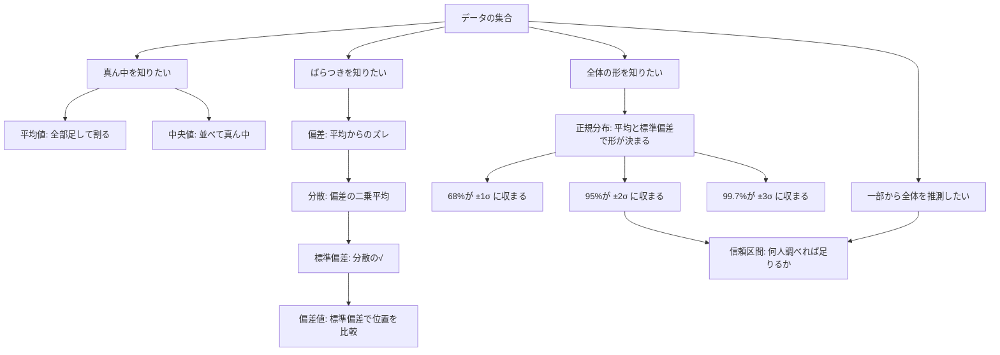
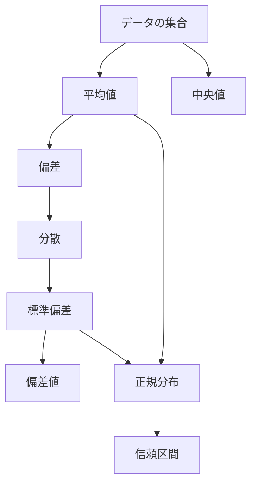

平均値、標準偏差、正規分布、偏差値、信頼区間。どれも一度は目にしたことのある用語ですが、「それぞれ何のためにあるのか」「互いにどうつながっているのか」がイメージしにくい、という状態のまま通り過ぎてきた方は多いはずです。

この記事では、これらの統計用語を「何のためにあるか」という視点で、1つずつ順番に積み上げて説明します。各概念が前の概念を材料にして成り立っている関係を、身近な例とともにたどっていきます。

## この記事で扱う概念の全体像

まず全体の地図を確認します。



図を上から読むと、後ろの概念ほど前の概念を「材料」として使っています。偏差値を理解するには標準偏差が必要で、標準偏差を理解するには分散が必要で、分散を理解するには偏差が必要です。信頼区間は正規分布の性質を土台にしています。

各セクションでは「定義」→「これがないと何が困るか」→「具体例」の順で説明します。

## 平均値 — データを1つの数字にまとめる

### 平均値とは何か

平均値は、データをすべて足して個数で割った値です。「全体の傾向をざっくり1つの数字で表したい」ときに使います。

### 平均値がないと何が困るか

クラス30人のテスト結果があるとします。1人ずつ点数を読み上げていては「今回のクラスの出来はどうだった？」という問いに答えられません。平均値は、30個のデータを1つの数字に圧縮して伝えるための道具です。

たとえば 60, 70, 80, 75, 65 という5人のデータがあれば、合計 350 ÷ 5 = **70点** が平均値です。

### 平均値の落とし穴

平均値は極端な値に引っ張られます。マラソン大会で大半のランナーが4〜5時間台で完走したとしても、1人だけ8時間かかった参加者がいると平均タイムが押し上げられます。「みんなだいたい何時間くらいで走ったか」を知りたいのに、平均値が実態とかけ離れてしまう場合があります。

:::message
平均値は「全員のデータを均等に反映する」という性質から、外れ値の影響を受けやすいです。この問題を解消するのが次に説明する「中央値」です。
:::

## 中央値 — 平均値だけでは実態とズレるケース

### 中央値とは何か

中央値は、データを小さい順に並べたとき、ちょうど真ん中に位置する値です。データが偶数個の場合は、真ん中2つの平均をとります。

### 平均値と中央値の使い分け

先ほどのマラソン大会の例で考えます。100人が参加し、99人が4〜5時間台、1人が12時間だったとします。

| 指標 | 値 | 実態との一致 |
|------|-----|------------|
| 平均値 | 約4時間43分 | ズレがある（12時間の1人に引っ張られる） |
| 中央値 | 約4時間30分 | 実態に近い |

「だいたいみんなどのくらいで走ったか」を知りたい場合、中央値のほうが適切です。一方、「全員のタイムを合計したら何時間分か」を知りたい場合は平均値が必要です。目的によって使い分けます。

### 正規分布では平均値と中央値が一致する

左右対称な分布では、平均値と中央値が同じ値になります。後で説明する「正規分布」は、この性質を持つ代表的な分布です。逆に、平均値と中央値が大きくズレているデータは、分布が左右どちらかに偏っているサインです。この「分布の形」については後のセクションで詳しく説明します。

## 分散と標準偏差 — ばらつきを数字にする

### 「ばらつき」を測る必要性

クラスAとクラスBがあり、どちらも平均点は70点だったとします。しかし内訳はまったく異なります。

| クラス | 点数の内訳 | 平均 |
|--------|-----------|------|
| A | 65, 68, 70, 72, 75 | 70点 |
| B | 40, 50, 70, 90, 100 | 70点 |

平均だけを見ると同じですが、クラスBのほうが点数のばらつきが大きく、「全員がそれなりに理解している」とは言えない状況です。この「ばらつきの違い」を数字にするのが分散と標準偏差の役割です。

### 分散の計算

分散は次の手順で求めます。クラスA（65, 68, 70, 72, 75）で計算してみます。

1. 各データから平均（70）を引く → 偏差を求める
   - 65-70=**-5**、68-70=**-2**、70-70=**0**、72-70=**+2**、75-70=**+5**

2. 偏差をそのまま合計すると -5-2+0+2+5 = 0 になってしまいます。プラスとマイナスが打ち消し合うためです。そこで各偏差を二乗します。
   - 25、4、0、4、25

3. 二乗した値を平均します。
   - (25+4+0+4+25) ÷ 5 = **11.6** → これが分散

:::message
偏差をそのまま合計するとゼロになってしまう理由は、「平均からのズレ」はプラスとマイナスが必ず釣り合うからです。二乗することで符号をなくし、ばらつきの大きさだけを取り出します。
:::

### 標準偏差 — 分散を元の単位に戻す

分散は偏差を「二乗」した値の平均なので、単位も二乗されています。点数のデータなら単位が「点²」になってしまい、直感的に解釈しにくいです。そこで分散の平方根（√）をとったものが**標準偏差**です。

- クラスAの標準偏差：√11.6 ≈ **3.4点**

「平均70点で、標準偏差が3.4点」とは、「多くのデータが 70±3.4点 の範囲に収まっている」というイメージです。標準偏差が大きいほどデータがばらついていて、小さいほど平均付近に集まっています。

## 偏差と偏差値 — 条件が違うもの同士を比べる

### 偏差値が必要な場面

国語のテストで80点、数学のテストで80点を取ったとします。同じ点数ですが、どちらの成績がよかったかはこれだけではわかりません。国語の平均が75点なら「少し上」ですが、数学の平均が50点なら「かなり上」です。

科目ごとに難易度や点数の分布が異なる状況で、「自分が全体のどのあたりにいるか」を共通のスケールで比べる道具が**偏差値**です。

### 偏差値の計算

偏差値の計算式は次のとおりです。

```
偏差値 = (自分の点数 − 平均点) ÷ 標準偏差 × 10 + 50
```

国語（平均75点、標準偏差10点）で80点を取った場合：
- (80 - 75) ÷ 10 × 10 + 50 = **55**

数学（平均50点、標準偏差15点）で80点を取った場合：
- (80 - 50) ÷ 15 × 10 + 50 ≈ **70**

数学のほうが偏差値70と高く、相対的に上位であることがわかります。「× 10 + 50」の変換は、結果を見やすい数値に調整するためです（平均が50、標準偏差1つ分が10になるよう設定）。

### 偏差値は「前の概念の組み合わせ」で成り立つ

偏差値の計算には平均値と標準偏差の両方が必要です。標準偏差を出すには分散が必要で、分散を出すには偏差（各データと平均の差）が必要です。最初に紹介した概念ツリーがそのまま計算の依存関係になっています。

## 正規分布 — 多くのデータが従う釣鐘型の形

### 正規分布とは何か

正規分布は、平均値を中心に左右対称の釣鐘型になる分布です。身長、テストの点数、製品の寸法誤差など、自然界や社会のさまざまなデータがこの形に近くなることが知られています。

<!-- TODO: 画像差し替え — normal-distribution-curve.png -->
<!-- Gemini Flash 3.1 Image prompt:
A clean, minimal statistical diagram of a normal distribution (bell curve) on a white background.
The horizontal axis is labeled with: −3σ, −2σ, −1σ, μ (center), +1σ, +2σ, +3σ.
The vertical axis has no numbers, just a subtle axis line.
The bell curve is drawn with a smooth dark gray (#333) line.
Mark the center line at μ with a thin dashed vertical line.
No colors, no shading, no grid — just the curve and axis labels.
Style: textbook illustration, vector-like, high contrast on white.
Aspect ratio: 16:9. No decorative elements.
-->


### 正規分布の形を決めるのは2つだけ

正規分布の形は、**平均値**と**標準偏差**の2つだけで完全に決まります。平均値は山の「中心の位置」を決め、標準偏差は山の「幅（広がり）」を決めます。

この2つがわかれば、そのデータ全体の分布を数式で表せます。これが正規分布の大きな便利さです。

### 68-95-99.7ルール

正規分布には重要な性質があります。

<!-- TODO: 画像差し替え — 68-95-99.7-rule.png -->
<!-- Gemini Flash 3.1 Image prompt:
A clean statistical diagram showing the 68-95-99.7 rule of normal distribution on a white background.
Draw a smooth bell curve (dark gray #333 line).
The area between −1σ and +1σ is shaded in light blue (#B3D9FF) with the label "68%" centered inside.
The area between −2σ and −1σ, and between +1σ and +2σ, is shaded in lighter blue (#D6ECFF) — together with the center, the full −2σ to +2σ range covers "95%". Show "95%" label with a bracket spanning −2σ to +2σ below the curve.
The area between −3σ and −2σ, and between +2σ and +3σ, is shaded in very light blue (#EBF5FF) — together, the full −3σ to +3σ range covers "99.7%". Show "99.7%" label with a bracket spanning −3σ to +3σ further below.
The horizontal axis is labeled: −3σ, −2σ, −1σ, μ, +1σ, +2σ, +3σ.
Style: textbook illustration, vector-like, high contrast, minimal. No grid, no decorative elements.
Aspect ratio: 16:9.
-->


| 範囲 | データが収まる割合 |
|------|-----------------|
| 平均 ± 1σ | 約68% |
| 平均 ± 2σ | 約95% |
| 平均 ± 3σ | 約99.7% |

日本人成人男性の身長が平均170cm、標準偏差6cmの正規分布に従うとすると：

- 約68%が164〜176cmの範囲に入ります（±1σ）
- 約95%が158〜182cmの範囲に入ります（±2σ）
- 約99.7%が152〜188cmの範囲に入ります（±3σ）

この「±2σ に95%が収まる」という性質が、次に説明する信頼区間の根拠になります。

## 信頼区間 — 全部は調べられないときの判断基準

### 信頼区間が必要な場面

学園祭の準備で「全校生徒1000人に、お昼メニューの人気投票をしたい」という状況を考えます。しかし全員に聞く時間はないため、100人にアンケートを取ることにしました。

このとき、「100人の結果は全校生徒の意見をどれくらい正確に反映しているか」「そもそも何人に聞けば十分な精度になるか」という疑問が生まれます。これに答えるのが信頼区間です。

### 信頼区間の仕組み

100人に聞いた結果、カレー支持率が60%だったとします。しかしこの60%は「たまたま聞いた100人の結果」であり、全校生徒の本当の支持率とは差がある可能性があります。

信頼区間を使うと、「全校生徒の本当の支持率は 60% ± ○% の範囲にある」と95%の信頼度で表現できます。この「± ○%」の幅は、標本数・標準偏差・信頼水準（95%など）から計算します。

標本数が多いほど幅は狭くなり（精度が上がる）、少ないほど幅は広くなります（精度が下がる）。

### なぜ「95%」が標準なのか

信頼水準は90%、95%、99%などを選べますが、なぜ95%が最もよく使われるのでしょうか。

| 信頼水準 | 正規分布上の範囲 | 使われる場面 |
|---------|----------------|------------|
| 90% | ± 1.65σ | 探索的な調査・スクリーニング |
| **95%** | **± 1.96σ** | **多くの分野の標準** |
| 99% | ± 2.58σ | 医療・安全性など失敗が許されない分野 |

95%が標準になった背景には、統計学者のロナルド・フィッシャーが1925年に「p値が0.05（5%）以下なら偶然とは言えない」と提唱したことが起源とされています。数学的な必然ではなく、実用上の慣習として広まりました。

「20回に1回は外れる可能性がある」という水準が、多くの場面で「厳しすぎず甘すぎない」バランスだったのです。

:::message
95%信頼区間の「95%」は「この区間に真の値が入る確率が95%」という意味ではありません。「同じ手順で100回調査したとき、95回はこの範囲に真の値が収まる区間が得られる」という意味です。微妙に異なるので注意が必要です。
:::

### 「何人に聞けば足りるか」を逆算する

信頼区間の計算式を逆に使うと、必要なサンプル数を求めることができます。「95%の信頼度で、誤差 ±5% 以内に収めたい」という条件なら、必要なサンプル数は約385人と計算できます。

全校生徒が1000人いても、385人調べれば95%の信頼度で全体の傾向を ±5% の精度で推定できます。これがアンケートの「必要回答数」を設計する根拠です。

## まとめ

ここで扱った概念を振り返ります。



後ろの概念ほど前の概念を材料として使っており、順番に積み上がっています。

各用語の「何に使うか」をまとめると次のとおりです。

| 概念 | 何に使うか |
|------|-----------|
| 平均値 | データ全体をざっくり1つの数字で表したいとき |
| 中央値 | 外れ値に引っ張られず「真ん中あたり」を知りたいとき |
| 分散・標準偏差 | データのばらつきを数値化したいとき |
| 偏差値 | 難易度の異なる試験を横並びで比較したいとき |
| 正規分布 | データ全体の形を把握し、確率的な推測をしたいとき |
| 信頼区間 | 全数調査できない状況で、何人調べれば十分かを決めたいとき |

用語が「なぜ必要か」と「前の概念とどうつながっているか」を意識すると、統計の全体像が見えやすくなります。

---

## 編集メモ（投稿前に削除）

- 推定文字数: 約4800字（コードブロック除く）
- Mermaid図: 3箇所（全体ツリー・正規分布イメージ・まとめツリー）
- テーブル: 6箇所
- 要確認事項:
  - 正規分布のMermaidは「釣鐘型」を表現するには不十分。図の代わりに説明文と表で補っているが、画像素材があれば差し替えを検討
  - 「95%信頼区間の解釈」のmessageボックスは正確な統計的定義を記載しているが、初心者には難しいと感じる可能性あり
  - サンプル数385人の計算根拠を本文に入れるか検討（n = (1.96/0.05)² × 0.5 × 0.5 ≈ 385）
