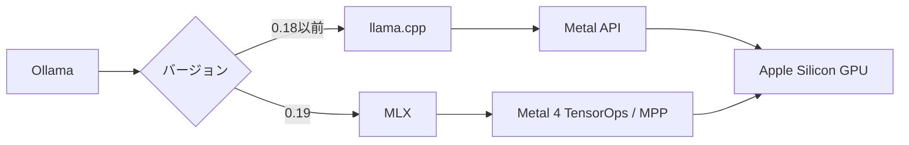

2026年3月末、Ollamaがバージョン0.19のプレビューをリリースしました。Apple Silicon向けの推論バックエンドが、従来のllama.cpp（Metal）からApple製フレームワーク「MLX」に切り替わっています。公式ベンチマークでは、NVFP4量子化との組み合わせでデコード性能が約2倍に向上しました。

この記事では、MLXへの移行が技術的に何を意味するのか、パフォーマンスの変化、NVFP4量子化やキャッシュ改善といった周辺アップデート、そして現時点での制約を整理します。

## Ollama 0.19の変更点の全体像

### 推論バックエンドがllama.cppからMLXに移行

Ollama on Macの推論バックエンドが大きく変わりました。従来はllama.cppがMetal APIを通じてApple SiliconのGPUを利用していましたが、0.19ではApple製の機械学習フレームワーク「MLX」がその役割を担います。



0.19プレビュー版では、MLXバックエンドの最適化はQwen3.5シリーズを対象としています。他のモデルは従来のバックエンドで引き続き動作しますが、MLXによる性能改善は適用されません。なお、0.19はプレビュー版で、正式リリースの時期は未発表です。

### 主な変更点の一覧

| 変更点 | 概要 |
|--------|------|
| MLXバックエンド | llama.cppからApple製MLXフレームワークに移行 |
| M5 Neural Accelerators | M5チップのGPU Neural Acceleratorsに対応 |
| NVFP4量子化 | NVIDIAの低精度推論フォーマットをサポート |
| キャッシュ刷新 | 会話間再利用・チェックポイント・スマートエビクション |

## MLXの設計思想 ─ llama.cppとの違い

### MLXの設計思想と統一メモリの活用

MLXはAppleが開発したオープンソースの機械学習フレームワークです。最大の特徴は、Apple Siliconの統一メモリアーキテクチャ（Unified Memory Architecture）をネイティブに活用する設計になっている点です。

https://github.com/ml-explore/mlx

従来のGPUコンピューティングでは、CPUメモリとGPUメモリが物理的に分かれており、データ転送がボトルネックになっていました。Apple Siliconでは両者が同じ物理メモリを共有しています。MLXはこの構造を前提に設計されており、CPU/GPU間のゼロコピーテンソル操作が可能です。

llama.cppもMetal APIを通じてApple SiliconのGPUを利用していましたが、Metal APIは元来グラフィックス描画やGPGPU向けに設計されたものです。Metal 4（2025年発表）でTensorOpsやNeural Accelerators対応などML向け機能が追加されましたが、これらを活用するには開発者側での対応が必要です。MLXはMetal 4のこれらの機能をフレームワークレベルで抽象化し、統一メモリの特性をより簡潔に活かせるようにしています。

### llama.cppとMLXの特性比較

| 観点 | llama.cpp | MLX |
|------|-----------|-----|
| 対応プラットフォーム | Windows / macOS / Linux / CUDA | Apple Silicon専用 |
| GPU利用方式 | Metal API経由 | 統一メモリ直接アクセス |
| モデルフォーマット | GGUF | SafeTensors（主要）/ GGUF（一部対応） |
| エコシステム | 多くのツール・UIが対応 | Apple中心、急速に拡大中 |
| 短〜中コンテキスト（〜32k） | 良好 | 回転キャッシュで効率的 |
| 長いコンテキスト（32k-128k） | スライディングウィンドウで安定 | スケーリングに課題あり |

どちらが「上位互換」というわけではなく、最適化の方向性が異なります。llama.cppはマルチプラットフォームでの広い互換性、MLXはApple Siliconへの最適化に注力しています。OllamaがMLXを採用したのは、Macユーザーにとってのパフォーマンスを最大化する判断です。

## パフォーマンス改善の実測値

### 公式ベンチマーク ─ Qwen3.5-35B-A3Bでの比較

Ollamaが公開した公式ベンチマークの数値です。テスト対象のQwen3.5-35B-A3BはMoE（Mixture of Experts）ベースのモデルで、35Bパラメータのうち推論時に3Bがアクティブになります。

| 指標 | Ollama 0.18（llama.cpp） | Ollama 0.19（MLX） | 改善率 |
|------|-------------------------|-------------------|--------|
| プリフィル | 1,154 tok/s | 1,810 tok/s | **+57%** |
| デコード | 58 tok/s | 112 tok/s | **+93%** |

:::message
この比較にはバックエンド変更（llama.cpp → MLX）と量子化フォーマットの変更（Q4_K_M → NVFP4）の両方の影響が含まれています。MLX単体での改善幅ではない点に注意が必要です。
:::

:::message
プリフィルはプロンプトの処理速度（入力の読み込み）、デコードはトークン生成速度（出力の書き出し）を指します。ユーザー体感に直結するのは主にデコード速度です。
:::

int4量子化での追加計測では、プリフィル1,851 tok/s、デコード134 tok/sという結果も報告されています。

### M5チップでの追加最適化

M5チップを搭載したMacでは、GPU Neural Acceleratorsによる追加の最適化が効きます。Neural Acceleratorsは行列演算に特化したハードウェアで、MLXがMetal 4のTensorOpsおよびMetal Performance Primitivesを通じてこの機能を活用します。

| 指標 | M4（ベース） | M5（ベース） | 差分 |
|------|-----|-----|------|
| メモリ帯域幅 | 120 GB/s | 153 GB/s | +28% |
| 全体性能 | ベースライン | +19〜27% | — |

Appleのリサーチによると、M5では密な14Bモデルで初回トークン生成（TTFT）が10秒未満、30B MoEモデルで3秒未満を達成しています。M1〜M4のユーザーにもMLX移行の恩恵はありますが、M5での改善幅が最も大きいです。

### 「NVFP4にしないと速くならない」という補足

注意点として、既存のQ4_K_Mフォーマットのモデルをそのまま0.19で動かしても、劇的な速度改善は得られない場合があります。MLXバックエンドの性能を最大限に引き出すには、NVFP4フォーマットのモデルを使う必要があります。

```bash
# NVFP4フォーマットのモデルを指定して実行
ollama run qwen3.5:35b-a3b-coding-nvfp4

# 速度を確認する場合は --verbose オプション
ollama run qwen3.5:35b-a3b-coding-nvfp4 --verbose
```

:::message alert
バージョン0.19へのアップデートだけでは十分ではなく、NVFP4対応のモデルタグを選択することが性能改善の鍵になります。
:::

## NVFP4量子化とキャッシュの改善

### NVFP4量子化 ─ NVIDIAフォーマットをApple Siliconで活用

NVFP4はNVIDIAがBlackwell GPU向けに開発した低精度推論フォーマットです。1符号ビット + 2指数ビット + 1仮数ビットの4ビット構成（E2M1形式）で、16要素のブロックごとにE4M3形式のスケールファクターを持ちます。

FP16と比較してメモリ帯域幅と保存要件を大幅に削減できるため、限られたメモリでより大きなモデルを実行できます。NVIDIA独自のフォーマットですが、OllamaがApple Silicon上でもサポートしたことで、Mac環境でも利用可能になりました。

| フォーマット | ビット幅 | 特徴 |
|------------|---------|------|
| FP16 | 16bit | 高精度だがメモリ消費大 |
| Q4_K_M（GGUF） | 4bit | llama.cppの標準的な量子化 |
| NVFP4 | 4bit | ブロック量子化で精度維持、MLXと相性が良い |

### キャッシュシステムの刷新

Ollama 0.19ではKVキャッシュの仕組みも大きく改善されました。

**会話間でのキャッシュ再利用**: 過去の会話で計算済みのKVキャッシュを再利用します。同じシステムプロンプトやプレフィックスを持つ会話では、再計算が不要になります。

**インテリジェントチェックポイント**: 戦略的なタイミングでキャッシュのスナップショットを保存します。長い会話の途中で再開する場合でも、最初から再計算する必要がありません。

**スマートエビクション**: メモリが逼迫した際に、共有プレフィックス（システムプロンプトなど多くの会話で共通する部分）を優先的に保持します。

これらの改善により、複数の会話を切り替えながら使う場合のメモリ効率と応答速度が向上しています。

## Macへの導入手順

### インストール

Ollama 0.19プレビュー版のインストール手順です。macOS Sonoma（v14）以降が必要です。

公式サイトからDMGファイルをダウンロードし、Ollama.appをApplicationsフォルダにドラッグします。

https://ollama.com/download/mac

初回起動時にCLIツールを`/usr/local/bin`に配置するための権限を求められます。許可すると、ターミナルから`ollama`コマンドが使えるようになります。

```bash
# インストール確認
ollama --version
# ollama version is 0.19.0
```

すでにOllamaを使っている場合は、アプリを上書きインストールするだけでアップデートできます。既存のモデルはそのまま引き継がれます。

### モデルのダウンロードと実行

インストールが完了したら、モデルをダウンロードして実行します。

```bash
# NVFP4フォーマットのモデルをダウンロード・実行（推奨）
ollama run qwen3.5:35b-a3b-coding-nvfp4

# Qwen3.5の小さいバリアントで試す場合
ollama run qwen3.5:0.8b
```

`ollama run`を実行すると、モデルが未ダウンロードの場合は自動的にダウンロードされます。初回は数分〜十数分かかります。

:::message
NVFP4フォーマットのモデル（`-nvfp4`タグ付き）を使うことで、MLXバックエンドの性能を最大限に引き出せます。Q4_K_Mフォーマットのモデルでも動作しますが、性能改善は限定的です。
:::

### 動作確認

モデルが正常に動作しているか確認します。

```bash
# 実行中のモデルを確認
ollama ps

# --verbose オプションで推論速度を表示
ollama run qwen3.5:35b-a3b-coding-nvfp4 --verbose
# 出力末尾にプリフィル速度とデコード速度が表示される
```

`--verbose`で表示されるデコード速度でMLXバックエンドの動作を確認できます。速度はモデルサイズ、量子化フォーマット、チップによって大きく異なります。

### モデルの保存場所とディスク容量

モデルは`~/.ollama`以下に保存されます。35Bクラスのモデルは20GB前後のディスク容量を使うため、空き容量を確認してからダウンロードしてください。

```bash
# ダウンロード済みモデルの一覧とサイズを確認
ollama list
```

### 環境変数による設定カスタマイズ

Ollamaはいくつかの環境変数で動作を制御できます。macOSでは`launchctl setenv`で設定するか、Ollama.appの起動前にターミナルで`export`します。

| 環境変数 | デフォルト | 用途 |
|---------|-----------|------|
| `OLLAMA_MODELS` | `~/.ollama/models` | モデルの保存先を変更 |
| `OLLAMA_HOST` | `127.0.0.1:11434` | APIサーバーのバインドアドレス |
| `OLLAMA_KEEP_ALIVE` | `5m` | モデルをメモリに保持する時間 |
| `OLLAMA_KV_CACHE_TYPE` | `f16` | KVキャッシュの量子化タイプ |
| `OLLAMA_NUM_PARALLEL` | 自動 | 1モデルあたりの並列リクエスト数 |

```bash
# モデルの保存先を外部SSDに変更する例
launchctl setenv OLLAMA_MODELS /Volumes/ExternalSSD/ollama/models

# 他のデバイスからアクセスできるようにする例（⚠ 下記の警告を参照）
launchctl setenv OLLAMA_HOST 0.0.0.0:11434

# 設定を反映するにはOllama.appを再起動
# なお、launchctl setenvの設定はマシン再起動で失われる
```

:::message alert
OllamaのAPIには認証機構がありません。`OLLAMA_HOST`を`0.0.0.0`に設定すると、同一ネットワーク上の全デバイスから無認証でアクセス可能になります。信頼できるローカルネットワーク内でのみ使用し、公共Wi-Fiや外部に公開されたネットワークでは使用しないでください。
:::

`launchctl setenv`の設定はマシン再起動で失われます。永続化が必要な場合はlaunchdのplistファイルを作成してください。

`OLLAMA_KEEP_ALIVE`はメモリ管理に直結します。頻繁にモデルを使う場合は長めに設定すると再ロードの待ち時間がなくなります。逆に、メモリを節約したい場合は短く設定します。

```bash
# モデルを常駐させる（手動でollama stopするまで保持）
launchctl setenv OLLAMA_KEEP_ALIVE -1

# 応答後すぐにアンロードする
launchctl setenv OLLAMA_KEEP_ALIVE 0
```

### Modelfileによるモデルのカスタマイズ

Modelfileを使うと、既存モデルにシステムプロンプトやパラメータを固定した「カスタムモデル」を作成できます。用途に応じた設定を事前に組み込んでおくことで、毎回オプションを指定する手間が省けます。

```dockerfile
# Modelfile の例: コードレビュー用にカスタマイズ
FROM qwen3.5:35b-a3b-coding-nvfp4

PARAMETER temperature 0.3
PARAMETER num_ctx 8192

SYSTEM """
あなたはシニアソフトウェアエンジニアです。
コードレビューでは、セキュリティ、パフォーマンス、可読性の観点で指摘してください。
修正案はコードブロックで提示してください。
"""
```

```bash
# カスタムモデルを作成
ollama create code-reviewer -f Modelfile

# 作成したモデルを実行
ollama run code-reviewer
```

`temperature`は出力のランダム性を制御します。コード生成やレビューなど正確性が求められるタスクでは0.1〜0.3、ブレインストーミングや文章生成では0.7〜0.9が目安です。`num_ctx`はコンテキスト長で、大きくするほどメモリ消費が増えます。

### 開発ツールとの連携

OllamaはOpenAI互換APIを`http://localhost:11434/v1`で提供しています。OpenAI SDKやそのAPIを利用するツールからそのまま接続できます。

```bash
# curlでAPIを叩く例
curl http://localhost:11434/v1/chat/completions \
  -H "Content-Type: application/json" \
  -d '{
    "model": "qwen3.5:35b-a3b-coding-nvfp4",
    "messages": [{"role": "user", "content": "Hello"}]
  }'
```

VS CodeのContinue拡張を使えば、ローカルのOllamaモデルでコード補完やチャットが動作します。`~/.continue/config.yaml`にモデルを追加するだけで設定は完了します。

```yaml
# ~/.continue/config.yaml の models セクションに追加
- name: Qwen3.5 (Local)
  provider: ollama
  model: qwen3.5:0.8b
  apiBase: http://localhost:11434
  roles:
    - chat
```

設定の詳細は[Continue公式のOllamaガイド](https://docs.continue.dev/guides/ollama-guide)を参照してください。

Claude Codeのセッション中からOllamaを呼び出すこともできます。プロンプト入力欄で`!`プレフィックスをつけるとシェルコマンドが実行されます。

```bash
# Claude Codeのセッション中で実行
! ollama run qwen3.5:0.8b "このエラーメッセージの原因を教えて: $(head -50 error.log)"
```

Claude Code（Opus/Sonnet）で複雑なタスクを進めながら、プライバシーが必要なデータの処理やシンプルな質問をローカルモデルに投げる、という使い分けができます。

ローカルモデルをコード補完に使うメリットは、ネットワーク遅延がないことと、コードが外部に送信されないことです。ただし、フロンティアモデルと比較すると補完の精度には差があるため、用途に応じた使い分けが現実的です。

## 現時点の制約と注意点

### プレビュー版としての制約

Ollama 0.19はプレビュー版です。導入にあたっていくつかの制約があります。

| 項目 | 内容 |
|------|------|
| 推奨メモリ | 32GBを超える統一メモリ（公式推奨） |
| ロールバック | 公式サイトから0.18のDMGを再インストールで戻し可能 |
| モデル互換性 | 一部モデルで問題が発生する可能性あり |
| 長いコンテキスト | 32k-128kではllama.cppの方が安定する場面がある |

MLXバックエンドの恩恵を得るにはQwen3.5モデルを使う必要があり、公式は32GBを超える統一メモリを推奨しています。Qwen3.5の小バリアント（0.8B、2B、4B、9B）はOllama 0.19で公式にサポートされており、少ないメモリでも動作します。公式推奨の「32GBを超えるメモリ」は35Bモデルを動かすための条件です。

### 32GB環境での実測 ─ 動くモデルと動かないモデル

M4（32GB統一メモリ）の環境で実際に試した結果です。

| モデル | サイズ | 結果 |
|--------|-------|------|
| qwen3.5:35b-a3b-coding-nvfp4 | 21GB | MLXランナーがタイムアウトで失敗 |
| qwen3.5:35b-a3b-nvfp4 | 21GB | 同上 |
| qwen3.5:0.8b | 1.0GB | 動作 |

35Bモデルは21GBのモデルファイルをロードした時点で統一メモリの大半を消費し、KVキャッシュやMLXの作業領域が確保できませんでした。公式が「32GBを超える統一メモリ」を推奨しているのは、まさにこの理由です。

0.8Bモデルの `--verbose` 出力は以下の通りです。

```
total duration:       57.314341334s    # 全体の処理時間
load duration:        121.411292ms     # モデルのロード時間
prompt eval count:    20 token(s)      # 入力トークン数
prompt eval duration: 141.366791ms     # プリフィル処理時間
prompt eval rate:     141.48 tokens/s  # プリフィル速度
eval count:           2771 token(s)    # 出力トークン数
eval duration:        56.346063583s    # デコード処理時間
eval rate:            49.18 tokens/s   # デコード速度
```

各指標の意味を整理します。

| 指標 | 意味 | 体感への影響 |
|------|------|------------|
| prompt eval rate | プリフィル速度。入力プロンプトの処理速度 | 長いプロンプトを送ったときの待ち時間 |
| eval rate | デコード速度。トークン生成速度 | 応答がどれくらいスムーズに流れるか |
| load duration | モデルのメモリへのロード時間 | 初回起動や `KEEP_ALIVE` 切れ後の待ち時間 |
| total duration | 全工程の合計時間 | ロード + プリフィル + デコードの合算 |

ユーザー体感に最も直結するのは **eval rate（デコード速度）** です。30 tok/s以上あれば文字が流れるように表示され、読む速度を上回ります。10 tok/s以下になると待ちを感じます。

自分の環境でベンチマークを取る場合は、以下のように実行します。

```bash
# --verbose で推論速度を計測
ollama run qwen3.5:0.8b --verbose "Explain quicksort in 3 sentences."

# 2回目以降はモデルがメモリに常駐するため load duration が短くなる
# 純粋な推論速度を見たい場合は2回目の結果を使う
```

この環境（M4 32GB）での実測サマリーは以下の通りです。

| 指標 | 実測値 | 備考 |
|------|--------|------|
| プリフィル | 141.48 tok/s | 入力20トークン |
| デコード | 49.18 tok/s | 体感は十分スムーズ |
| ロード | 121ms | 2回目以降はほぼゼロ |

:::message
0.8Bモデルでthinkingモード（推論モード）を使うと、自己参照的なループに陥って数千トークンを無駄に生成する現象が確認されました。小さいモデルでは `/no_think` プレフィックスでthinkingを無効化するか、非推論モデルを使うことを推奨します。
:::

32GB環境でMLXバックエンドの恩恵を最大限に得るには、48GB以上のMacへのアップグレードか、8B前後のモデルの利用が現実的な選択肢です。

### ベンチマークと現実のギャップ ─ フロンティアモデルとの比較

Ollamaが0.19のベンチマーク対象に採用したQwen3.5-35B-A3Bは、Qwen公式の報告では知識理解（MMMLU）や指示追従（IFBench）で一部のフロンティアモデルに迫るスコアを記録しています。一方で、高度な数学推論（AIME 2026）ではGPT-5.2やOpus 4.6との差が残ります。

ただし、これらのベンチマーク数値を額面通りに受け取るのは危険です。

**ベンチマーク環境と実環境の乖離が大きい**のが現実です。公式ベンチマークはM5 Max以上の大メモリ環境で計測されており、前述のとおり32GBのM4では35Bモデル自体がロードできませんでした。32GB環境で動作するのは0.8B〜8Bクラスのモデルであり、これらはベンチマーク上の35Bとは別物です。

:::message alert
「ローカルLLMがSonnet 4.5相当」というベンチマーク結果は、48GB以上のメモリで35Bモデルを動かせる環境が前提です。32GB環境で動く小さいモデルでは、フロンティアモデルとの差は依然として大きいです。
:::

各モデルクラスの現実的な対応関係は以下のようになります。

| モデルサイズ | 必要メモリ目安 | 現実的な用途 |
|------------|-------------|------------|
| 0.8B〜3B | 8〜16GB | 簡単な質問応答、テキスト整形 |
| 7B〜9B | 16〜24GB | コード補完、要約、翻訳 |
| 35B（MoE, 3B active） | 48GB以上 | コード生成、複雑な指示追従 |

### ローカルLLMの現実的な使いどころ

ベンチマークの数値に惑わされず、ローカルLLMが実際に力を発揮する場面を見極めることが重要です。

- **コード補完**: ネットワーク遅延なしで即座に補完が返る。小さいモデルでも十分実用的
- **テキスト要約・構造化**: 定型的な処理は0.8Bクラスでも動作する
- **プライバシーが求められるデータの処理**: コードや社内文書が外部に送信されない
- **オフライン環境での作業**: ネットワーク接続なしで動作

複雑な推論、エージェントタスク、長いコンテキストが必要な場面では、クラウドのフロンティアモデル（Claude、GPT、Gemini）に任せる方が確実です。ローカルLLMとクラウドAPIを用途に応じて使い分ける設計が現実的です。

## まとめ ─ ローカル推論の選択肢がどう広がったか

Ollama 0.19のMLXバックエンド採用は、Mac上のローカル推論における重要な転換点です。NVFP4 + MLXの組み合わせにより、デコード性能は従来の約2倍に向上しました。M5チップではNeural Acceleratorsによる追加の高速化も得られます。

現時点ではプレビュー版であり、長いコンテキストでのスケーリングや一部モデルの互換性に課題が残ります。正式リリースでこれらが改善されるかが次の注目点です。

ローカルLLMの用途を見極めつつ、MLXエコシステムの成熟を追っていく段階にあります。

