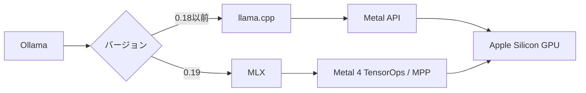

2026年3月末、Ollamaがバージョン0.19のプレビューをリリースしました。Apple Silicon向けの推論バックエンドが、従来のllama.cpp（Metal）からApple製フレームワーク「MLX」に切り替わっています。公式ベンチマークでは、NVFP4量子化との組み合わせでデコード性能が約2倍に向上しました。

この記事では、MLXへの移行が技術的に何を意味するのか、パフォーマンスの変化、NVFP4量子化やキャッシュ改善といった周辺アップデート、そして現時点での制約を整理します。

## Ollama 0.19の変更点の全体像

### 推論バックエンドがllama.cppからMLXに移行

Ollama on Macの推論バックエンドが大きく変わりました。従来はllama.cppがMetal APIを通じてApple SiliconのGPUを利用していましたが、0.19ではApple製の機械学習フレームワーク「MLX」がその役割を担います。



0.19プレビュー版のMLXバックエンドは、現時点ではQwen3.5シリーズのみをサポートしています。他のモデルへの対応は今後予定されています。なお、0.19はプレビュー版で、正式リリースの時期は未発表です。

### 主な変更点の一覧

| 変更点 | 概要 |
|--------|------|
| MLXバックエンド | llama.cppからApple製MLXフレームワークに移行 |
| M5 Neural Accelerators | M5チップのGPU Neural Acceleratorsに対応 |
| NVFP4量子化 | NVIDIAの低精度推論フォーマットをサポート |
| キャッシュ刷新 | 会話間再利用・チェックポイント・スマートエビクション |

## MLXの設計思想 ─ llama.cppとの違い

### MLXの設計思想と統一メモリの活用

MLXはAppleが開発したオープンソースの機械学習フレームワークです。最大の特徴は、Apple Siliconの統一メモリアーキテクチャ（Unified Memory Architecture）をネイティブに活用する設計になっている点です。

https://github.com/ml-explore/mlx

従来のGPUコンピューティングでは、CPUメモリとGPUメモリが物理的に分かれており、データ転送がボトルネックになっていました。Apple Siliconでは両者が同じ物理メモリを共有しています。MLXはこの構造を前提に設計されており、CPU/GPU間のゼロコピーテンソル操作が可能です。

llama.cppもMetal APIを通じてApple SiliconのGPUを利用していましたが、Metal APIは元来グラフィックス描画やGPGPU向けに設計されたものです。Metal 4（2025年発表）でTensorOpsやNeural Accelerators対応などML向け機能が追加されましたが、これらを活用するには開発者側での対応が必要です。MLXはMetal 4のこれらの機能をフレームワークレベルで抽象化し、統一メモリの特性をより簡潔に活かせるようにしています。

### llama.cppとMLXの特性比較

| 観点 | llama.cpp | MLX |
|------|-----------|-----|
| 対応プラットフォーム | Windows / macOS / Linux / CUDA | Apple Silicon専用 |
| GPU利用方式 | Metal API経由 | 統一メモリ直接アクセス |
| モデルフォーマット | GGUF | SafeTensors（主要）/ GGUF（一部対応） |
| エコシステム | 多くのツール・UIが対応 | Apple中心、急速に拡大中 |
| 短〜中コンテキスト（〜32k） | 良好 | 回転キャッシュで効率的 |
| 長いコンテキスト（32k-128k） | スライディングウィンドウで安定 | スケーリングに課題あり |

どちらが「上位互換」というわけではなく、最適化の方向性が異なります。llama.cppはマルチプラットフォームでの広い互換性、MLXはApple Siliconへの最適化に注力しています。OllamaがMLXを採用したのは、Macユーザーにとってのパフォーマンスを最大化する判断です。

## パフォーマンス改善の実測値

### 公式ベンチマーク ─ Qwen3.5-35B-A3Bでの比較

Ollamaが公開した公式ベンチマークの数値です。テスト対象のQwen3.5-35B-A3BはMoE（Mixture of Experts）モデルで、35Bパラメータのうち推論時に3Bがアクティブになります。

| 指標 | Ollama 0.18（llama.cpp） | Ollama 0.19（MLX） | 改善率 |
|------|-------------------------|-------------------|--------|
| プリフィル | 1,154 tok/s | 1,810 tok/s | **+57%** |
| デコード | 58 tok/s | 112 tok/s | **+93%** |

:::message
この比較にはバックエンド変更（llama.cpp → MLX）と量子化フォーマットの変更（Q4_K_M → NVFP4）の両方の影響が含まれています。MLX単体での改善幅ではない点に注意が必要です。
:::

:::message
プリフィルはプロンプトの処理速度（入力の読み込み）、デコードはトークン生成速度（出力の書き出し）を指します。ユーザー体感に直結するのは主にデコード速度です。
:::

int4量子化での追加計測では、プリフィル1,851 tok/s、デコード134 tok/sという結果も報告されています。

### M5チップでの追加最適化

M5チップを搭載したMacでは、GPU Neural Acceleratorsによる追加の最適化が効きます。Neural Acceleratorsは行列演算に特化したハードウェアで、MLXがMetal 4のTensorOpsおよびMetal Performance Primitivesを通じてこの機能を活用します。

| 指標 | M4（ベース） | M5（ベース） | 差分 |
|------|-----|-----|------|
| メモリ帯域幅 | 120 GB/s | 153 GB/s | +28% |
| 全体性能 | ベースライン | +19〜27% | — |

Appleのリサーチによると、M5では密な14Bモデルで初回トークン生成（TTFT）が10秒未満、30B MoEモデルで3秒未満を達成しています。M1〜M4のユーザーにもMLX移行の恩恵はありますが、M5での改善幅が最も大きいです。

### 「NVFP4にしないと速くならない」という補足

注意点として、既存のQ4_K_Mフォーマットのモデルをそのまま0.19で動かしても、劇的な速度改善は得られない場合があります。MLXバックエンドの性能を最大限に引き出すには、NVFP4フォーマットのモデルを使う必要があります。

```bash
# NVFP4フォーマットのモデルを指定して実行
ollama run qwen3.5:35b-a3b-coding-nvfp4

# 速度を確認する場合は --verbose オプション
ollama run qwen3.5:35b-a3b-coding-nvfp4 --verbose
```

:::message alert
バージョン0.19へのアップデートだけでは十分ではなく、NVFP4対応のモデルタグを選択することが性能改善の鍵になります。
:::

## NVFP4量子化とキャッシュの改善

### NVFP4量子化 ─ NVIDIAフォーマットをApple Siliconで活用

NVFP4はNVIDIAがBlackwell GPU向けに開発した低精度推論フォーマットです。1符号ビット + 2指数ビット + 1仮数ビットの4ビット構成（E2M1形式）で、16要素のブロックごとにE4M3形式のスケールファクターを持ちます。

FP16と比較してメモリ帯域幅と保存要件を大幅に削減できるため、限られたメモリでより大きなモデルを実行できます。NVIDIA独自のフォーマットですが、OllamaがApple Silicon上でもサポートしたことで、Mac環境でも利用可能になりました。

| フォーマット | ビット幅 | 特徴 |
|------------|---------|------|
| FP16 | 16bit | 高精度だがメモリ消費大 |
| Q4_K_M（GGUF） | 4bit | llama.cppの標準的な量子化 |
| NVFP4 | 4bit | ブロック量子化で精度維持、MLXと相性が良い |

### キャッシュシステムの刷新

Ollama 0.19ではKVキャッシュの仕組みも大きく改善されました。

**会話間でのキャッシュ再利用**: 過去の会話で計算済みのKVキャッシュを再利用します。同じシステムプロンプトやプレフィックスを持つ会話では、再計算が不要になります。

**インテリジェントチェックポイント**: 戦略的なタイミングでキャッシュのスナップショットを保存します。長い会話の途中で再開する場合でも、最初から再計算する必要がありません。

**スマートエビクション**: メモリが逼迫した際に、共有プレフィックス（システムプロンプトなど多くの会話で共通する部分）を優先的に保持します。

これらの改善により、複数の会話を切り替えながら使う場合のメモリ効率と応答速度が向上しています。

## Macへの導入手順

### インストール

Ollama 0.19プレビュー版のインストール手順です。macOS Sonoma（v14）以降が必要です。

公式サイトからDMGファイルをダウンロードし、Ollama.appをApplicationsフォルダにドラッグします。

https://ollama.com/download/mac

初回起動時にCLIツールを`/usr/local/bin`に配置するための権限を求められます。許可すると、ターミナルから`ollama`コマンドが使えるようになります。

```bash
# インストール確認
ollama --version
# ollama version is 0.19.0
```

すでにOllamaを使っている場合は、アプリを上書きインストールするだけでアップデートできます。既存のモデルはそのまま引き継がれます。

### モデルのダウンロードと実行

インストールが完了したら、モデルをダウンロードして実行します。

```bash
# NVFP4フォーマットのモデルをダウンロード・実行（推奨）
ollama run qwen3.5:35b-a3b-coding-nvfp4

# Qwen3.5の小さいバリアントで試す場合
ollama run qwen3.5:0.8b
```

`ollama run`を実行すると、モデルが未ダウンロードの場合は自動的にダウンロードされます。初回は数分〜十数分かかります。

:::message
NVFP4フォーマットのモデル（`-nvfp4`タグ付き）を使うことで、MLXバックエンドの性能を最大限に引き出せます。Q4_K_Mフォーマットのモデルでも動作しますが、性能改善は限定的です。
:::

### 動作確認

モデルが正常に動作しているか確認します。

```bash
# 実行中のモデルを確認
ollama ps

# --verbose オプションで推論速度を表示
ollama run qwen3.5:35b-a3b-coding-nvfp4 --verbose
# 出力末尾にプリフィル速度とデコード速度が表示される
```

`--verbose`で表示されるデコード速度が100 tok/s前後であれば、MLXバックエンドが正常に動作しています。

### モデルの保存場所とディスク容量

モデルは`~/.ollama`以下に保存されます。35Bクラスのモデルは20GB前後のディスク容量を使うため、空き容量を確認してからダウンロードしてください。

```bash
# ダウンロード済みモデルの一覧とサイズを確認
ollama list
```

## 現時点の制約と注意点

### プレビュー版としての制約

Ollama 0.19はプレビュー版です。導入にあたっていくつかの制約があります。

| 項目 | 内容 |
|------|------|
| 推奨メモリ | 32GBを超える統一メモリ（公式推奨） |
| ロールバック | 公式サイトから0.18のDMGを再インストールで戻し可能 |
| モデル互換性 | 一部モデルで問題が発生する可能性あり |
| 長いコンテキスト | 32k-128kではllama.cppの方が安定する場面がある |

MLXバックエンドの恩恵を得るにはQwen3.5モデルを使う必要があり、公式は32GBを超える統一メモリを推奨しています。Qwen3.5の小さいバリアント（0.8Bなど）であれば少ないメモリでも動作する可能性がありますが、公式にはテストされていません。

### ローカルLLMの現実的な立ち位置

MLXへの移行でMac上のローカル推論は大きく改善されましたが、フロンティアモデル（Claude、GPT-4など）との性能差は依然として存在します。特に複雑な推論やエージェントタスクでは差が顕著です。

ローカルLLMが力を発揮するのは、以下のような定型的なタスクです。

- コード補完・生成
- テキスト要約
- エンティティ抽出・構造化
- プライバシーが求められるデータの処理

Hacker Newsのコミュニティでは「小さいモデルは自分の限界を知り、必要に応じて外部サービスに委譲するパターンが現実的だ」という議論も見られました。ローカルLLMとクラウドAPIを使い分ける設計が、現時点での実用的なアプローチと言えます。

## まとめ ─ ローカル推論の選択肢がどう広がったか

Ollama 0.19のMLXバックエンド採用は、Mac上のローカル推論における重要な転換点です。NVFP4 + MLXの組み合わせにより、デコード性能は従来の約2倍に向上しました。M5チップではNeural Acceleratorsによる追加の高速化も得られます。

現時点ではプレビュー版であり、長いコンテキストでのスケーリングや一部モデルの互換性に課題が残ります。正式リリースでこれらが改善されるかが次の注目点です。

ローカルLLMの用途を見極めつつ、MLXエコシステムの成熟を追っていく段階にあります。
