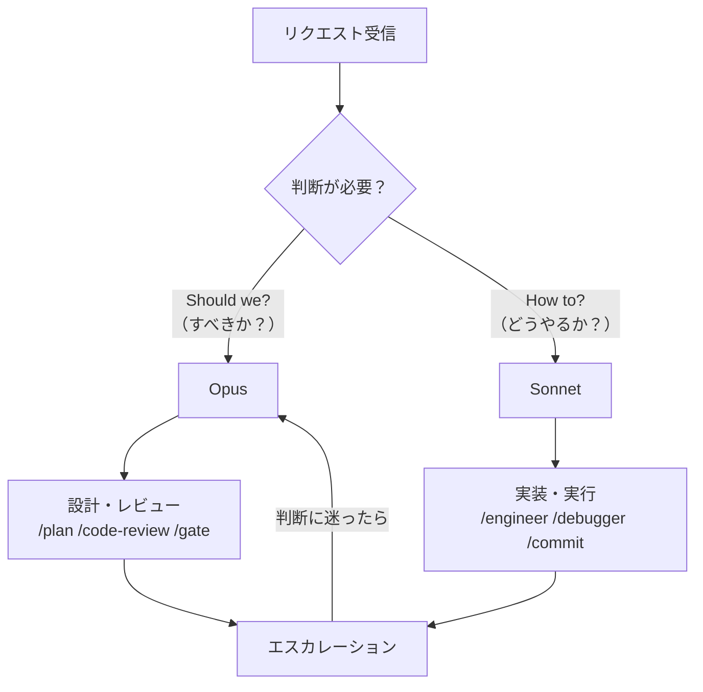
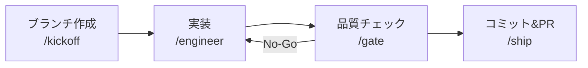

@[docswell](https://www.docswell.com/s/takish/TODO-skill-philosophy)

## 60以上のスキルを破綻させない5つの設計原則

Claude CodeにはAgent Skills（エージェントスキル）という仕組みがあります。YAMLフロントマター付きのMarkdownファイルを1つ書くだけで、AIの振る舞いを定義できる機能です。最初の数個は直感で作れます。「コードレビュー用」「コミット用」「実装用」——用途ごとにスキルを分ければいい、それだけの話です。

しかし10個、30個、60個と増えるにつれて、設計判断が積み重なっていきます。「このスキルはOpus（高性能モデル）とSonnet（高速モデル）のどちらで動かすべきか？」「レビュー系スキルにBash実行を許可すべきか？」「スキル同士をどう連携させるか？」——こうした問いに、毎回その場で判断していては一貫性が保てません。

私は現在、65個のClaude Codeスキルを運用しています。この記事では、その過程で見えてきた**5つの設計原則**を共有します。

1. **モデル選択は「判断」vs「実行」で分ける** — Opusは設計判断、Sonnetは実装実行
2. **allowed-toolsで安全境界を作る** — ツール制限でスキルの責務を定義する
3. **パイプラインは明示的に繋ぐ** — スキル連携を暗黙にしない
4. **ルーティングテーブルで迷わせない** — 意図→スキルの対応表を用意する
5. **コンテキストサイズは用途で決める** — デフォルトは標準、必要なときだけ1M

これらの判断基準を持つことで、スキルの数が増えても破綻しない体系を維持できます。

<!-- 画像: Claude Codeのスキル一覧（ターミナルでスキルディレクトリをlsした画面） -->

## スキルが増えると起きる問題

### 「とりあえずOpus」がコストを膨らませる

スキルを作るとき、最初に悩むのがモデル選択です。Claude Codeでは、スキルごとに使用するモデルを指定できます。OpusとSonnetの2択が基本です（Claude CodeではHaikuも利用可能ですが、スキルの実行品質を考慮するとOpusかSonnetの選択が実用的です）。

判断に迷ったとき、「とりあえずOpus（高性能モデル）にしておこう」という選択をしがちです。高性能なほうが安全だろう、という考えです。しかし実際に運用してみると、Opusが本当に必要な場面は全体の20〜30%程度でした。残りの70〜80%はSonnetで十分な品質が出ます。

Opusは処理速度も遅く、コストも高い。「とりあえずOpus」は、コストとレイテンシの両方を無駄に増やしていたのです。

### 責務の重複がツール制限の甘さを生む

もう1つの問題は、スキル間の責務が曖昧になることです。たとえばcode-review（コードレビュー）とarch-review（アーキテクチャレビュー）の境界はどこでしょうか。どちらも「コードを見て問題を指摘する」という点では同じです。

さらに厄介なのが、レビュー系スキルにツール制限をかけていない場合の事故です。レビューを依頼したはずなのに、AIがコードを直接修正してしまう。レビューの目的は「問題を指摘すること」であって「勝手に直すこと」ではありません。ツール制限が甘いと、スキルの責務が曖昧になり、予期しない副作用が生まれます。

こうした問題を解決するために、私は5つの設計原則を定めました。以下で1つずつ解説します。

<!-- 画像: Before/After図 — 左: スキルが無秩序に増えた状態、右: 5原則で整理された状態 -->

## 原則1: モデル選択は「判断」vs「実行」で分ける

### Opusは「Should we?」、Sonnetは「How to?」

モデル選択の基準はシンプルです。「Should we?（すべきか？）」と問う場面ではOpus、「How to?（どうやるか？）」と問う場面ではSonnetを使います。

具体的には次のような分け方です。

**Opusを使う場面（判断・設計）:**
- アーキテクチャ設計（`/plan`）
- コードレビュー（`/code-review`）
- 品質ゲート判定（`/gate`）
- 大きなIssueの分解（`/agent-split`）
- PRのレビューとマージ判定（`/agent-lead`）

**Sonnetを使う場面（実行・実装）:**
- コード実装（`/engineer`）
- バグの切り分けと修正（`/debugger`）
- コミット（`/commit`）
- PR作成（`/create-pr`）
- ブラウザ操作（`/chrome`、`/agent-browser`）

この基準の背景にある考え方は、「判断ミスのコストが高い場面だけOpusを使う」です。設計判断を間違えると、その後の実装がすべてやり直しになります。一方、コミットメッセージの生成やブランチの作成は、間違えてもすぐ修正できます。コストの非対称性を基準にモデルを選ぶのです。



### 5カテゴリ65スキルの分類マップ

私のスキルは以下のカテゴリに分類されています（Private・未分類含む）。

| カテゴリ | スキル数 | 主要モデル | 代表的なスキル |
|---------|---------|-----------|-------------|
| 設計・判断系 | 12 | Opus | plan, code-review, arch-review, design |
| 実行・実装系 | 10 | Sonnet | engineer, debugger, chrome |
| コンテンツ系 | 6 | Sonnet | seo, aieo, imagen-prompt |
| チーム | 1 | Opus | team |
| ワークフロー | 19 | 混在 | kickoff, ship, gate, issue-work |
| Private | 13 | 混在 | （非公開） |
| その他（未分類） | 4 | — | quick-impl, split-issue 等 |

設計・判断系はすべてOpusです。これらのスキルは「何をすべきか」「この設計は正しいか」を判断する役割を持ちます。実行・実装系はすべてSonnetです。「指示された内容を正確に実行する」ことが求められるため、高速なSonnetが適しています。

ワークフロー系は混在しています。`/gate`（品質ゲート）のように判断を含むものはOpus、`/kickoff`（ブランチ作成）のように実行に特化したものはSonnetです。

<!-- 画像: 5カテゴリの分類マップ図 — カテゴリごとにモデルが色分けされたツリー図 -->

### エスカレーションルール — Sonnetが判断に迷ったらOpusへ

モデル選択は静的なものだけでは不十分です。Sonnetスキルの実行中に、想定外の設計判断が必要になることがあります。たとえば`/engineer`でコード実装中に「このモジュールの責務分割をどうするか」という問いに直面するケースです。

この場合のルールを明文化しています。「Sonnetスキル実行中に設計判断・アーキテクチャ選択が必要と感じたら、`/plan`への切り替えを提案する」。AIに判断を委ねるのではなく、適切なモデルに切り替える仕組みを持つことが重要です。

暗黙の判断に頼ると、Sonnetが無理に設計判断をして品質が下がります。エスカレーションルールの明文化は、モデル選択の原則を動的に補完する役割を果たします。

実運用での体感としては、エスカレーションが発生するのは月に数回程度です。Sonnetが適切に「迷い」を検知できるかは完璧ではなく、不要なエスカレーションも含まれます。それでも、設計判断をSonnetに無理にさせて後から手戻りするよりは、多少の誤検知があってもOpusに切り替えるほうがトータルのコストは低いと感じています。

## 原則2: allowed-toolsで安全境界を作る

### ツール制限の4パターン

Claude Codeのスキルでは、`allowed-tools`（許可ツール）というフロントマターで、スキルが使えるツールを制限できます。重要な点として、`allowed-tools`を省略した場合、ツールが使えなくなるわけではありません。**省略すると全ツールが承認ベースで使用可能**になります。つまり、ツール制限は「明示的に指定して絞る」ことで機能します。

逆に、`allowed-tools`を明示的に指定した場合、そのツールはスキルがアクティブな間は**承認なしで**使用可能になります。つまりallowed-toolsは「使えるツールを絞る」だけでなく、「指定したツールの承認をスキップさせる」という効果も持ちます。これはセキュリティ上の重要なトレードオフです。利便性のためにガードレール（承認ダイアログ）を外す行為であることを認識した上で、スキルごとに必要最小限のツールだけを指定してください。

この仕組みを理解した上で、私は4つのパターンに整理しています。

**パターン1: レビュー系（プロンプトによる行動制御）**

```yaml
---
name: code-review
model: claude-opus-4-6[1m]
# allowed-tools 省略 = 全ツール使用可能（承認ベース）
# ただしプロンプトで「分析・指摘のみ行い、コードを変更しない」と指示
---
```

レビュー系スキルでは、`allowed-tools`による制限ではなく、プロンプト内容によって行動を制御します。スキルのプロンプトに「コードの読み取りと分析だけに専念し、ファイルを変更しないこと」と明示的に記述することで、レビューに専念させます。この指示がプロンプトに含まれていないと、AIが「親切に」コードを修正してしまうリスクがあるため、必ず明記してください。技術的にはツールへのアクセス権はありますが、プロンプトの指示により分析のみを行います。

ただし注意点があります。**プロンプトによる行動制御はソフトな制約**であり、ハードな安全境界ではありません。コンテキストが長くなるとプロンプト指示の遵守率が下がることがありますし、ユーザーが会話中に明示的にツール使用を許可すると実行されることもあります。理想的には`allowed-tools`によるハードな制約と併用すべきです。レビュー系で`allowed-tools`を使わない理由は、レビュー中にBashでテスト実行やビルド確認が必要になる場面があるためです。この利便性とリスクのトレードオフを理解した上で、プロンプト制御を選択しています。

**パターン2: 実装系（全ツール許可）**

```yaml
---
name: engineer
model: claude-sonnet-4-6[1m]
# allowed-tools 省略 = 全ツール使用可能（通常の承認フロー）
---
```

実装系スキルにもすべてのツールを許可します。コードの読み書き、Bash実行、ファイル検索——実装に必要なすべての操作を制限なく実行できます。レビュー系との違いは、プロンプトで「変更を行ってよい」と指示している点です。

**パターン3: ワークフロー系（Bash + Read）**

```yaml
---
name: commit
model: claude-sonnet-4-6
allowed-tools: Bash, Read, Glob, Grep
# Edit/Write がないのでコード変更不可
---
```

ワークフロー系スキルにはBashとRead系ツールのみを許可します。git操作やファイル読み取りはできますが、コードの直接変更はできません。`/commit`スキルが勝手にコードを修正してからコミットする、という事故を防げます。

**パターン4: コンテンツ系（Read + Write）**

```yaml
---
name: note-draft
model: claude-sonnet-4-6
allowed-tools: Read, Write
# Bash がないので環境アクセス不可
---
```

コンテンツ系スキルにはReadとWriteのみを許可します。ファイルの読み書きはできますが、Bashコマンドは実行できません。記事生成スキルがシステムコマンドを実行する必要はないからです。

### 「レビューがコードを変更する」事故を防ぐ

なぜここまで行動制御にこだわるのか。それは実際に事故を経験したからです。

プロンプトでの行動制御が不十分だったとき、`/code-review`がレビュー結果の報告だけでなく、指摘した問題を「親切に」修正してしまうことがありました。レビューとは「問題を発見し、改善案を提示する」行為です。修正するかどうかの判断は人間が行うべきです。

ここで整理すると、スキルの責務制御には2つのアプローチがあります。**プロンプトによる行動制御**（レビュー系のように「何をすべきか」を指示で制御）と、**allowed-toolsによるツール制限**（ワークフロー系のように使えるツール自体を絞る）です。どちらも「このスキルは何をする責任があり、何をしてはいけないか」を明示する設計ツールです。用途に応じて使い分けることが、スキルの責務定義の核心なのです。

<!-- 画像: ツール制限の4パターン比較表 — 各パターンで使えるツールをマトリクスで表示 -->

## 原則3: パイプラインは明示的に繋ぐ

### 12のワークフローチェーン

スキルは単体で使うだけでなく、複数のスキルを連携させる「パイプライン」として使うと真価を発揮します。ただし、この連携を暗黙的にしてはいけません。

私は12のワークフローチェーン（スキル連携パターン）を明示的に定義しています。代表的なものを紹介します。

**新機能開発パイプライン:**
```
/kickoff → /engineer → /gate → /ship
```
ブランチ作成 → コード実装 → 品質チェック → コミット&PR作成。新機能を追加する際の標準フローです。

**バグ修正パイプライン:**
```
/debugger → /engineer → /gate → /ship
```
バグの切り分け → 修正実装 → 品質チェック → コミット&PR作成。デバッグと修正を分離しています。

**設計からの実装パイプライン:**
```
/plan → /kickoff → /engineer → /code-review → /ship
```
設計検討 → ブランチ作成 → 実装 → レビュー → コミット&PR作成。リスクの高い変更に使います。

**@claude自律パイプライン:**
```
/agent-split → /agent-impl → /agent-lead
```
Issue分解 → 自動実装 → PRレビュー&マージ判定。人間の介入を最小化した自律フローです。

**Issue駆動（単発自動）:**
```
/issue-work
```
1つのスキルで解析から実装、検証、PR作成まで完結します。パイプラインを1スキルに凝縮したパターンです。

これらのチェーンを定義する意義は「次に何をすべきか」を明確にすることです。各スキルの完了時に「次のステップはこれです」と提案できるようになります。



### gate — 並列オーケストレーションの実装

パイプラインの中でも特に面白い設計が`/gate`（品質ゲート）スキルです。このスキルは「スキルがスキルを呼ぶ」パターンを実装しています。

`/gate`はOpusで動作し、以下の5つのサブチェックを並列に起動します。

1. コード品質チェック
2. TypeScript静的解析
3. 重複コード検出
4. 設計原則の遵守確認
5. シークレット（API キーやパスワード）の検出

各サブチェックの結果を統合し、Go（コミット可）またはNo-Go（修正必要）を判定します。単一のスキルでは「チェック漏れ」が起きやすいですが、複数の専門スキルを並列実行することで網羅的な品質チェックが可能になります。

このパターンのポイントは、オーケストレーター（指揮者）としてのスキルをOpusで動かし、個々のチェッカーは軽量なSonnetで動かすことです。判断の統合はOpus、個別の検査はSonnet——原則1の「判断vs実行」がここでも適用されています。

<!-- 画像: gateスキルの並列オーケストレーション図 — 中央のOpus gateから5つのサブチェックが分岐し、結果が統合される -->

## 原則4: ルーティングテーブルで迷わせない

### 33行のインテント→スキル対応表

65個のスキルがあると、「どのスキルを使えばいいか」という問題が生まれます。スキルの名前と用途をすべて覚えるのは現実的ではありません。

この問題を解決するのがルーティングテーブル（意図→スキル対応表）です。私はCLAUDE.md（Claude Codeの設定ファイル）に33行の対応表を定義しています。

```markdown
| ユーザーの意図 | 推奨スキル | 備考 |
|--------------|-----------|------|
| 機能を実装したい | /engineer | iOSの場合は /ios-engineer |
| バグを直したい | /debugger | 切り分け後の修正は /engineer へ |
| コードをレビューしてほしい | /code-review | アーキテクチャ観点は /arch-review |
| 設計を相談したい | /plan | リスクの高い変更は必須 |
| コミットしたい | /commit | PRまで一括なら /ship |
| 品質チェックしたい | /gate | セキュリティは /secret-scan |
| 次に着手するIssueを選びたい | /issue-next | Issue整理は /issue-triage |
```

この対応表があることで、ユーザーはスキル名を知らなくても、自然言語で意図を伝えるだけで適切なスキルが提案されます。「機能を実装したい」と言えば`/engineer`が、「コードをレビューしてほしい」と言えば`/code-review`が候補として挙がるのです。

### CLAUDE.mdに書くべきメタ情報

ルーティングテーブルをスキルファイル内ではなくCLAUDE.mdに書くのには理由があります。CLAUDE.mdはClaude Codeが常に読み込む設定ファイルです。スキルファイルはそのスキルが呼び出されたときだけ読み込まれます。

CLAUDE.mdに書くべき情報は3つです。

- **ルーティングテーブル**: どのスキルをいつ使うか
- **ワークフローチェーン**: スキルの連携パターン
- **エスカレーションルール**: モデル切り替えの条件

これらはすべて「スキル横断的な情報」です。個々のスキルの中に書いても、そのスキルが呼び出されないと参照されません。常に参照可能なCLAUDE.mdに置くことで、スキル選択の段階から適切な判断ができるようになります。

スキル本体には「そのスキルが何をするか」だけを書きます。「いつ使うか」「他のスキルとどう連携するか」はCLAUDE.mdの責務です。この責務分離が、スキルの数が増えても管理を破綻させないコツです。

なお、この手法にもスケーラビリティの限界はあります。ルーティングテーブルが33行でも既にそれなりの長さであり、CLAUDE.mdに書くメタ情報が増えるほどセッション開始時のトークン消費も増加します。100スキルを超える規模になった場合は、プロジェクト別CLAUDE.mdへの分離や、ルーティングテーブルの階層化を検討する必要があるでしょう。

<!-- 画像: CLAUDE.mdとスキルファイルの責務分離図 — CLAUDE.md側にルーティング・チェーン・エスカレーション、スキル側にプロンプト・ツール制限 -->

## 原則5: コンテキストサイズは用途で決める

### 標準 vs 1Mコンテキストの使い分け

Claude Codeでは、スキルごとにコンテキストウィンドウ（AIが一度に読み込める情報量）のサイズを選択できます。標準コンテキストと1M（100万トークン）の2択です。

結論から言えば、ほとんどのスキルは標準で十分です。1Mコンテキストが必要なのは、コードベース全体を俯瞰する必要がある限定的な場面のみです。

**標準コンテキストで十分なスキル:**
- `/ask`（質問応答）
- `/commit`（コミット）
- `/kickoff`（ブランチ作成）
- `/create-pr`（PR作成）
- `/imagen-prompt`（画像生成プロンプト作成）

これらのスキルは、局所的な情報だけで処理が完結します。コミットメッセージの生成にコードベース全体の知識は不要です。

**1Mコンテキストが必要なスキル:**
- `/plan`（アーキテクチャ設計）
- `/code-review`（包括的レビュー）
- `/engineer`（大規模実装）
- `/issue-work`（Issue全体の解析→実装→検証）
- `/agent-split`（大きなIssueの分解）

これらのスキルは、コードベースの複数箇所を横断的に参照する必要があります。アーキテクチャ設計で「既存の設計パターンとの整合性」を判断するには、広範なコンテキストが不可欠です。

### コストとレイテンシのトレードオフ

1Mコンテキストは便利ですが、コストもレイテンシ（応答遅延）も増加します。闇雲にすべてのスキルを1Mにすると、処理が遅くなり、API利用料も膨らみます。

判断基準は明確です。「このスキルは、タスクを完了するために複数ファイルを横断的に読む必要があるか？」——Yesなら1M、Noなら標準。迷ったら標準から始めて、コンテキスト不足で品質が下がったときに1Mへ切り替えるのが安全です。

モデル選択と同じく、「デフォルトは軽量、必要なときだけリッチに」という原則がここでも適用されます。コストに敏感な運用をするなら、この使い分けは避けて通れません。

## まとめ: まず3つから始めよう

65個のスキルを運用してきた経験から、5つの設計原則をまとめました。

1. **モデル選択は「判断」vs「実行」で分ける** — Opusは「すべきか？」、Sonnetは「どうやるか？」
2. **allowed-toolsで安全境界を作る** — ツール制限はスキルの責務定義そのもの
3. **パイプラインは明示的に繋ぐ** — 「次に何をすべきか」を定義する
4. **ルーティングテーブルで迷わせない** — 意図→スキルの対応表をCLAUDE.mdに置く
5. **コンテキストサイズは用途で決める** — デフォルトは標準、必要なときだけ1M

なお、本記事ではClaude Codeのスキルに焦点を絞りました。Claude Codeにはスキルとは別にサブエージェント（`agents/`）という仕組みもあり、分離されたコンテキストでの実行やツール制限が可能です。スキルとサブエージェントの使い分けについては別の機会に紹介します。

ただし、65個のスキルを最初から作る必要はありません。私自身も最初は`/engineer`（実装）、`/commit`（コミット）、`/code-review`（レビュー）の3つから始めました。必要を感じたときに、この5原則に沿って少しずつ追加していけば、スキルの数が増えても一貫した体系を維持できます。

[Claude Code Agent Skillsの公式ドキュメント](https://docs.anthropic.com/en/docs/claude-code/skills)も合わせて参照してください。スキルのフロントマター仕様や設定方法の詳細が記載されています。
