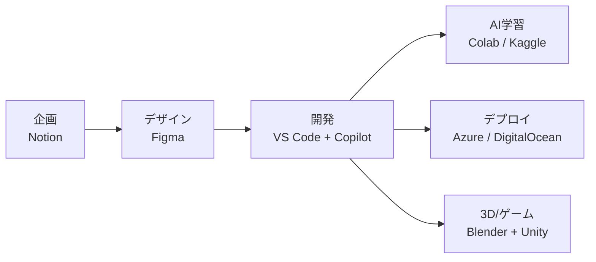
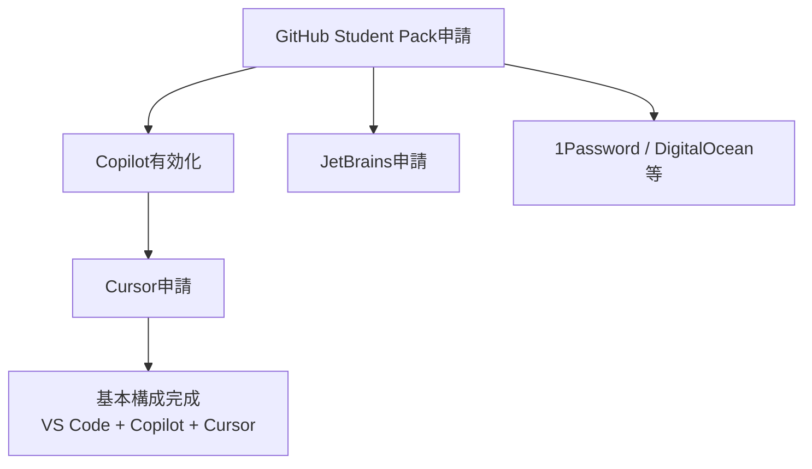

学生であれば、プロのエンジニアが使う開発環境・AIツール・クラウドサービスのほとんどを無料で利用できます。その中心にあるのがGitHub Student Developer Packです。GitHub Copilotを含む60以上のツールが、学生認証だけで手に入ります。

この記事では、AI開発を始めたい学生向けに、以下の内容をまとめました。

- 日本から申請して実際に通るサービスの整理
- AIコーディングツール6種の学割比較
- クラウドGPUや3D/クリエイティブ系ツールの特典
- コストを抑えた最適構成

:::message
この記事の情報は2026年4月時点のものです。各サービスの料金・特典内容は変更される可能性があるため、申請前に公式サイトで最新情報を確認してください。
:::

## 学生特典の全体像 — 開発・AI・クラウド・クリエイティブが無料になる

### GitHub Student Developer Packを軸にした特典マップ

GitHub Student Developer Packは、学生認証を行うだけで60以上の開発ツール・サービスが無料または大幅割引で利用できるプログラムです。開発・AI・クラウド・デザインの主要ツールがカテゴリ横断で揃います。

| カテゴリ | サービス | 学生特典 |
|---------|---------|---------|
| AI開発 | GitHub Copilot | Pro相当が無料 |
| AI開発 | Cursor | Pro 1年間無料 |
| 開発ツール | JetBrains全製品 | 無料（非商用） |
| 開発ツール | GitHub Pro | 無料 |
| クラウド | Microsoft Azure | $100クレジット |
| クラウド | DigitalOcean | $200クレジット |
| デザイン | Figma | Education Plan無料 |
| デザイン | Adobe CC | 初年度75-80%OFF |
| SaaS | Notion | Plus Plan無料 |
| SaaS | 1Password | 1年間無料 |
| 3D/CG | Autodesk全製品 | 無料（非商用） |
| 3D/CG | Blender | 全員無料（OSS） |

これらを合計すると、ソフトウェアだけで年間20万円以上（3D/CG系を含めると数十万円以上）の価値になります。

### 1人でプロダクト開発が完結する構成

学生特典を組み合わせると、企画からデプロイまでの全工程を1人でカバーできます。

Web開発、AI開発、3D/ゲーム開発のいずれの方向に進んでも、初期投資$0で始められます。

## AIコーディングツール6種の学割比較

### 学割の手厚さランキング

AIコーディングツールの学割対応は、サービスごとに大きく異なります。以下は2026年4月時点の比較です。

| ツール | 学生料金 | 通常料金 | 主要機能 | 日本からの利用 |
|--------|---------|---------|---------|--------------|
| **GitHub Copilot** | **無料** | $10/月 | コード補完、Chat、Agent Mode、Coding Agent | .ac.jpで通る |
| **Cursor** | **無料（1年）** | $20/月 | コード補完、Chat、マルチファイル編集 | 学生証で通る |
| **Gemini** | 終了（延長の可能性あり） | $19.99/月 | Deep Research、NotebookLM、2TB Storage | 要確認 |
| **Windsurf** | 約$6.90/月（50%以上OFF） | $20/月 | コード補完、Chat、Cascade | .edu前提 |
| **ChatGPT** | **学割なし** | Go $8/月 | Chat、コード生成 | 大学Edu導入なら無料 |
| **Claude** | **学割なし** | Pro $20/月〜 | Chat、コード生成、Claude Code | — |

GitHub Copilot（Pro相当が完全無料）とCursor（Pro 1年間無料）が、学割の手厚さで頭ひとつ抜けています。

Google Geminiは2026年3月11日にメインの学生オファーが終了しました。ただし、日本は再認証（SheerID）による延長アクセスの対象国に含まれているため、公式サイトでの確認を推奨します。

ChatGPTとClaudeには、個人向けの公式学割が存在しません。ChatGPTは大学がChatGPT Eduを一括導入していれば無料で使えますが、個人で申請する手段はありません。

### CopilotとCursorは併用できる

GitHub CopilotとCursorは競合するツールに見えますが、実際には併用が可能です。

GitHub Copilotは、VS Code内の拡張機能として動作します。コード補完やCopilot Chatを日常的に使うメインツールとして機能します。一方、CursorはVS Codeをフォークした独立エディタです。プロジェクト単位でエディタを切り替える運用ができます。

両方とも学生は無料で使えるため、実際に試して自分の開発スタイルに合う方をメインにする判断ができます。

### Claude Codeの位置づけ — 補助的パワーツール

Claude Codeは、ターミナルで動作するCLIベースのAI開発ツールです。ファイルの読み書き、コマンド実行、Git操作を自律的に行い、プロジェクト全体を把握した上でコードを生成します。

大規模なリファクタリングや、複数ファイルにまたがるアーキテクチャ変更など、CopilotやCursorでは手が届きにくい領域が得意です。ただし、学割は存在せず、Pro $20/月またはAPI従量課金で利用することになります。

使い分けの方針としては、「普段はCopilotで開発し、重い設計タスクにClaude Code」が合理的です。

## GitHub Copilot学生プランの中身と制限

### 学生プランで使える機能

GitHub Copilotの学生プランは、有料のPro相当の機能を無料で提供します。GitHub Student Developer Packの認証が完了すれば、追加の申請は不要です。

主な機能は以下のとおりです。

- **コード補完**：無制限。タブキーで候補を受け入れるだけで、コーディング速度が大幅に向上します
- **Copilot Chat**：IDE内およびGitHub.com上で利用可能。コードの説明、バグの特定、リファクタリング提案を受けられます
- **リファクタリング支援・テスト生成**：選択したコードに対して、改善案やテストコードを自動生成します

さらに、以下の付帯特典も利用できます。

- **GitHub Codespaces**：月180コア時間の無料枠。ブラウザ上でVS Code環境が立ち上がります
- **GitHub Certifications**：1回分の試験バウチャー（2026年6月30日まで有効）

### Agent ModeとCoding Agent — 半自動開発の実力

Copilotの学生プランには、2つのエージェント機能が含まれます。

**Agent Mode**は、IDE内で動作するマルチステップのコーディングエージェントです。「このバグを修正して」と指示すると、関連ファイルの特定、コード修正、ターミナルコマンドの実行、エラーの修正までを自律的に行います。Agent Modeでは、送信するプロンプトごとにプレミアムリクエストを消費します。使用されるモデルによって消費量が異なる点に注意が必要です。

**Coding Agent**は、GitHub上で動作するエージェントです。IssueをCoding Agentに割り当てると、コードの変更からPR作成までを自動化します。Coding Agentは、タスク割り当て時に1プレミアムリクエストを消費します。

学生プランのプレミアムリクエスト枠は月300回です。通常のコード補完は無制限でプレミアムリクエストを消費しないため、日常的な開発には十分な枠です。

:::message
プレミアムリクエストは、通常のコード補完とは別枠です。コード補完は無制限で利用でき、プレミアムリクエストの消費はありません。
:::

### 2026年3月の変更点 — モデル選択の制限

2026年3月12日に、Copilot学生プランのモデル選択に関する変更がありました。GPT-5.4、Claude Opus、Claude Sonnetなどのプレミアムモデルを手動で選択する機能が、学生プランでは利用できなくなりました。

ただし、Auto Modeでのアルゴリズム的なモデルルーティングは引き続き利用可能です。Auto Modeでは、タスクの内容に応じてCopilotが最適なモデルを自動選択します。通常の開発作業では、この変更による実質的な影響はほとんどありません。

## 日本の学生が実際に使えるサービスの仕分け

海外サービスの学割は、.eduメールを前提としているケースがあります。日本の大学は.ac.jpドメインを使用するため、すべてのサービスが同じように利用できるわけではありません。

### 安定して通るサービス

以下のサービスは、日本の大学・専門学校の.ac.jpメールまたは学生証で申請が通ります。

| サービス | 認証方法 | 備考 |
|---------|---------|------|
| GitHub Student Pack | .ac.jpメール + 学生証画像 | 審査に数日かかる場合あり |
| JetBrains | 大学メール or GitHub Student Pack | 大学メールなら即承認 |
| Cursor | .eduメール or 学生証アップロード | SheerID認証 |
| Figma Education | 学校メール | — |
| Notion Education | 学校メール | — |
| Autodesk Education | 学生証等で認証 | Maya, 3ds Max等 |
| Adobe CC学割 | .ac.jpメール or 学生証 | 日本の公式ストアで購入可 |

:::message
GitHub Student Packの申請が最優先です。Packが承認されると、JetBrainsや1Password、DigitalOceanなどの連携サービスも一括で利用可能になります。
:::

推奨する申請順序は以下のとおりです。

GitHub Student Packが起点になるため、まずこの申請を済ませることで後続の手続きがスムーズになります。

### 条件付き・注意が必要なサービス

以下のサービスは、教育機関の登録状況やメールドメインによって結果が異なります。

- **AWS Educate / GCP for Education / Azure for Students**：教育機関がプログラムに登録しているかどうかに依存します。Azure for Studentsは比較的通りやすい傾向があります
- **Google Gemini学生プラン**：メインの学生オファーは2026年3月に終了しました。日本は延長の可能性がありますが、公式サイトでの確認が必要です
- **Windsurf**：.eduメール前提のため、.ac.jpで認証が通るかは不明です
- **ChatGPT**：大学がChatGPT Eduを導入していれば無料で利用できます。個人での学割申請手段はありません

### ハードウェア学割の実情

ソフトウェアだけでなく、ハードウェアにも学割があります。

**PCは学割が手厚い領域です。** Apple、Lenovo、Dellは公式の学生・教職員向け価格を提供しています。Appleの場合、MacBook Airで数千円〜数万円の割引になります。

**周辺機器は学割が弱い領域です。** マウスやキーボードなどの周辺機器メーカーは、学割をほとんど提供していません。

**オーディオインターフェースは一部対応です。** Focusriteは教育割引を提供しており、音楽制作やポッドキャスト制作をする学生にとって有力な選択肢です。Universal AudioやAntelopeは学割対象外のため、セール時期を狙うことになります。

## 開発周辺の学割 — クラウドGPU・3D・デザイン・SaaS

### クラウドGPU — AI学習に使える無料環境

機械学習やディープラーニングの学習には、GPUが必要です。以下のサービスは学生に限らず全員が無料で利用できますが、AI開発のオンボーディングには欠かせません。

| サービス | GPU | 特徴 |
|---------|-----|------|
| Google Colab | T4 / P100 | ブラウザで即利用可。セッション制限あり |
| Kaggle Notebooks | T4 / P100 | Colabより安定。長時間セッション対応 |
| Lightning AI | 無料枠あり | AI/ディープラーニング特化 |
| SageMaker Studio Lab | 無料 | AWSアカウント・クレカ不要 |

Google ColabとKaggleは、Pythonの機械学習コードを動かす環境として定番です。Kaggleの方がセッションの安定性が高く、長時間の学習ジョブに向いています。

### 3Dモデリング・ゲーム開発

3D/CG分野は、学生特典が非常に充実しています。

| ソフト | 提供元 | 学生特典 | 備考 |
|--------|--------|---------|------|
| Blender | Blender Foundation | **全員無料（OSS）** | 学割不要。商用利用もOK |
| Maya / 3ds Max等 | Autodesk | **全製品無料** | 教育ライセンス、非商用限定 |
| Cinema 4D + ZBrush等 | Maxon | **$9.99/6ヶ月** | 通常年$1,400相当のバンドル |
| Houdini | SideFX | **Apprentice版が無料** | フル機能、非商用限定 |
| Unity | Unity Technologies | **Student Plan無料** | ゲーム/インタラクティブ開発 |
| Unreal Engine | Epic Games | **個人利用は全員無料** | プロダクトごとの総収益100万ドルまでロイヤリティなし |

Blenderはオープンソースソフトウェアのため、そもそも学割という概念がありません。誰でも完全無料で、商用利用も可能です。Autodeskは、Maya・3ds Max・AutoCAD・Fusionなど、ほぼ全製品を教育ライセンスで無料提供しています。

:::message alert
Autodesk・JetBrains・Maxonの教育ライセンスは非商用限定です。フリーランスの仕事や業務委託での使用はライセンス違反になります。
:::

### デザイン・SaaS・その他

| サービス | 学生特典 | 備考 |
|---------|---------|------|
| Adobe CC | 初年度75-80%OFF（月約1,738円） | 2年目から4,180円/月。時期により変動 |
| Figma | Education Plan無料 | 学校メール必須 |
| Notion | Plus Plan無料 | AI add-onは提供状況が変更されている可能性あり |
| 1Password | 1年間無料 | GitHub Student Pack経由 |
| JetBrains全製品 | 無料 | 非商用限定。卒業後40%OFF |

1Passwordは、開発者にとって重要なセキュリティツールです。GitHub Student Pack経由で1年間無料になるため、このタイミングでパスワード管理の習慣を身につけておくことをおすすめします。

## コスト比較 — 学生が意識すべき料金構造

### 学生が無料で使えるツールの価値換算

学生特典をフル活用した場合の年間節約額を整理します。

| ツール | 通常料金 | 学生料金 | 年間節約額 |
|--------|---------|---------|----------|
| GitHub Copilot Pro | $10/月 | 無料 | 約$120（約18,000円） |
| Cursor Pro | $20/月 | 無料（1年） | 約$240（約36,000円） |
| JetBrains All Products | $289/年 | 無料 | 約$289（約43,000円） |
| Figma Professional | $12/月 | 無料 | 約$144（約21,600円） |
| Notion Plus | $12/月（年払い$10） | 無料 | 約$144（約21,600円） |
| Autodesk全製品 | 年数十万円 | 無料 | 数十万円 |
| Adobe CC | 約7,780円/月 | 約1,738円/月 | 約72,500円/年 |

Autodesk以外のソフトウェアだけでも年間約20万円以上の節約になります。Autodeskの製品群（Maya, 3ds Maxなど）は通常価格が非常に高額なため、3D/CG系の学生は特に恩恵が大きくなります。

### 有料AIツールのコスト感

学割がないAIツールを使う場合のコスト感も把握しておく必要があります。

| ツール | 料金 | 備考 |
|--------|------|------|
| Claude Code（Pro） | $20/月 | claude.aiではOpus 4.6利用可。Claude CodeはMax推奨 |
| Claude Code（API従量課金） | 約$6/日（平均） | 利用量で変動 |
| ChatGPT Go | $8/月 | Deep Research・Codex・Agent Mode非対応 |
| Gemini Advanced | $19.99/月 | 学生トライアル終了後 |

Claude Codeの場合、学生の利用頻度であれば月$20〜50程度が現実的な範囲です。無料のCopilotとCursorをメインに据えて、Claude Codeは「必要なときだけ使うパワーツール」として位置づけるのがコスト効率の良い運用です。

## 最適構成 — 学生AI開発環境のベストプラクティス

### 基本構成（コスト$0）

まずは以下の3つを揃えます。これだけで日常の開発は完結します。

| 役割 | ツール | 入手方法 |
|------|--------|---------|
| エディタ | VS Code | 無料（全員） |
| AI支援 | GitHub Copilot | GitHub Student Pack（無料） |
| バージョン管理 | GitHub Pro | GitHub Student Pack（無料） |

この構成のコストは$0です。コード補完は無制限、Agent Modeでの半自動開発も月300回まで利用できます。

### 拡張構成（用途に応じて追加）

基本構成に加えて、開発の方向性に応じてツールを追加します。すべて無料または低コストで利用可能です。

| 用途 | ツール | コスト |
|------|--------|--------|
| AIエディタ（併用） | Cursor | 無料（1年） |
| Java/Kotlin/Python IDE | JetBrains | 無料（非商用） |
| UI/UXデザイン | Figma Education | 無料 |
| プロジェクト管理 | Notion Education | 無料 |
| クラウドデプロイ | Azure for Students / DigitalOcean | 無料クレジット |
| AI学習（GPU） | Google Colab / Kaggle | 無料 |
| 3Dモデリング | Blender + Autodesk | 無料 |
| 重い設計タスク | Claude Code | $20/月〜 |

### 学生のうちに経験しておく価値

学生特典の多くは、在学中のみ有効です。卒業後はGitHub Copilotが$10/月、JetBrainsが$289/年（卒業後40%OFFあり）の通常料金に切り替わります。

プロと同じ環境で開発を経験しておくことで、就職後の立ち上がりが早くなります。特にCopilotのAgent ModeやCoding Agentは、チーム開発の現場でも利用が広がっている機能です。

在学中のみ有効な特典が多いため、早めに申請しておくと選択肢が広がります。

## まとめ

- GitHub Student Developer Packが、学生AI開発環境の起点になります
- AIコーディングツールは、GitHub Copilot（無料）とCursor（1年無料）が最も手厚い学割を提供しています
- ChatGPTとClaudeには公式学割がなく、有料ツールとして割り切る必要があります
- 日本からの申請では、.ac.jpメールで通るサービスを優先するのが確実です
- 3D・クラウドGPU・デザインも含めると、年間数十万円分の環境が無料で手に入ります
- 基本構成（VS Code + GitHub Copilot）はコスト$0で、ほとんどの開発シーンをカバーします
