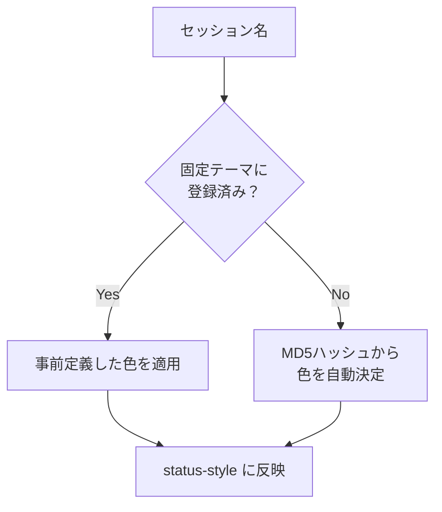
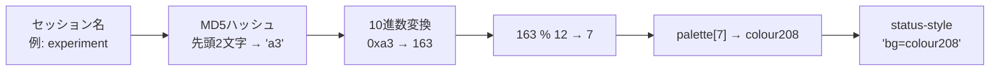
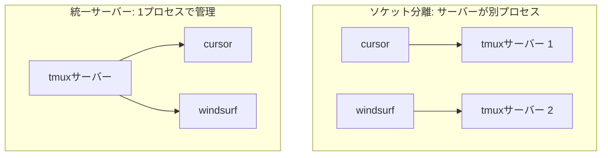

@[docswell](https://www.docswell.com/s/takish/TODO-tmux-socket)

Claude Codeでの開発やチームエージェントの並列実行など、tmuxのセッション数が増える場面が多くなりました。セッションが5つ、10と増えてくると、`prefix + s` でセッション一覧を開いても「今どのセッションにいるのか」がステータスバーだけでは判別しにくくなります。

この記事では、**セッション名に応じてステータスバーの色を自動的に変更する仕組み**を紹介します。よく使うセッションには固定色を割り当て、それ以外はMD5ハッシュから色を自動決定する二層構造です。

筆者はこの仕組みに至るまでに、ソケット分離（サーバーレベルの分離）による管理も半年ほど試しています。その経験も含めて、セッション管理の設計判断をまとめました。

:::message
動作確認環境: macOS 14 Sonoma / tmux 3.4 / zsh 5.9
:::

## 前提: 名前付きセッションと永続化

自動カラーテーマの前提として、セッションに名前をつけて運用していることが必要です。まだ名前付きセッションを使っていない場合は、先にこのセクションの設定を入れてください。

### `tmux new -As` による名前付きセッション

`tmux new -As <name>` は、名前付きセッションの作成と接続をワンコマンドで行います。`-A` フラグは「既存セッションがあればattach、なければ新規作成」という意味で、何度実行しても同じ結果になる冪等な動作です。

```bash
# 用途別セッション（zsh / bash 向け）
alias tc='tmux new -As cursor'
alias tw='tmux new -As windsurf'
alias tv='tmux new -As vscode'
alias ti='tmux new -As iterm'

# 任意の名前でセッション作成
tnew() {
  local name=$1
  if [ -z "$name" ]; then
    echo "Usage: tnew <name>"
    return 1
  fi
  tmux new -As "$name"
}
```

名前をつけることで `tmux ls` の出力が意味を持つようになり、`prefix + s`（`choose-tree`）でのセッション切り替えも快適になります。

### tmux-resurrect / tmux-continuum による永続化

tmuxのセッションはPC再起動で失われますが、tmux-resurrect / tmux-continuum を導入すると自動保存・自動復元が可能になります。名前付きセッションも名前ごと復元されるため、カラーテーマとの相性がよい組み合わせです。

```tmux
set -g @plugin 'tmux-plugins/tmux-resurrect'
set -g @plugin 'tmux-plugins/tmux-continuum'
set -g @continuum-restore 'on'
set -g @continuum-save-interval '15'
set -g @resurrect-processes 'ssh zsh bash fish vim nvim git'
```

:::message alert
tmux-resurrectが復元するのは、ウィンドウ構成・ペインレイアウト・カレントディレクトリ・`@resurrect-processes` で指定したプロセスです。スクロールバックバッファや実行中プロセスの内部状態は復元されません。
:::

## セッション別カラーテーマの設計

### なぜ色で分けるのか

名前付きセッションと `prefix + s` で切り替え自体は快適になります。しかし、作業に集中しているときに「今どのセッションにいるか」を確認するには、ステータスバーのテキストを読む必要があります。

色があると、視界の隅に入るステータスバーの色だけで「今 cursor セッションにいる」「これは windsurf だ」と瞬時に判断できます。テキストを読む認知コストがなくなるのは、セッション数が増えるほど効いてきます。

### 二層構造: 固定テーマ + ハッシュベース自動カラー

設計のポイントは、**固定テーマとフォールバックの二層構造**です。



- **固定テーマ**: 日常的に使うセッション（cursor、windsurf 等）には事前に色を割り当てます。体で覚える色なので、慎重に選びます
- **ハッシュベース自動カラー**: `tnew experiment` のようにその場で作ったセッションにも自動的に色が割り当てられます。同じセッション名は常に同じ色になります

この二層構造のおかげで、固定テーマを定義するたびに設定を書き足す必要がなく、未登録のセッションにも色がつきます。

## 実装

### run-shell と POSIX sh の罠

tmuxの `run-shell` コマンドは、実行前にフォーマット変数（`#S` はセッション名など）を展開してからシェルに渡します。この仕組みを利用して、セッション名に応じた条件分岐を実現しています。

ここで重要なのは、**`run-shell` は `$SHELL` ではなく `/bin/sh` で実行される**という点です。筆者はこの事実を知らず、最初はbash記法の配列やブレース展開を使って実装していました。

```bash
# ❌ 動かない: bash記法の配列は /bin/sh で使えない
colors=(33 34 166 205 127 226)
bg_color=${colors[$color_idx]}
```

`.tmux.conf` を `source-file` しても色が変わらず、原因がわからないまましばらく悩みました。`run-shell 'echo $0'` でシェルを確認して初めて `/bin/sh` だと気づき、POSIX sh互換の書き方に書き直しています。

:::message
tmux 3.5 で `run-shell` が `default-shell` を使うよう一時的に変更されましたが、3.5a で `/bin/sh` に戻されています。tmux 3.4 および 3.5a 以降では `/bin/sh` で動作します。
:::

### カラーテーマの実装コード

以下がPOSIX sh互換で書いた実装です。`.tmux.conf` にそのまま追記できます。

```tmux
run-shell "
case '#S' in \
  cursor)
    tmux set status-style 'bg=colour93';    # 紫
    tmux set status-left ' 🖥 cursor '
    ;; \
  windsurf)
    tmux set status-style 'bg=colour166';   # オレンジ
    tmux set status-left ' 🏄 windsurf '
    ;; \
  vscode)
    tmux set status-style 'bg=colour33';    # 青
    tmux set status-left ' 📝 vscode '
    ;; \
  iterm)
    tmux set status-style 'bg=colour34';    # 緑
    tmux set status-left ' 💻 iterm '
    ;; \
  *)
    # 未定義セッション: MD5ハッシュからカラー自動決定
    hash_hex=\$(printf '%s' '#S' | md5 -q | cut -c1-2)
    hash_dec=\$(printf '%d' \"0x\$hash_hex\")
    color_idx=\$((hash_dec % 12))
    colors='33 34 166 205 127 226 45 208 93 214 81 39'
    bg_color=\$(echo \$colors | cut -d' ' -f\$((\$color_idx + 1)))
    tmux set status-style \"bg=colour\$bg_color\"
    tmux set status-left ' #S '
    ;; \
esac
"
```

:::message
`md5 -q` はmacOS（BSD系）固有のコマンドです。Linux / WSL環境では `printf '%s' '#S' | md5sum | cut -c1-2` に置き換えてください。
:::

ハッシュ関数にMD5を使っているのは、セキュリティ用途ではなく色の決定に使うだけなので暗号学的な強度は不要であること、macOSに `md5` コマンドがプリインストールされていること、が理由です。SHA256やcksumでも同様の実装は可能ですが、MD5が最もシンプルでした。

処理の流れを整理します。

1. tmuxが `run-shell` の引数内の `#S` をセッション名に展開する
2. `/bin/sh` で `case` 文が評価される
3. 固定テーマに一致すれば、事前定義した色を `status-style` に設定
4. 一致しなければ、セッション名のMD5ハッシュ先頭2文字（16進数、256通り）を取得
5. 10進数に変換し、12で割った余りをパレットのインデックスにする
6. 12色パレットから背景色を選んで `status-style` に設定



異なるセッション名でも同じ色になることはあります（12色に対して256通りのハッシュ値なので確率的に約 1/12）。ただし、ステータスバーにはセッション名のテキストラベルも常に表示しているため、色だけに依存しない識別が可能です。

> **注:** 上記コードは説明のために簡略化しています。筆者の環境では `status-left` にPowerline風の区切りアイコンを含む、より装飾的なフォーマットを使用しています。


*セッションごとにステータスバーの色が異なる。青、緑、ピンク、オレンジなど、視界の隅に入る色だけで今どのセッションにいるか判別できる。*

### 12色パレットの選定

パレットの12色は、tmux 256色の中から**彩度と明度が互いに離れた色**を選定しています。

| インデックス | colour | 色 | 用途例 |
|-------------|--------|-----|--------|
| 0 | colour33 | 青 | vscode |
| 1 | colour34 | 緑 | iterm |
| 2 | colour166 | オレンジ | windsurf |
| 3 | colour205 | ピンク | — |
| 4 | colour127 | マゼンタ | — |
| 5 | colour226 | 黄 | — |
| 6 | colour45 | シアン | — |
| 7 | colour208 | ダークオレンジ | — |
| 8 | colour93 | 紫 | cursor |
| 9 | colour214 | ゴールド | — |
| 10 | colour81 | ライトブルー | — |
| 11 | colour39 | スカイブルー | — |

色覚特性によっては一部の色の区別が難しい場合があります。テキストラベルを併用しているのはそのためです。パレットをカスタマイズしたい場合は、`colors` 変数のスペース区切りの値を書き換えるだけで対応できます。

### フックによる自動適用

このカラーテーマを手動で適用する必要はありません。tmuxのフック機能で、セッション作成・名前変更時に自動的に `.tmux.conf` を再読み込みします。

```tmux
set-hook -g session-renamed 'run-shell "tmux source-file ~/.tmux.conf"'
set-hook -g after-new-session 'run-shell "tmux source-file ~/.tmux.conf"'
```

これにより、以下の操作がすべて自動で処理されます。

- `tnew new-project` でセッションを作る → ハッシュベースの色が即座に適用される
- `tmux rename-session` で名前を変更する → 新しい名前に対応した色に切り替わる
- tmux-resurrectでセッションが復元される → `after-new-session` フックで色が適用される（tmux 3.4 + tmux-resurrect で確認）

カラー設定だけを別ファイル（例: `~/.tmux/colors.conf`）に切り出して `source-file` する方法もあります。`.tmux.conf` にプラグインの読み込み等、重い処理が多い場合はそちらのほうが効率的です。筆者の環境では `.tmux.conf` が軽量なため、全体を再読み込みする方式を採用しています。

## ソケット分離を試してやめた話

自動カラーテーマに至る前に、筆者はtmuxの `-L` オプションによるソケット分離を半年ほど運用していました。

### ソケット分離とは

tmuxの `-L` オプションはソケット名を指定してサーバーを起動する機能です。ソケットが異なると完全に独立したtmuxサーバーが立ち上がります。

```bash
# ソケット分離版（-L: ソケット名指定でサーバーを分離）
alias tc='tmux -L cursor new -As cursor'
alias tw='tmux -L windsurf new -As windsurf'
```



サーバーレベルで分離されるため、クラッシュ隔離やメモリ空間の分離が得られます。以前のプロジェクトでtmuxサーバーが不安定になった経験があり、IDE別にサーバーを分離してリスクを回避しようと考えました。

### 半年運用して見えたこと

ソケット分離には理論的なメリットがありましたが、実運用では以下の問題が積み重なりました。

**メリット（理論値）:**
- クラッシュ隔離: あるサーバーが落ちても他に影響しない
- メモリ空間の分離: 大量のスクロールバックバッファが他のセッションに影響しない
- IDE単位の起動・停止: `tmux -L cursor kill-server` で特定サーバーだけ終了できる

**デメリット（実運用で痛かったもの）:**
- **`tmux ls` で全セッションを一覧できない**: ソケットごとに `tmux -L cursor ls` のように指定が必要。日に何度も実行するコマンドだけに、このフリクションは無視できませんでした
- **`prefix + s` でセッション間を横断できない**: 異なるサーバー間ではセッション切り替えが不可能。これは自動カラーテーマの恩恵も受けられないことを意味します
- **設定の再読み込みがサーバー数分必要**: `.tmux.conf` の変更を反映するのに、各サーバーで `source-file` する必要がありました
- **リソース消費**: tmuxサーバー1プロセスあたりのRSS（実メモリ使用量）は約5〜8MB。4プロセスで20〜32MB。絶対値は小さいものの、統一サーバーなら5〜8MBで済みます

そして何より、**tmuxのクラッシュは半年間で一度も起きませんでした**。tmuxは非常に安定したソフトウェアであり、サーバー分離の最大のメリットであるクラッシュ隔離は実際には必要ありませんでした。当初懸念していた「サーバー全体の応答が重くなる問題」も、日常的な負荷では再現しませんでした。

### なぜ統一サーバー + カラーテーマに落ち着いたか

統一サーバーに戻した結果、`tmux ls` で全セッションを一覧でき、`prefix + s` で自由にセッション間を行き来でき、自動カラーテーマで視覚的に識別できるようになりました。ソケット分離で得ようとしていた「セッションの識別性」は、色で解決するほうがシンプルでした。

なお、`-L` と似たオプションに `-S` があります。`-L` はソケット名を指定して `/tmp/tmux-<uid>/` に自動配置するのに対し、`-S` はソケットのフルパスを指定するものです。Docker内でソケットファイルをボリュームマウントして共有する場合やペアプログラミングで使う場合には `-S` が有用です。

## まとめ

tmuxのセッション名に応じてステータスバーの色を自動適用する仕組みを紹介しました。

- **固定テーマ + ハッシュベース自動カラーの二層構造**で、登録済みセッションにも未登録セッションにも色がつきます
- **`run-shell` は `/bin/sh` で実行される**ため、POSIX sh互換で書く必要があります（tmux 3.5 で一時変更、3.5a で戻されました）
- **tmuxフックで自動適用**されるため、手動での色設定は不要です
- **ソケット分離より統一サーバー + カラーテーマのほうがシンプルでした**: 半年運用した結果、tmuxの安定性を考えるとサーバー分離のメリットは薄く、色による識別で十分でした

筆者の環境では、`alias tc='tmux new -As cursor'` の1行と、`.tmux.conf` への `case` 文の追記から始まりました。
