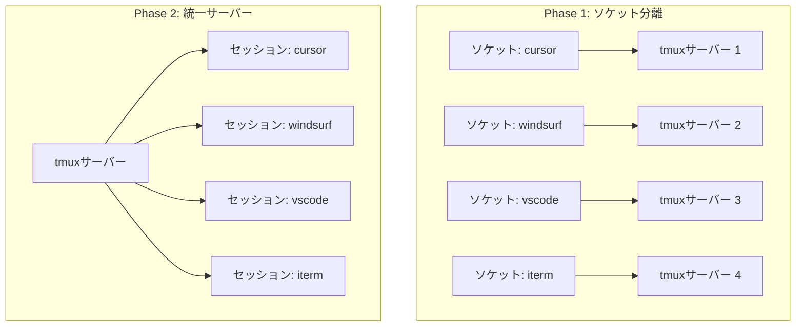
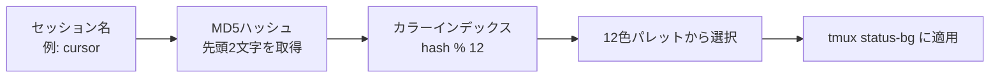

@[docswell](https://www.docswell.com/s/takish/TODO-tmux-socket)

**結論: tmuxのセッション管理はソケット分離よりセッション名ベースが実用的でした。** 両方試した結果、日常のワークフローではシンプルな設計のほうが馴染みました。

Cursor、Windsurf、VS Code、iTerm2。エンジニアが用途に応じてIDEを使い分けるのは、もはや珍しくありません。しかし、複数IDEからtmux（ターミナルの多重化ツール）を使い始めると、セッション管理が途端に混沌としてきます。

`tmux ls` を実行すると、10個以上のセッションが並ぶ。どれがどのIDEで使っていたのか、もう思い出せない。この状況に心当たりのある方は多いのではないでしょうか。

筆者はこの問題に対して、最初はtmuxの `-L` オプションでIDE別にソケット（プロセス間通信の接続口）を分離する設計を採用しました。プロセス完全分離、クラッシュ隔離、メモリ空間の分離。理論的には完璧な設計です。

しかし実運用を半年続けた結果、セッション名ベースの統一アプローチに移行しています。

この記事では、ソケット分離と名前ベース分離の両方を実装・運用した経験をもとに、設計判断のポイントとセッション別カラーテーマの実装までを紹介します。

:::message
動作確認環境: macOS 14 Sonoma / tmux 3.4 / zsh 5.9
:::

<!-- 画像: tmux lsで大量のセッションが並んでいるターミナルのスクリーンショット -->

## 複数IDEでtmuxを使うとセッション管理が破綻する

### セッションの混在と識別困難

複数のIDEからtmuxを使うと、セッションの識別が困難になります。

```
$ tmux ls
0: 1 windows (created Sun Mar 22 09:00:00 2026)
1: 3 windows (created Sun Mar 22 09:15:00 2026)
2: 1 windows (created Sun Mar 22 10:30:00 2026)
default: 2 windows (created Sun Mar 22 08:00:00 2026)
```

この出力を見ても、どのセッションがCursorで使っていたもので、どれがiTerm2のものなのか判別できません。セッションを閉じようとして、別のIDEで作業中のセッションを誤って終了してしまうリスクもあります。

さらに厄介なのは、あるIDEのターミナルでtmuxサーバーを終了すると、別のIDEで使っていたセッションまで巻き込まれることです。1つのtmuxサーバーが全セッションを管理している以上、`kill-server` は文字通り全セッションを破壊してしまいます。

### 「分離」のレベル — サーバー分離 vs セッション分離

tmuxのアーキテクチャは、4つの階層構造から成り立っています。

- **サーバー**: tmuxプロセスの本体。ソケットファイルを通じて通信する
- **セッション**: サーバー内に複数作成可能。ウィンドウのグループ
- **ウィンドウ**: セッション内に複数作成可能。タブのような存在
- **ペイン**: ウィンドウ内の分割領域。実際にシェルが動く場所

IDE別のセッション管理を考えるとき、「どの階層で分離するか」が設計の最初の判断ポイントになります。サーバーレベルで分離すれば完全な隔離が得られる。セッションレベルで分離すれば管理のシンプルさが得られる。筆者はまずサーバーレベルの分離を選びました。

当初サーバー分離を選んだ理由は、以前のプロジェクトでtmuxサーバーが不安定になった経験があったためです。大量のペインを同時に開いてビルドログを流し続けた結果、サーバー全体の応答が重くなり、無関係なセッションまで巻き添えを食らったことがありました。IDE別にサーバーを分離すれば、この種の問題を構造的に回避できると考えたわけです。

<!-- 画像: tmuxの階層構造（サーバー > セッション > ウィンドウ > ペイン）を示す図解 -->

## tmuxの-Lオプションでソケットを分離する

### -L オプションによるIDE別サーバー起動

tmuxの `-L` オプションは、ソケット名を指定してサーバーを起動する機能です。異なるソケット名を指定すると、完全に独立したtmuxサーバーが立ち上がります。

この仕組みを利用して、IDE別のエイリアスを作成しています。

```bash
# IDE別ソケットでの起動（-L: ソケット名指定）
alias tc='tmux -L cursor new -As cursor'    # Cursor用
alias tw='tmux -L windsurf new -As windsurf' # Windsurf用
alias tv='tmux -L vscode new -As vscode'     # VS Code用
alias ti='tmux -L iterm new -As iterm'       # iTerm2用
```

`-L cursor` でソケット名を指定し、`new -As cursor` でセッション名も同じ名前にしています。`-A` フラグは「既存セッションがあればattach、なければ新規作成」という意味です。この冪等性（何度実行しても同じ結果になる性質）のおかげで、エイリアスを何度叩いても安全になっています。

ソケットファイルはデフォルトでは `/tmp/tmux-<uid>/` ディレクトリに自動生成されます（`TMUX_TMPDIR` または `TMPDIR` 環境変数で変更可能です）。管理用のエイリアスも用意しています。

```bash
# ソケット一覧の確認
alias tls='ls -l /tmp/tmux-$(id -u)/'

# 全ソケットを一括終了
alias tkill='for s in /tmp/tmux-$(id -u)/*; do tmux -S "$s" kill-server 2>/dev/null && echo "Killed: $s"; done'

# 任意の名前でソケットを作成
tnew() {
  local name=$1
  if [ -z "$name" ]; then
    echo "Usage: tnew <name>"
    return 1
  fi
  tmux -L "$name" new -As "$name"
}
```

なお、`-L` と似たオプションに `-S` があります。`-L` はソケット名を指定して `/tmp/tmux-<uid>/` に自動配置するのに対し、`-S` はソケットのフルパスを指定するものです。Docker内でソケットファイルをボリュームマウントして共有したり、ペアプログラミングで他ユーザーとセッションを共有したりする場合は `-S` が有用ですが、IDE別分離の用途では `-L` のほうがシンプルです。

### ソケット分離のメリットとデメリット

ソケット分離アプローチを半年運用して見えてきたメリットとデメリットを整理してみます。

**メリット:**

- **クラッシュ隔離**: あるIDEのtmuxサーバーがクラッシュしても、他のIDEには影響しない
- **メモリ空間の分離**: 各サーバーが独立したメモリ空間を持つため、大量のスクロールバックバッファが他のセッションに影響しない
- **IDE単位の起動・停止**: `tmux -L cursor kill-server` でCursor用のサーバーだけを安全に終了できる

**デメリット:**

- **リソース消費が増加**: tmuxサーバーが4プロセス起動するため、メモリ消費が増加する。筆者の環境で `ps aux` を確認したところ、tmuxサーバー1プロセスあたりのRSS（実メモリ使用量）は約5〜8MBだった。4プロセスで合計20〜32MB。絶対値としては小さいが、統一サーバーなら5〜8MBで済むことを考えると、ソケットファイルやカーネルリソースも含めたオーバーヘッドが気になるところ
- **`tmux ls` で一覧できない**: ソケットごとに `tmux -L cursor ls` のように指定が必要
- **セッション間のウィンドウ移動が不可能**: 異なるサーバー間ではウィンドウの移動ができない
- **設定の再読み込みが4回必要**: `.tmux.conf` を変更したとき、各サーバーごとに `source-file` する必要がある

特に「`tmux ls` で一覧できない」というデメリットは、日常のワークフローで大きな摩擦を生みました。今どのセッションが動いているのか確認するために、毎回ソケット名を指定する必要がある。思いのほかストレスでした。



## 統一サーバー + セッション名ベースがシンプルで勝る

### 移行の決め手 — 理論的正しさ vs 実用的シンプルさ

ソケット分離から統一サーバーへの移行を決めたのは、ソケット分離のメリットが実運用ではほぼ活きなかったためです。

具体的には、以下の3つの事実が判断材料になっています。

- **tmuxのクラッシュは半年間で一度も起きなかった**: tmuxは非常に安定したソフトウェアであり、サーバークラッシュによるセッション消失のリスクは現実的ではなかった。当初の懸念だった「サーバー全体の応答が重くなる問題」も、IDE別に使い分ける程度の負荷では再現しなかった
- **メモリ分離の恩恵を体感できなかった**: 4つのサーバーに分かれていても、個々のメモリ消費に問題を感じることはなかった
- **`tmux ls` で全セッションを一覧できないストレスが想定以上に大きかった**: 日に何度も実行するコマンドだけに、このフリクションは無視できなかった

「理論的に正しい設計」よりも「実用的にシンプルな設計」が勝った、典型的なケースです。エンジニアリングにおいて、過剰な分離は複雑さというコストを生む。そのコストに見合うリスク低減効果がなければ、シンプルな方を選ぶのが合理的でしょう。

### 現在のエイリアス構成

統一サーバーへの移行後、エイリアスは驚くほどシンプルになりました。

```bash
# セッション名のみで分離（-Lオプション不要）
alias tc='tmux new -As cursor'
alias tw='tmux new -As windsurf'
alias tv='tmux new -As vscode'
alias ti='tmux new -As iterm'

# 管理コマンドもシンプルに
alias tls='tmux ls'
alias tkill='tmux kill-server'  # 全セッションが終了する点に注意（後述）
alias tsr='tmux source-file ~/.tmux.conf'

# 任意の名前でセッション作成
tnew() {
  local name=$1
  if [ -z "$name" ]; then
    echo "Usage: tnew <name>"
    return 1
  fi
  tmux new -As "$name"
}
```

なお、`tkill` は `tmux kill-server` なので全セッションが一括終了します。冒頭で述べた「`kill-server` は全セッションを破壊する」リスクは統一サーバーでも同様ですが、tmux-continuumが15分ごとに自動保存しているため、`tkill` で全セッションを終了しても次回起動時に自動復元されます。この安全ネットがあるからこそ、統一サーバーへの移行が現実的になっています。

:::details tmux-resurrect / tmux-continuum の設定例

```tmux
# TPM（tmux Plugin Manager）でプラグイン管理
set -g @plugin 'tmux-plugins/tmux-resurrect'
set -g @plugin 'tmux-plugins/tmux-continuum'

# 起動時に自動復元
set -g @continuum-restore 'on'

# 15分ごとに自動保存
set -g @continuum-save-interval '15'

# デフォルトリストに加えて復元するプロセスを追加指定
set -g @resurrect-processes 'ssh zsh bash fish vim nvim git'
```

tmux-resurrectはセッションのウィンドウ構成、ペインレイアウト、カレントディレクトリを保存・復元するプラグインです。tmux-continuumはその保存を定期的に自動実行します。この仕組みが後述の `after-new-session` フックと組み合わさることで、復元されたセッションにもカラーテーマが自動適用されます。

:::

変更点は `-L <name>` の削除だけです。`new -As <name>` の冪等な動作はそのまま活きている。エイリアス名（tc/tw/tv/ti）も変わらないため、移行時に指が覚えたコマンドを変える必要もありませんでした。

`tnew` 関数は、IDE以外の用途でセッションを作りたいときに使います。たとえば `tnew web-app` と実行すれば、web-appという名前のセッションが作成されます。プロジェクトごとにセッションを分ける運用にも対応できるようになっています。

`tmux new -As` の `-A` フラグが持つ冪等性は、このアプローチの要です。セッションが存在すればattach、なければ作成。この動作のおかげで、「セッションが既にあるかどうか」を意識する必要がなくなります。

## セッション別カラーテーマの自動適用

### プロジェクト固定テーマ + ハッシュベース自動カラー

統一サーバーに移行したことで、新たな課題が生まれました。すべてのセッションが同じ見た目になるため、「今どのセッションにいるのか」が一目ではわかりません。

この課題を解決するために、セッション名に応じてステータスバーの色とアイコンを動的に変更する仕組みを実装しました。

tmuxの `run-shell` コマンドは、実行前にフォーマット変数（`#S` はセッション名など）を展開します。この仕組みを利用して、セッション名に応じた条件分岐を実現しました。

> **注意:** tmuxの `run-shell` は `$SHELL` ではなく `/bin/sh` で実行されます。筆者はこの事実を知らず、最初はbash記法の配列やブレース展開を使ってカラーテーマを実装していました。`.tmux.conf` を `source-file` しても色が変わらず、`run-shell 'echo $0'` でシェルを確認して初めて `/bin/sh` だと気づいた、という経緯があります。以下のコードではPOSIX sh互換の書き方を採用しています。

```tmux
# セッション名に応じたカラーテーマ
run-shell "
case '#S' in \
  web-app)
    tmux set -s status-bg colour33;   # 青
    tmux set -s status-left ' web-app '
    ;; \
  base)
    tmux set -s status-bg colour34;   # 緑
    tmux set -s status-left ' base '
    ;; \
  api-server)
    tmux set -s status-bg colour166;  # オレンジ
    tmux set -s status-left ' api-server '
    ;; \
  ml-pipeline)
    tmux set -s status-bg colour45;   # シアン
    tmux set -s status-left ' ml-pipeline '
    ;; \
  *)
    # 未定義セッション: MD5ハッシュからカラー自動決定
    hash_hex=\$(printf '%s' '#S' | md5 -q | cut -c1-2)
    # 16進数→10進数の変換（POSIX sh互換）
    hash_dec=\$(printf '%d' \"0x\$hash_hex\")
    color_idx=\$((hash_dec % 12))
    colors='33 34 166 205 127 226 45 208 93 214 81 39'
    bg_color=\$(echo \$colors | cut -d' ' -f\$((\$color_idx + 1)))
    tmux set -s status-bg colour\$bg_color
    tmux set -s status-left ' #S '
    ;; \
esac
"
```

:::message
`md5 -q` はmacOS（BSD系）固有のコマンドです。Linux / WSL環境では `printf '%s' '#S' | md5sum | cut -c1-2` に置き換えてください。
:::

> **注:** 上記コードは説明のために簡略化しています。筆者の環境では `status-left` にPowerline風の区切りアイコンや絵文字を含む、より装飾的なフォーマットを使用しています。

設計のポイントは、**固定テーマとフォールバックの二層構造**です。

- **固定テーマ**: 頻繁に使うプロジェクトには事前に色を割り当てる。筆者の環境では10個の固定テーマを定義しており、以下はその一部（web-app: 青、base: 緑、api-server: オレンジ、ml-pipeline: シアンなど）
- **ハッシュベース自動カラー**: 未登録のセッション名に対しては、MD5ハッシュの先頭2文字（16進数）を10進数に変換し、12色パレットのインデックスを算出して自動割り当て

ハッシュベースの自動カラーにより、`tnew experiment` のようにその場で作ったセッションにも、自動的にユニークな色が割り当てられます。同じセッション名は常に同じ色になるため、「cursor は紫、windsurf はオレンジ」のように体が覚えてくれます。

12色パレットには `colour33`（青）、`colour205`（ピンク）、`colour226`（黄）など、tmux 256色の中から彩度・明度が離れた色を選定しています。ただし、色覚特性によっては一部の色の区別が難しい場合があります。ステータスバーにはセッション名のテキストラベルも常に表示しているため、色だけに依存しない識別が可能です。パレットの色選定をカスタマイズしたい場合は、`colors` 変数の値を書き換えるだけで対応できます。



<!-- 画像: セッションごとに異なる色のステータスバーが表示されているtmuxのスクリーンショット（3〜4セッション並べて比較） -->

### フックによるリアルタイム適用

カラーテーマの適用には、tmuxのフック機能を活用しています。

```tmux
# セッション名変更・新規作成時に自動適用
set-hook -g session-renamed 'run-shell "tmux source-file ~/.tmux.conf"'
set-hook -g after-new-session 'run-shell "tmux source-file ~/.tmux.conf"'
```

`session-renamed` フックは、`tmux rename-session` でセッション名を変更したときに発火します。`after-new-session` フックは、新しいセッションが作成されたときに発火します。

どちらの場合も `.tmux.conf` を再読み込みするため、先ほどの `case` 文が再評価され、新しいセッション名に対応した色が適用されます。

この仕組みのおかげで、以下のような操作がすべて自動的に処理されます。

- `tnew new-project` で新しいセッションを作る → 自動的にハッシュベースの色が適用される
- `tmux rename-session old-name` でセッション名を変更する → 新しい名前に対応した色に切り替わる
- tmux-resurrectでセッションが復元される → `after-new-session` フックで色が適用される

手動で色を設定する手間は一切ありません。セッションを作れば色がつく。名前を変えれば色が変わる。この自動化が、統一サーバー運用の快適さを支えています。

## まとめ

tmuxのセッション管理を、ソケット分離（サーバーレベル分離）からセッション名ベース（セッションレベル分離）に移行した設計判断と、その実装を紹介しました。

要点を3つにまとめます。

- **過剰な分離は複雑さのコストを生む**: ソケット分離は理論的には正しいが、tmuxの安定性を考えると実用上のメリットは薄かった
- **`tmux new -As` の冪等性がカギ**: エイリアス1つでセッション作成もattachもカバーできるシンプルさ
- **カラーテーマの自動適用で視覚的識別を確保**: MD5ハッシュベースの自動カラーとフックの組み合わせで、手間のかからない運用を実現

筆者の環境では、`alias tc='tmux new -As cursor'` の1行から始まりました。
