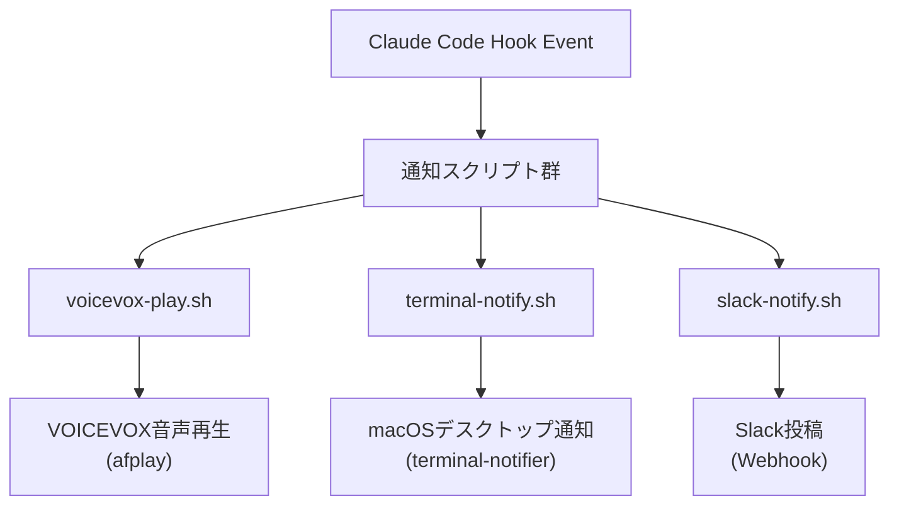
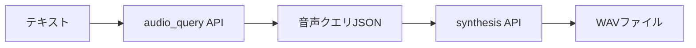

@[docswell](https://www.docswell.com/s/takish/TODO-voicevox-notification)

## はじめに

Claude Codeで大きなリファクタリングを走らせている間、別タブでSlackを読んだりドキュメントを書いたりしていると、ふと気づく瞬間があります。「あれ、権限確認のダイアログが20分前から出ていた」。

AIコーディングアシスタントは黙々と働きますが、人間の注意を引く手段を持っていません。デスクトップ通知は他の通知に埋もれ、Slack通知は未読バッジが1つ増えるだけです。

この問題を、VOICEVOX音声通知で解消しました。本記事ではその設計と実装を紹介します。168ファイルの事前生成音声、セッションごとに自動で変わるキャラクター、音声ファイルがない環境でも動作するフォールバック。実運用で磨いてきた仕組みの全体像です。

> スクリプトの完全なソースコードは [GitHub (takish/dotfiles)](https://github.com/takish/dotfiles) の `dot_claude/hooks/` および `dot_claude/scripts/` にあります。本記事では設計判断の「なぜ」を中心に解説し、コードは要点を抜粋して掲載します。

## 音声通知で解消する「サイレント問題」

### 権限確認に気づけない

Claude Codeは、ファイルの書き込みや外部コマンドの実行時に権限確認ダイアログを表示します。このダイアログに応答しない限り、処理は先に進みません。

よくあるのがこういう状況です。npm installを含む大きなタスクを投げて、別ウィンドウで調べ物を始める。30分後にターミナルに戻ると、5分前に権限確認が出て止まっていた。25分間のロスタイム。AIの処理速度がいくら速くても、人間のレスポンスがボトルネックになります。

### 視覚通知だけでは足りない

macOSの`terminal-notifier`を使えばデスクトップ通知は簡単に実装できますし、Slack Webhookで通知を飛ばすこともできます。しかし視覚的な通知には「見ていなければ気づかない」という根本的な弱点があります。

ブラウザでドキュメントを読んでいるとき、Figmaでデザインを確認しているとき、別のターミナルでログを追っているとき。デスクトップ通知は右上に一瞬表示されて消えていきます。

音声は別のチャネルです。画面を見ていなくても耳に届く。しかもキャラクターの声であれば「あ、ずんだもんが呼んでる」と直感的に状況を把握できます。

## 3層通知パイプライン

### 音声 + デスクトップ + Slack

音声通知だけに頼るのは危険です。ヘッドフォンを外しているとき、会議中でミュートにしているとき、音声は届きません。そこで3つのレイヤーを組み合わせました。

| Layer | 手段 | 特徴 |
|-------|------|------|
| 1 | VOICEVOX音声（`afplay`） | 即座に気づける。バックグラウンド再生 |
| 2 | macOSデスクトップ通知（`terminal-notifier`） | 通知センターに履歴が残る |
| 3 | Slack通知（Webhook） | 外出先でもスマホで確認できる |

この3層はClaude Codeのフックイベントから同時に発火します。1つのイベントに対して複数のフックを登録できるため、「権限確認が出たら音声を再生し、デスクトップ通知を出し、Slackにも投稿する」という動作が実現できます。



### フックイベントとの紐付け

Claude Codeのフックシステムは、特定のイベントが発生したときにシェルコマンドを実行する仕組みです。`settings.json`に以下のように定義します。

```json
{
  "hooks": {
    "Notification": [
      {
        "matcher": "permission_prompt",
        "hooks": [
          {
            "type": "command",
            "command": "~/.claude/hooks/voicevox-play.sh permission"
          },
          {
            "type": "command",
            "command": "~/.claude/hooks/terminal-notify.sh '確認' '権限リクエスト' '$MESSAGE'"
          },
          {
            "type": "command",
            "command": "~/.claude/hooks/slack-notify.sh '$MESSAGE'"
          }
        ]
      }
    ],
    "Stop": [
      {
        "matcher": "",
        "hooks": [
          {
            "type": "command",
            "command": "~/.claude/hooks/voicevox-play.sh completion"
          }
        ]
      }
    ],
    "SessionStart": [
      {
        "matcher": "startup",
        "hooks": [
          {
            "type": "command",
            "command": "~/.claude/hooks/voicevox-play.sh startup"
          }
        ]
      }
    ]
  }
}
```

主要なイベントと通知の対応は以下のとおりです。

| フックイベント | 発火タイミング | 音声カテゴリ |
|-------------|-------------|-----------|
| `Notification`（`permission_prompt`） | 権限確認ダイアログ表示 | `permission` |
| `Notification`（`idle_prompt`） | アイドル状態通知 | `idle` |
| `Notification`（`auth_success`） | 認証成功 | `auth` |
| `Notification`（`elicitation_dialog`） | 入力待ちダイアログ表示 | `elicitation` |
| `Stop` | Claude応答完了 | `completion` |
| `SessionStart`（`startup`） | 新規セッション開始 | `startup` |
| `SessionStart`（`resume`） | セッション再開 | `resume` |
| `SessionEnd`（`clear`, `logout`等） | セッション終了 | `session_end` |

`matcher`フィールドで発火条件を細かく制御できます。`Notification`イベントであれば、`permission_prompt`のときは`permission`カテゴリ、`idle_prompt`のときは`idle`カテゴリと使い分けが可能です。

> **`$MESSAGE`変数について**: commandフィールド内の`'$MESSAGE'`はシングルクォートで囲まれていますが、Claude Codeのフックシステムがコマンド実行時にこの変数を展開します。シェルではなくClaude Code側が展開するため、シェルメタ文字によるインジェクションリスクは低い設計です。

## 168ファイルのプリレンダリング音声

### なぜリアルタイム合成ではないのか

「Claude Code + VOICEVOX」の記事の多くは、VOICEVOX EngineのAPIをリアルタイムで呼び出す構成を採用しています。MCP Server経由で呼ぶ方法、Hooksから直接curlする方法、いくつかのアプローチが紹介されています。

本記事のアプローチは異なります。音声ファイルをすべて事前に生成（プリレンダリング）し、再生時にはWAVファイルを`afplay`で鳴らすだけです。この設計を選んだ理由は3つあります。

- **遅延ゼロ**: 合成待ちが発生しない。権限確認のような「すぐ気づきたい」通知で、API呼び出しの数百ミリ秒は無視できない
- **VOICEVOX Engine不要**: 再生時にEngineが起動している必要がない。常駐プロセスを増やさなくて済む
- **環境非依存**: WAVファイルをdotfilesリポジトリにコミットしておけば、新しいマシンでも`chezmoi apply`一発で音声通知が動く

168ファイルの合計サイズは約12MBです。1ファイルあたり平均70KB程度なので、git LFS（Large File Storage）を使う必要はありません。一般的にgit LFSの導入が推奨されるのは100MB超のファイルや、頻繁に更新されるバイナリです。音声ファイルは一度生成したらほぼ変更しないため、通常のgitで問題になることはありませんでした。

> **chezmoiとは**: dotfiles（設定ファイル）を管理するツールです。gitリポジトリに設定ファイルのソースを保持し、`chezmoi apply`コマンドで任意のマシンに展開できます。本記事のWAVファイルもchezmoiで管理しているため、新しいマシンのセットアップ時に音声ファイルも自動配置されます。

### 8カテゴリ x 3バリエーション

音声通知で重要なのは「飽きさせない」ことです。毎回同じセリフだと、脳がそれをノイズとして処理するようになり、通知の効果が薄れます。8カテゴリそれぞれに3つのバリエーションを用意しました。

| カテゴリ | 用途 | セリフ例（ずんだもん） |
|---------|------|----------------|
| `permission` | 権限確認 | 「ご確認お願いします」「許可が必要です」「確認をお待ちしています」 |
| `completion` | タスク完了 | 「完了しました」「作業が終わりました」「タスク完了です」 |
| `startup` | セッション開始 | 「よろしくお願いします」「はじめましょう」「準備OKです」 |
| `resume` | セッション再開 | 「再開します」「続きからですね」「お帰りなさい」 |
| `idle` | アイドル状態 | 「お待ちしています」「入力をお待ちしています」「何かありましたらどうぞ」 |
| `auth` | 認証成功 | 「認証できました」「ログインしました」「準備完了です」 |
| `elicitation` | 入力待ち | 「入力が必要です」「情報を教えてください」「追加情報をお願いします」 |
| `session_end` | セッション終了 | 「お疲れ様でした」「また後ほど」「ではまた」 |

再生時にはカテゴリに一致するファイルからランダムに1つを選択するため、同じ状況でも毎回少しずつ違うセリフが流れます。

ディレクトリ構成は以下のとおりです。

```
~/.claude/sounds/voicevox/
├── zundamon/          # ずんだもん（24ファイル）
├── shikoku_metan/     # 四国めたん
├── tohoku_itako/      # 東北イタコ
├── voidoll/           # Voidoll
├── whitecul/          # WhiteCUL
├── aoyama_ryusei/     # 青山龍星
└── takopi/            # カスタムキャラクター（後述）
    ├── permission_01.wav
    ├── permission_02.wav
    ├── permission_03.wav
    ├── ...
    └── session_end_03.wav   # 各24ファイル
```

### VOICEVOX APIによる一括生成

VOICEVOXの音声合成は2ステップです。`audio_query`でテキストから音声合成パラメータを生成し、`synthesis`でWAVファイルを合成します。



一括生成スクリプト`generate-voices.sh`の中核部分は以下のとおりです。

```bash
#!/bin/bash
# VOICEVOX Engine API を使って音声ファイルを一括生成
# Usage: ./generate-voices.sh [--preset=takopi] [SPEAKER_ID]

API_URL="http://localhost:50021"
SPEAKER_ID="${1:-3}"  # デフォルト: 3 = ずんだもん ノーマル

# VOICEVOX Engine の起動確認
if ! curl -s "$API_URL/version" > /dev/null 2>&1; then
    echo "Error: VOICEVOX Engine is not running at $API_URL"
    exit 1
fi

# セリフ定義（標準セリフ。プリセット指定時は別の配列に切り替え）
VOICES="
permission_01:ご確認お願いします
permission_02:許可が必要です
permission_03:確認をお待ちしています
completion_01:完了しました
completion_02:作業が終わりました
completion_03:タスク完了です
...
"

echo "$VOICES" | while IFS=: read -r key text; do
    [ -z "$key" ] && continue
    output_file="$OUTPUT_DIR/${key}.wav"

    # Step 1: テキストから音声クエリ生成
    QUERY=$(curl -s -X POST "$API_URL/audio_query" \
        -H "Content-Type: application/json" \
        --get --data-urlencode "text=$text" \
        --data-urlencode "speaker=$SPEAKER_ID")

    # Step 2: 音声クエリからWAV合成
    curl -s -X POST "$API_URL/synthesis?speaker=$SPEAKER_ID" \
        -H "Content-Type: application/json" \
        -d "$QUERY" \
        --output "$output_file"
done
```

新しいキャラクターやセリフを追加したい場合のみ、VOICEVOX Engineをローカルで起動してこのスクリプトを実行します。日常の再生にはEngineは不要です。

> 完全なスクリプトは [generate-voices.sh (GitHub)](https://github.com/takish/dotfiles/blob/main/dot_claude/scripts/executable_generate-voices.sh) を参照してください。プリセット切り替え、Speaker ID自動検出、日本語キャラクター名のマッピングなどを含む完全版です。

### カスタム方言 --- タコピーモード

7キャラクターのうち6キャラクターは標準的な敬語ベースのセリフを使います。一方、タコピー（takopi）だけは独自の語尾パターンを持っています。

タコピーはVOICEVOX公式キャラクターではありません。ずんだもんの声（speaker_id=3）をベースに、独自の語尾（「〜ッピ」）を付与したカスタム設定です。`generate-voices.sh --preset=takopi`で、ずんだもんの音声合成エンジンにタコピー専用のセリフテキストを渡して生成します。

| カテゴリ | 標準セリフ | タコピーモード |
|---------|-----------|------------|
| `permission` | ご確認お願いします | 確認してほしいッピ！ |
| `completion` | 完了しました | できたッピ！ |
| `startup` | よろしくお願いします | よろしくッピ！ |
| `resume` | お帰りなさい | おかえりッピ！ |
| `idle` | お待ちしています | 待ってるッピよ〜 |
| `session_end` | お疲れ様でした | おつかれッピ〜 |

キャラクター固有の語尾があると、音声を聞いた瞬間に「今のセッションはタコピーだな」と識別できます。複数のClaude Codeセッションを同時に走らせているとき、どのセッションからの通知なのかを聴覚だけで判断できるのは実用的な利点です。

## セッション別キャラクター自動割り当て

### MD5ハッシュによる決定論的選択

セッションごとにキャラクターが変わりますが、ランダムではありません。決定論的（deterministic）に選択しています。同じセッションIDからは常に同じキャラクターが選ばれます。

再生スクリプト`voicevox-play.sh`の全体像は以下のとおりです。

```bash
#!/bin/bash
# VOICEVOX 音声ファイルをランダム再生（SEフォールバック対応）
# Usage: voicevox-play.sh <category>

CATEGORY="$1"
[[ -z "$CATEGORY" ]] && exit 0
[[ "${VOICEVOX_MUTE:-0}" == "1" ]] && exit 0

VOLUME="${VOICEVOX_VOLUME:-0.7}"

# SE再生関数（フォールバック用）
play_se() {
    case "$CATEGORY" in
        completion|session_end) SE_FILE="stop.wav" ;;
        *) SE_FILE="notification.wav" ;;
    esac
    SE_PATH="$HOME/.claude/sounds/$SE_FILE"
    [[ -f "$SE_PATH" ]] && afplay -v "$VOLUME" "$SE_PATH" &
}

# SEモード強制時
if [[ "${VOICEVOX_MODE:-}" == "se" ]]; then
    play_se
    exit 0
fi

# キャラクター決定: 環境変数 or セッションIDから自動選択
if [[ -n "${VOICEVOX_CHARACTER:-}" ]]; then
    CHARACTER="$VOICEVOX_CHARACTER"
    cat > /dev/null  # stdinを消費
else
    INPUT=$(cat)
    SESSION_ID=$(echo "$INPUT" | jq -r '.session_id // empty' 2>/dev/null)

    if [[ -n "$SESSION_ID" ]]; then
        HASH=$(echo -n "$SESSION_ID" | md5)
        INDEX=$(( 0x${HASH:0:2} % 7 ))
        CHARACTERS=(zundamon shikoku_metan tohoku_itako voidoll whitecul aoyama_ryusei takopi)
        CHARACTER="${CHARACTERS[$INDEX]}"
    else
        CHARACTER="zundamon"
    fi
fi

# 音声ファイル選択 → 再生（フォールバック付き）
SOUND_DIR="$HOME/.claude/sounds/voicevox/$CHARACTER"
FILES=("$SOUND_DIR/${CATEGORY}_"*.wav)

if [[ -f "${FILES[0]}" ]]; then
    SELECTED="${FILES[$RANDOM % ${#FILES[@]}]}"
    afplay -v "$VOLUME" "$SELECTED" &
else
    play_se
fi
```

フックのstdinからJSON形式でセッション情報を受け取り、`jq`でパースしています。キャラクター選択のロジックは3行です。

```bash
HASH=$(echo -n "$SESSION_ID" | md5)
INDEX=$(( 0x${HASH:0:2} % 7 ))
CHARACTER="${CHARACTERS[$INDEX]}"
```

MD5ハッシュの先頭2バイト（16進数）を10進数に変換し、キャラクター数で割った余りをインデックスにします。

この仕組みが持つ性質は3つあります。

- **一貫性**: セッション中にキャラクターが変わらない。「さっきはずんだもんだったのに急に四国めたんになった」ということが起きない
- **分散性**: 先頭2バイトは0x00〜0xFFの256通り。7キャラクターへの分配は完全に均等ではなく、256 mod 7 = 4なので、インデックス0〜3のキャラクターは37回、4〜6は36回選ばれる計算になる。実用上は無視できる偏りだが、厳密な均等分配が必要な場面では注意が要る
- **再現性**: セッションIDが同じなら、スクリプトを何度実行しても同じキャラクターが選ばれる

「今日はどのキャラクターが割り当てられるかな」という小さな楽しみが生まれます。通知システムに遊び心を入れることで、通知への注意力を維持する効果を狙った設計です。

> **macOSの`md5`コマンドについて**: パイプ入力時（`echo -n "..." | md5`）はハッシュ値のみが出力されます。ファイルを引数に渡す場合は`MD5 ("...") = hash`形式になるため注意してください。Linuxでは`md5sum`コマンドに置き換えが必要です。

### 環境変数によるオーバーライド

自動割り当てが気に入らない場合、環境変数で上書きできます。

```bash
export VOICEVOX_CHARACTER=zundamon   # 常にずんだもんを使う
export VOICEVOX_VOLUME=0.3           # 音量を下げる（デフォルト: 0.7）
export VOICEVOX_MUTE=1               # 音声を完全に無効化
export VOICEVOX_MODE=se              # VOICEVOX音声を使わずSEのみ再生
```

| 環境変数 | デフォルト値 | 説明 |
|---------|-----------|------|
| `VOICEVOX_CHARACTER` | （セッションIDから自動決定） | キャラクターを固定指定 |
| `VOICEVOX_VOLUME` | `0.7` | 再生音量（0.0〜1.0） |
| `VOICEVOX_MUTE` | `0` | `1`にすると全音声を無効化 |
| `VOICEVOX_MODE` | （未設定） | `se`にするとVOICEVOX音声を使わずSEのみ再生 |

`.zshrc`やtmuxの設定ファイルに書けば永続化できます。プロジェクト単位で変えたい場合は`.envrc`（direnv）に書く手もあります。

## 2段階フォールバック

### VOICEVOX音声 → SE → 無音

すべての環境にVOICEVOX音声ファイルがあるとは限りません。新しいマシンのセットアップ直後や、特定のキャラクターだけファイルが欠けている場合があります。

この問題に対して、2段階のフォールバックを実装しています。

```
VOICEVOX音声ファイルが存在する？
  ├─ YES → afplay で再生（キャラクター音声）
  └─ NO → SE（効果音）にフォールバック
           ├─ completion / session_end → stop.wav
           └─ その他 → notification.wav
              └─ SEも存在しない → 無音（Claude Code自体の動作には影響しない）
```

SEファイルはわずか2つ（`notification.wav`と`stop.wav`）だけなので、どの環境でも確実に配置できます。

`VOICEVOX_MODE=se`を設定すれば、VOICEVOXファイルが存在していてもSEモードを強制できます。会議中などキャラクターの声が場にそぐわない場面で使っています。

## 5分で始める最小構成

フル構成（7キャラ x 24パターン）はやり過ぎに見えるかもしれません。最小構成は1キャラクター x 3パターンで十分機能します。

**手順:**

1. [VOICEVOX公式サイト](https://voicevox.hiroshiba.jp/)からエンジンをダウンロードして起動
2. 音声ファイルを3つ生成する

```bash
# VOICEVOX Engine起動後に実行
mkdir -p ~/.claude/sounds/voicevox/zundamon

for pair in "permission_01:ご確認お願いします" "completion_01:完了しました" "startup_01:よろしくお願いします"; do
    key="${pair%%:*}"
    text="${pair#*:}"
    query=$(curl -s -X POST "http://localhost:50021/audio_query" \
        --get --data-urlencode "text=$text" --data-urlencode "speaker=3")
    curl -s -X POST "http://localhost:50021/synthesis?speaker=3" \
        -H "Content-Type: application/json" -d "$query" \
        -o "$HOME/.claude/sounds/voicevox/zundamon/${key}.wav"
done
```

3. `settings.json`にフックを追加（本記事の「フックイベントとの紐付け」セクションを参照）
4. 再生スクリプトを配置

```bash
# 最小版の再生スクリプト
cat > ~/.claude/hooks/voicevox-play.sh << 'SCRIPT'
#!/bin/bash
CATEGORY="$1"
[[ -z "$CATEGORY" ]] && exit 0
FILES=(~/.claude/sounds/voicevox/zundamon/${CATEGORY}_*.wav)
[[ -f "${FILES[0]}" ]] && afplay "${FILES[$RANDOM % ${#FILES[@]}]}" &
SCRIPT
chmod +x ~/.claude/hooks/voicevox-play.sh
```

これだけで、権限確認時にずんだもんが「ご確認お願いします」、タスク完了時に「完了しました」と声をかけてくれるようになります。慣れてきたらキャラクターを増やしたり、バリエーションを追加したりすればよいです。

## まとめ

AIコーディングアシスタントの「サイレント問題」は、音声という別チャネルを追加することで解消できます。VOICEVOXの無料音声合成とClaude Codeのフックシステムを組み合わせた構成のポイントは3つです。

- **3層通知パイプライン**: VOICEVOX音声 + デスクトップ通知 + Slack通知で、どの状態でも確実に気づける
- **セッション固定キャラクター**: MD5ハッシュによる決定論的な割り当てで、複数セッションを聴覚で識別できる
- **2段階フォールバック**: VOICEVOXファイルがなくてもSEで最低限の通知を維持。Claude Code自体の動作は阻害しない

ずんだもんに「完了しました」と言ってもらえるだけでも、作業中の体験はだいぶ変わりました。

> スクリプトの完全版: [takish/dotfiles](https://github.com/takish/dotfiles)（`dot_claude/hooks/`、`dot_claude/scripts/`）

**VOICEVOXキャラクター音声の利用に関する注意**: VOICEVOXのキャラクター音声を利用する場合、`VOICEVOX:キャラクター名`（例: `VOICEVOX:ずんだもん`）のクレジット表記が必要です。詳しくは各キャラクターの利用規約をご確認ください。

